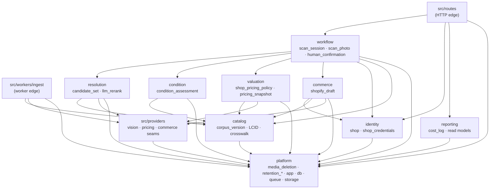

# Decision Record — Modular-Monolith Module Boundaries, Dependency Rule and Extraction Criteria

**Version:** 1.4.0
**Status:** RATIFIED 2026-09-03 by the acting head of board under Jeremy Longshore's 2026-09-03 delegation, after a two-lens architecture cannon (`rich-hickey-reviewer`, `martin-fowler-reviewer`, both ACCEPT-WITH-CHANGES). Binding per §9. **v1.1.1, v1.2.0, v1.3.0 and v1.3.1 are amendments by a row under §9's "amend by a row" clause, not superseding records** — see the change log below; the decision itself is unchanged in all four.
**Bead:** E02-B02 `longbox-e5b.2.2` (epic LBOX-E02 `longbox-e5b.2`, gate G2) — see 000-docs/014 §8
**Drafted:** 2026-09-03 by `longbox-domain-builder` · **Cannon:** `rich-hickey-reviewer` + `martin-fowler-reviewer`, 2026-09-03 · **Decision owner:** Jeremy Longshore
**Sensitivity:** Restricted internal (014 §10)
**Supersedes:** nothing — first module-boundary record. **Inputs:** 014 §18 decision 2 ("modular monolith plus workers first"), 014 §3 (surfaces and journeys), 014 §4 (target technical architecture), 003 (architecture), 005 (v0 spec), 024 (stack and artifact map), 027 (repository truth audit, `46d9910`), 018 (evidence rules), 019 v1.2.0 (thresholds T10, T13a, T21, T22), 022 P7 (retention), CLAUDE.md locked decisions 2, 4, 5.

## Change log

**Version convention.** The minor bump is not skipped numbering: **1.0.0 → 1.1.0** absorbed ten substantive cannon amendments that changed the decision's content (a rule was deleted, an edge added, a module's scope split, a whole section written), which is a minor bump. **1.1.0 → 1.1.1** changes no decision at all — it repairs statements of fact about the existing tree that were wrong, which is a patch. A reader who acted on v1.1.0's *decisions* need re-read nothing; a reader who quoted its *description of the code* must re-read §1, §2.10 and §12. **1.1.1 → 1.2.0** is a minor bump because the owned-table lists *grew*: no boundary moved and no rule changed, but five modules now own tables they did not name before, which is new content a reader must have. A reader who quoted any owned-table list, or the table-ownership map, must re-read §2.1, §2.2, §2.3, §2.7, §2.8 and §2.10.

**Why 1.2.0 → 1.3.0 is a minor and not a patch, argued rather than assumed.** The edit has two halves and they pull opposite ways. The **first half is pure fact-repair**: fourteen §2.10 rows that said "catalog migration (sketch, 030 §7)" or "(not created)" now cite `016_catalog_core.sql` / `017_lcid_lifecycle_and_resolution.sql` at a line number, because the tables exist — that is §9 clause 2's "statements of fact about the existing tree", and on its own it is a patch. The **second half grows an owned-table list**: `catalog` gains five tables it did not name before (`lcid_merge`, `lcid_split`, `lcid_split_outcome`, `lcid_retirement`, `lcid_current_survivor`), and §2.10's map gains five rows. v1.2.0 set the precedent explicitly — a list that *grows* is content a reader must have, not a description that was wrong — so the larger claim governs and this is a **minor**. It is still not a **decision**: 047 §12.4 item 6 owed this row, 047 §4/§5/§6.2 already assign every one of those tables to `catalog` by this record's own §2.3 module rule, and nothing here chooses an owner that a ratified record had not already fixed. A reader who quoted `catalog`'s owned-table list, the §2.10 map, its count line, or §3.3's cruiser block must re-read §2.3, §2.10 and §3.3.

**Why 1.3.0 → 1.3.1 is a patch and not a minor, unlike the two edits above it.** §2.10's closing note (v1.3.0) already named the gap this row closes and already named the owner of every table in it: *"Each has an owner in its own ratified record (040, 042, 043) and each is declared in `src/db/appendOnlyTables.ts`, so none is unowned in the system; what is missing is the row that makes the ownership checkable **here**."* That sentence is the test v1.2.0's precedent turns on — a minor bump is for an owned-table list that *grows*, i.e. a module gaining a table it did not already own anywhere. Nothing here grows: `commerce` already owned `listing_status_observation` at `029:152`'s "webhook/poll reconciliation, and the observed listing lifecycle" and 040 §4.4 restates it in the same words; `platform` already owned `request_idempotency` at 042 §9.2 Entry A and `outbox`/`outbox_attempt` at 043 §2.6/§9.2 Entry A, both citing `029:176`'s own "the durable queue and outbox runtime"; `workflow` already owned `scan_session_transition` as the table 040 §8.2 specified for the state machine's own cursor; and `schema_migrations` was never domain-owned by any module — it is the migration runner's own ledger (`scripts/migrate.ts:90`), `appGrant: "none"` in `src/db/appendOnlyTables.ts` for exactly that reason, and 044 §4 calls it "the runner's own bookkeeping". This edit adds six rows to a table that already listed sixty-one; it does not hand any module a table another record had not already fixed on it. A reader who quoted §2.10's count line or its closing note must re-read §2.10; nothing else in this record changes meaning.

| Version | Date | What changed | Authority |
|---|---|---|---|
| 1.0.0 | 2026-09-03 | Initial draft, Status PROPOSED. | `longbox-domain-builder` |
| 1.1.0 | 2026-09-03 | RATIFIED. Ten cannon amendments absorbed: H1 (human_confirmation rationale), H2 (L2→L2 exception deleted), H3 (ingest-worker edge), H4 (workflow trigger counted), H5 (identity split; batch/bin/task → workflow), H6 (events are aspirational), F1 (CPU-share deleted; 500 ms signed), F2 (one commit per relocation), F3 (staged gate), F4 (new §12). | Two-lens cannon → acting head, §9 |
| **1.1.1** | **2026-09-03** | **Factual repair after `longbox-gate-auditor` returned NOT-READY on four blockers. No decision changed.** **B1** — §1 fact 1 was false: `scanSession.ts` INSERTs two tables and *reads* six through a hardcoded read model; the six event inserts live in `identify.ts`, `pricingService.ts` and the route. §1, §2.2, §2.4, §2.5, §2.6, §2.7, §2.10, §5 moves 2 and 6, §7 alt 3 and §10 repaired; the argument now rests on fact 2, which reproduces. **B2** — §3.1's L2 row granted `identity` to all four L2 modules while three other surfaces denied it; struck, commerce-only. **B3** — `reporting` holds real code and was missing from `ENFORCED_MODULES`; added. **B4** — §12 was present-tense but no transaction exists in the request path; a NOTHING-EXISTS-YET block added and §2.2/§11 put in future tense. Plus **N1** (`$1` backreference restored in `module-public-surface-only`), **N2** (`db.query` blind spot documented as an E02-B10 obligation), **N3** (reporting cohort mislabelled G5 → design-partner, 019:153). | `longbox-gate-auditor` → acting head, under §9 "amend by a row" |
| **1.2.0** | **2026-09-04** | **Eight amend-by-a-row entries applied under §9. No boundary, edge, rule or extraction criterion changed; only owned-table lists and the §2.10 map.** Three ratified records deferred or implied their entries to this one edit. **From 034 §7 (three entries):** §2.1 `identity` gains `organization`, `location`, `app_user`, `membership`, `membership_revocation`, `device`, `device_credential`, `device_credential_revocation`; §2.2 `workflow` gains `bin`, `batch`, `batch_close`, `batch_source_bin`, `task`, `task_event`; §2.8 `reporting` gains `labor_shift`, `labor_shift_confirmation` — which closes §2.10's own standing note that the `labor_shift` assignment "should be amended by a row rather than assumed". **From 036 §7.5 (four entries):** §2.2 `workflow` gains `physical_item`, `physical_item_identity_correction`, `physical_item_code_assignment`, `custody_event`, `write_off_event`, `scan_session_item_resolution`, `consignment_intake` (Entry 1); gains `identity_resolution` (Entry 2, deferred here by 030 §7.1/§12); gains the sale family `sale_event`, `return_event`, `refund_event`, `sale_resolution` plus one sentence in §2.2 (Entry 3, 036 A3); and §2.7 `commerce` replaces `shopify_draft` with `shopify_draft`, `listing_link`, `listing_link_deactivation`, `physical_item_active_listing` plus one sentence in §2.7, with `physical_item_active_listing` flagged in §2.10 as the one non-append-only table in the domain (Entry 4). **Entry 8 (030 §7 — ownership fact from a ratified record; 030 §2.6 assigned catalog by module rule but wrote no amend entry, closed here under §9):** §2.3 `catalog`'s owned-table list stops reserving "the LCID, edition, signature and crosswalk tables" in prose and **names them** — `lcid_registry`, `collectible_definition`, `edition`, `edition_signature`, `edition_external_id`, `data_source`, `vertical_pack`, `vertical_pack_version`. This assigns nothing new: 030 §2.6 checked its tables against this record's §2.3 and found them consistent; what was missing was the row that made the list checkable, which is precisely the gap §9's clause exists to close. `vertical_pack` is flagged in §2.10 as insert-only rather than append-only-immutable in the strict sense (030 §7). §2.10's map gains thirty-nine rows and its count line moves from seventeen to fifty-six; every table is still owned by exactly one module. | 034 §7 + 036 §7.5 + 030 §7 → E02-B05, under §9 "amend by a row" |
| **1.3.0** | **2026-09-04** | **The catalog module's tables stop being a sketch. Two amend-by-a-row entries under §9; no boundary, edge, rule or extraction criterion changed.** **Entry 1 (047 §12.4 item 6, the row that record owed this one):** `migrations/016_catalog_core.sql` and `017_lcid_lifecycle_and_resolution.sql` landed at E04-D01 (`ead9bdf`, PR #67) and created **fourteen** tables. Thirteen are `catalog`'s and §2.3's list now carries all thirteen: the eight v1.2.0 named from 030 §7 (`lcid_registry`, `collectible_definition`, `edition`, `edition_signature`, `edition_external_id`, `data_source`, `vertical_pack`, `vertical_pack_version`) plus the five this entry adds — `lcid_merge`, `lcid_split`, `lcid_split_outcome`, `lcid_retirement` (047 §5, append-only facts) and `lcid_current_survivor` (047 A2/§6.2, the **one projection exemption**: a materialized index over `lcid_merge`, deliberately mutable, declared in `src/db/appendOnlyTables.ts`'s `APPEND_ONLY_EXEMPTIONS` rather than absent from the trigger set). The fourteenth, `identity_resolution` (`017:379`), stays **`workflow`**'s exactly as v1.2.0 assigned it under 036 §7.5 entry 2 and 030 §7.1 — it FKs to `human_confirmation`, and a catalog that a batch importer must be able to read with no pipeline present cannot own it (§2.3); only its migration cell is repaired here. `corpus_version` was already catalog's and already created (`001:54`). §2.10's map gains five rows, fourteen rows move from "(sketch)" / "(not created)" to a real migration and line, and the count line moves from fifty-six tables (seventeen created) to sixty-one (thirty-one created); every table is still owned by exactly one module. §2.3's "Files today: **None**" — the sentence that called catalog "schema-reserved and unimplemented, the largest gap between the target architecture and the tree" — is retired: `src/catalog/` holds seven files. **Entry 2 (016 C39, the §3.3 patch row that register asked for):** §3.3 gains a patch block recording the three places the INSTALLED `.dependency-cruiser.cjs` differs from the block this record specified — defect **N4** (`routes-do-not-touch-the-database` matched `^pg$` against a resolved npm path and was green by construction; fixed at `510e4b8`), and the two named rules `catalog-public-surface-only` and `catalog-is-a-leaf` that E04-D01 added, which are the module-surface enforcement §3.3 asked for, keyed on the real `src/catalog/` path because E02-B03's `src/modules/` relocation has not happened. | 047 §12.4 + 016 C39 → E04-D02, under §9 "amend by a row" |
| **1.4.0** | **2026-09-04** | **`identity` gains four tables and eight of its sketched ones become real. One amend-by-a-row entry under §9; no boundary, edge, rule or extraction criterion changed.** **Entry 1 (048 §12.4 row 9, the row that record owed this one, filed as a same-PR obligation on E03-D09):** `migrations/019_identity_core.sql` and `020_sessions_pin_and_auth_attempt.sql` landed at E03-D09 and created **twelve** tables, every one `identity`'s. Eight were already named in §2.1's list by v1.2.0 (from 034 §7) and sat in §2.10 as *(sketch, 034 §4.1) — (not created)*; their rows now cite a migration and a line. **Four are new to the list**: `app_session` and `app_session_revocation` (048 §3.3 — append-only issuance facts with no status column, the revocation keyed on `chain_id` so revoking is one row rather than one per session ever issued), `operator_pin` (048 §10.1 — config, mutable, and the lockout ANCHOR whose `SELECT … FOR UPDATE` closes the write skew 041 §4.2 named) and `auth_attempt` (048 §9.1 — append-only, FAILURES ONLY, and declared SUBSTRATE rather than surface). **This is a minor and not a patch**, by v1.2.0's own test: an owned-table list that GROWS is content a reader must have, and `identity` gains four tables it did not name anywhere before. It is still not a decision — 048 §10.1 fixed every owner, and §2.1's rule (*"tenancy and authentication only … who is this, which tenant are they in"*) already answered the question this row records. §2.1 also gains one paragraph stating `auth_attempt`'s substrate obligation, which is the fourth name §3.3's accessor rule must gate (048 R17). The count line moves from sixty-seven tables (thirty-seven created) to **seventy-one (forty-nine created)**; every table is still owned by exactly one module. | 048 §12.4 row 9 → E03-D09, under §9 "amend by a row" |
| **1.3.1** | **2026-09-04** | **Statements of fact only — the six workflow and platform tables §2.10's own v1.3.0 closing note named as missing are now mapped by a row. No boundary, edge, rule or extraction criterion changed, and no module gains a table it did not already own.** §2.10 gains six rows: `listing_status_observation` (`005:73`, `commerce`, append-only, 040 §4.4), `request_idempotency` (`009:43`, `platform`, declared exemption — `permanent`, appGrant `full` — 041 §8.5/A11, 042 §5.2/§9.2 Entry A), `scan_session_transition` (`010:36`, `workflow`, append-only, 040 §8.2), `outbox` and `outbox_attempt` (`011:61`, `011:160`, both `platform`, append-only, 043 §2/§9.2 Entry A — `outbox` also carries the `appLockable` flag for its `SELECT … FOR UPDATE … SKIP LOCKED` claim query, 043 §7.2/§7.3), and `schema_migrations` (`scripts/migrate.ts:90`, `platform` ledger, declared exemption — `permanent`, appGrant `none` — 044 §4). Every owner was already fixed by its own ratified record and by `src/db/appendOnlyTables.ts`; this row only makes the ownership checkable in §2.10's own map, which is precisely the gap the v1.3.0 closing note left named and open. The count line moves from sixty-one tables (thirty-one created) to **sixty-seven (thirty-seven created)**; every table is still owned by exactly one module and none is owned twice. §2.10's "What this map still does not cover" callout is retired — it named exactly these six tables and this row closes it. | 029 §2.10 v1.3.0 closing note → E02-D12, under §9 "amend by a row" |

## Decision authority and evidence posture

Jeremy Longshore owns this decision; the acting head ratified it under the 2026-09-03 delegation recorded in 006 (see §9). Per 018 A1/A3:

- Every **"today" claim** in §1 and §4 is REPRODUCED — read from the tree at branch `feat/e02-b02-modular-monolith-adr` off main `fb3f706`, with `file:line` or a `CREATE TABLE` citation.
- Every **module boundary, allowed edge and event name** is ASSERTED. This record is a design intent; nothing here is TESTED until E02-B10 turns the rule into a gate-test. The event lists in §2 are the weakest claims in the document — nothing publishes an event today (H6).
- Every **extraction trigger** in §6 is OPEN until PILOT-MEASURED. Where a numeric bar exists it is quoted from 019 v1.2.0 (already signed) and never re-derived here. The one bar signed *by* this record — valuation's 500 ms provider-fan-out p95 (§6, F1) — is a decision under 019 §3 header discipline, not evidence that anything meets it. Where no bar exists the trigger names the missing measurement instead of inventing a percentage. **No unmeasured percentage appears in this record as a fact.**
- **Ratification is not evidence.** §9 records that this design was adopted. It does not raise any claim above the rung its artifact earned.
- **A REPRODUCED claim needs the line, not the memory of reading the file.** v1.0.0 asserted "one file writes eight tables" at the REPRODUCED rung on the strength of having read that file; the audit found it false (B1) because the claim was never reduced to a `file:line` that could be checked. Every "today" cite in v1.1.1 was re-derived by grep and carries its line number. The lesson generalises: a rung is earned by the citation, not by the reading.

## 1. Context — what exists today

`src/` is 1,930 lines across 21 TypeScript files with **no module structure at all**. `src/services/` is flat: eleven files in one directory, ordered by nothing.

The three structural facts that make this record necessary:

1. **The session-identity file writes two tables and reads six more through a hardcoded read model.** `src/services/scanSession.ts` (91 lines) INSERTs into exactly **two** tables — `scan_session` (`:19`) and `scan_photo` (`:49`) — and then reads **six** others it does not own through a hardcoded table list in `getSessionEvents` (`:73–81`: `candidate_set`, `llm_rerank`, `human_confirmation`, `condition_assessment`, `pricing_snapshot`, `shopify_draft`, alongside `scan_photo`), interpolating each table name into `SELECT * FROM ${t}` at `:85`. The coupling is real but it is a **read-model** coupling, not a write monopoly: one file names every event table in the system and must be edited whenever a new one is added.
   > **Correction (v1.1.1, gate-audit blocker B1).** v1.0.0/v1.1.0 asserted that this file "contains the insert path for" all eight tables. That was **false at `fb3f706`** and is withdrawn. The six inserts live where the work happens: `candidate_set` → `src/services/identify.ts:56` and `:107`; `llm_rerank` → `identify.ts:130`; `pricing_snapshot` → `src/services/pricingService.ts:103`; `human_confirmation` → `src/routes/scanSessions.ts:175`; `condition_assessment` → `routes/scanSessions.ts:201`; `shopify_draft` → `routes/scanSessions.ts:329`. The consequences of the error are worked through in §2.10, §5 move 2 and §7 alternative 3; the short version is that the codebase is **better** factored than the draft claimed, and the argument now rests on fact 2, which reproduces.
2. **One route file spans the whole pipeline.** `src/routes/scanSessions.ts` (346 lines, the largest file in the repo) imports condition, identify, pricing, pricingService, ebay, shopify, scanSession **and** `../providers/registry.js`, and issues its own SQL against five tables it does not own: `shop` (`:46`, `:74`), `shop_pricing_policy` (`:55`), `human_confirmation` (`:175`), `condition_assessment` (`:201`) and `shopify_draft` (`:329`). *(v1.1.1 corrects the membership of this list: the draft named `pricing_snapshot`, but the route only **reads** that one out of the `getSessionEvents` result at `:288`, never by SQL. Five tables either way.)* **This is the structural fact the record actually rests on.**
3. **Provider adapters live outside the provider directory.** `src/providers/` holds only the vision seam (anthropic, openaiCompat, registry, shared, types). The PriceCharting client and the `PricingProvider` interface are in `src/services/pricing.ts:76,49`; the eBay OAuth + Browse adapter is in `src/services/ebay.ts:57`; the Shopify Admin client is in `src/services/shopify.ts`. Three live external adapters sit in the services layer.

Four tables have **no code referencing them at all**: `corpus_version` (001), `media_deletion`, `retention_hold`, `retention_hold_release` (003). `retention_policy` is written only by `scripts/register-shop.ts` and `scripts/retention-defaults.ts`. Those are reserved slots (E02-D01), not dead code. They mean **`catalog` owns schema and no behaviour** today, and that most of `platform`'s retention surface is likewise unwritten. *(v1.1.1 corrects this sentence: v1.1.0 said "two of the nine modules (catalog, reporting)". `reporting` in fact holds real code — the `cost_log` insert at `src/services/costLog.ts:18` — which is exactly the finding behind blocker B3 and why `reporting` is in the enforced set at E02-B10.)*

014 §18 decision 2 already fixed the shape ("modular monolith plus workers first; extract services only for measured scaling, isolation, reliability or team-ownership reasons"). What it did not fix is **which modules**, **which direction dependencies may point**, and **what measurement counts as "measured"**. This record fixes those three things.

## 2. Decision A — Nine modules in one Fastify service

One process, one deployable, one Postgres. Nine modules under `src/modules/<name>/`, each with an `index.ts` that is its only public surface. Workers (E13-B03) run the same modules in the same image with a different entrypoint; a worker is not a tenth module.

Every table is owned by **exactly one** module. Ownership means: only that module's code writes it, and only that module's code reads it directly. Another module reads it by calling the owner's public function or, after E02-B09, by consuming its event.

> **⚠ Every "Publishes" and "Consumes" list below is ASPIRATIONAL, not a description of running code.** There is no event bus, no outbox and no publish call anywhere in this repository today; `workflow`'s fan-out is **direct synchronous function calls**, and that is what §5 move 2 and §12 actually build. The event names are past-tense on purpose — they name the Hickey record that the transition produces, so that when E02-B09 lands the outbox there is already an agreed vocabulary — but reading them as "the system emits these" would be false at every rung of the 018 ladder. Nothing in §2 is TESTED; the event lists in particular are ASSERTED and nothing more (H6).

### 2.1 identity — tenancy and auth, and nothing else

**Responsibility.** Owns **tenancy and authentication only** (H5). A shop is a row; every shop-scoped table in the system carries its `shop_id` (CLAUDE.md locked decision 4). Identity owns organization, shop, location, user, role, `shop_credentials` (credential *references* — never a raw key, locked decision 2), and device registration **as an auth principal**. It answers "who is this, which tenant are they in, and what are they allowed to do?" and nothing else. It never knows what a comic is.

**What moved out at the cannon's instruction.** The draft also gave identity `batch`, `bin` and `task`. Those are **inventory and operations taxonomy**, not tenancy: they change at a different rate, for a different reason, driven by how a shop physically organizes a long box rather than by who may log in. They belong to `workflow` (§2.2). Keeping them here would have made every re-organization of a shop's floor a change to the auth module.

**Tables owned.** `shop`, `shop_credentials`, `organization`, `location`, `app_user`, `membership`, `membership_revocation`, `device`, `device_credential`, `device_credential_revocation`, `app_session`, `app_session_revocation`, `operator_pin`, `auth_attempt`.

The last four arrive with 048 (E03-D09) and are identity's by this section's own rule rather than by a new judgement: a session is the answer to *"who is this, and which tenant are they in"*, and a failed PIN is a fact about that question being asked. **`auth_attempt` carries one extra obligation the other three do not** (048 §9.1, R17): it is SUBSTRATE, read only by the single-pair lockout derivation and by an audited break-glass query, so any read in which an operator identifier is a DIMENSION — a `GROUP BY`, an `ORDER BY`, a filter parameter, a view column, a count over more than one pair — is an architecture-gate failure rather than a review finding. It joins §3.3's accessor rule as its fourth name.

**Files today.** `scripts/register-shop.ts` (the whole of it). No `src/` file is identity-only today; `src/providers/registry.ts:*` reads `shop_credentials` and belongs to the provider seam, not to identity — it becomes a *consumer* of an identity port (§5 move 4).

**May import.** `platform` only.
**Must never import.** Any of the other seven modules, any provider, any HTTP route.

**Publishes.** `ShopRegistered`, `ShopCredentialReferenceRecorded`, `ShopCredentialReferenceRevoked`.
**Consumes.** Nothing.

### 2.2 workflow — the scan session and the human's authority over it

**Responsibility.** Owns `scan_session` as an *identity* in the Hickey sense (locked decision 4): a session is a thing that happened, and every later record is appended to it, never merged into it. Workflow owns capture (the photo rows), the canonical state machine and its authorized transitions (E02-B06), the recording of the human's ruling — the confirmation, the abstention, the correction — and, from E02-B03, the **inventory and operations taxonomy: batch, bin and task** (moved here from identity by cannon amendment H5, because how a shop organizes its floor changes at a different rate and for a different reason than who may log in). It orchestrates: it calls resolution, condition, valuation and commerce; none of them calls it back. Human authority is a workflow invariant, not a UI convention (022 P1).

Once E02-B07 builds it, and until the outbox lands, workflow is also the **transaction owner** for every request — see §12, which is load-bearing for this record and specifies the mechanism that will keep a `scan_session` from holding a half-written Hickey chain. **No such mechanism exists today** (§12 opening block).

**Tables owned.** `scan_session`, `scan_photo`, `human_confirmation`, `physical_item`, `physical_item_identity_correction`, `physical_item_code_assignment`, `custody_event`, `write_off_event`, `scan_session_item_resolution`, `consignment_intake`, `identity_resolution`, `sale_event`, `return_event`, `refund_event`, `sale_resolution`, `bin`, `batch`, `batch_close`, `batch_source_bin`, `task`, `task_event`.

A sale, return, refund and sale resolution are the copy's facts and are written here; commerce derives the listing consequence from them.

**Files today.** `src/services/scanSession.ts` in full — its two inserts, `scan_session` (`:19`) and `scan_photo` (`:49`), are already workflow's own. Two things arrive from elsewhere: the `human_confirmation` insert currently in the route (`src/routes/scanSessions.ts:175`), and ownership of the session/photo handlers in that route, which become thin calls into this module. One thing leaves: the hardcoded six-table read model `getSessionEvents` (`:73–81`), which names every other module's tables and must become each owner's own read function (§5 move 2).

**May import.** `platform`, `identity`, `catalog`, `resolution`, `condition`, `valuation`, `commerce`.
**Must never import.** `reporting` (a read model must never be on a write path); any provider; the HTTP layer.

**Publishes.** `ScanSessionOpened`, `ScanPhotoCaptured`, `HumanConfirmationRecorded`, `HumanAbstentionRecorded`, `ScanSessionClosed`.
**Consumes.** `CandidateSetProposed`, `LlmRerankRecorded`, `ConditionAssessmentRecorded`, `PricingSnapshotRecorded`, `CommerceDraftCreated`, `CommerceDraftFailed` — to advance state.

### 2.3 catalog — what a collectible *is*, independent of any provider

**Responsibility.** Owns the Longbox Canonical Collectible ID (LCID) and everything hanging off it: the generic `collectible_definition → edition` core (E02-B04), the versioned per-vertical identity schemas and normalized signatures (E04-B02, E04-B03), the vertical-pack manifest (E04-B04, 014 §3.4), the provider crosswalk (E04-B06) and the immutable versioned corpus snapshots. **A provider ID is never a primary key and never a foreign-key target** (014 §18 decision 3); it is a versioned alias edge with method, confidence and provenance. Catalog is the module that must survive a partner leaving.

**Tables owned.** `corpus_version`, `lcid_registry`, `collectible_definition`, `edition`, `edition_signature`, `edition_external_id`, `data_source`, `vertical_pack`, `vertical_pack_version` — the LCID, edition, signature and crosswalk tables E04 delivers, now named rather than reserved in prose (v1.2.0, 030 §7) — **and, from v1.3.0 (047 §12.4 item 6), the LCID's lifecycle: `lcid_merge`, `lcid_split`, `lcid_split_outcome`, `lcid_retirement` and `lcid_current_survivor`.** Thirteen tables, all of them created — `016_catalog_core.sql` and `017_lcid_lifecycle_and_resolution.sql` landed at E04-D01 (`ead9bdf`) — plus `corpus_version` from `001:54`.

**Append-only, with exactly one exemption.** Twelve of the thirteen landed by 016/017 carry a `forbid_mutation()` trigger (`corpus_version` has carried one since `001`, so fourteen owned tables, thirteen triggered) held at `ENABLE ALWAYS`, declared once in `src/db/appendOnlyTables.ts` and asserted in both directions by `tests/integration/migrations.test.ts`. Two of the twelve are **insert-only** rather than append-only-with-supersession and are declared rather than exempted, because the enforcement is identical — `forbid_mutation()` refuses UPDATE and DELETE and nothing else: `lcid_registry` (047 §4.2 / I1 — an LCID is minted once and never reused) and `vertical_pack` (030 §7 — a pack is registered once and evolves by a new `vertical_pack_version` row). The **one exemption is `lcid_current_survivor`** (047 A2, §6.2, I18): a materialized projection over `lcid_merge`, keys only, INSERTed and UPDATEd by the merge transaction's own trigger and rebuildable in one pass by `src/catalog/projection.ts`, so it is deliberately mutable and carries a `permanent` row in `APPEND_ONLY_EXEMPTIONS` rather than an absence. It is not a status column — a disagreement with `lcid_merge` is a test failure (I18), never a data state.

**Files today (v1.3.0).** `src/catalog/` — `index.ts` (the only public surface), `lcid.ts` (the one parser), `mint.ts` (`lcid_registry` INSERT at `:117`), `lifecycle.ts` (`lcid_merge` `:91`, `lcid_split` `:138`, `lcid_split_outcome` `:146`, `lcid_retirement` `:168`, the crosswalk writes at `:232` and `:277`), `resolve.ts` (`resolve(lcid, asOf)` with a mandatory as-of), `projection.ts` (`lcid_current_survivor` rebuild, `:104`/`:116`) and `editionSignature.ts`. Catalog is no longer schema-reserved and unimplemented — the sentence v1.1.1 carried calling it "the largest gap between the target architecture (014 §4) and the tree" is retired. What still has **no writer** is the corpus surface: `corpus_version`, `collectible_definition`, `edition`, `edition_signature`, `data_source`, `vertical_pack` and `vertical_pack_version` are created and unwritten, owned by E04-B02 / E04-B04 / E04-B05.

**May import.** `platform` only.
**Must never import.** `workflow`, `resolution`, `condition`, `valuation`, `commerce`, `reporting`, any provider. Catalog must be readable by a batch importer with no pipeline present. Provider *ingest* (E04-B11) lives in the `src/workers/ingest/**` composition root (§3.1, H3), which imports catalog and `src/providers/catalog/**` — never the reverse, and never another domain module.

**Publishes.** `CorpusVersionPublished`, `CrosswalkEdgeProposed`, `CrosswalkEdgeConfirmed`, `CrosswalkConflictRaised`.
**Consumes.** Nothing.

### 2.4 resolution — proposing an identity, and knowing when to abstain

**Responsibility.** Owns the deterministic-first ladder (014 §4.1): content hash, barcode/UPC/EAN, exact alias lookup, then and only then a paid model. Owns the bounded candidate set, the LLM re-rank, the structured evidence it must emit, the contradiction gate that cross-validates that evidence against candidate metadata, and the three confidence bands (locked decision 7). Its output is a *proposal*: resolution never confirms an identity — `human_confirmation` is workflow's table for exactly that reason.

**Tables owned.** `candidate_set`, `llm_rerank`.

**Files today.** `src/services/barcode.ts`, `src/services/identify.ts`, `src/services/rerank.ts`, `src/services/bands.ts`. **Both of this module's inserts are already here** — `candidate_set` at `identify.ts:56` and `:107`, `llm_rerank` at `identify.ts:130` — so relocating them is a **no-op for ownership**: they travel with the file in §5 move 3 and no insert changes hands. (v1.1.0 said these inserts sat in `scanSession.ts`; that was the B1 error.) What does change is the cost-log call out to `costLog.ts` (V5, §5 move 7).

**May import.** `platform`, `catalog`, and `src/providers/` (vision seam).
**Must never import.** `workflow` (would create a cycle), `condition`, `valuation`, `commerce`, `reporting`, `identity` (it receives a `shop_id`, it does not look shops up).

**Publishes.** `CandidateSetProposed`, `LlmRerankRecorded`, `EvidenceContradictionRaised`, `ResolutionAbstained`.
**Consumes.** `ScanPhotoCaptured`.

### 2.5 condition — grade range and defects, never a number

**Responsibility.** Owns the human-owned condition call: a grade **range** plus structured defect callouts, in schema, API, prompt and UI copy (locked decision 5, 014 §18 decision 5). Owns the per-vertical condition schema (a card's grading vocabulary is not a comic's) and the high-value / disputed branch to back-and-interior inspection or owner review. It never produces, stores or transports a numeric grade, and it never claims certification.

**Tables owned.** `condition_assessment`.

**Files today.** `src/services/condition.ts` (`GRADE_LABELS`, `validGradeRange`) — pure logic, no SQL. The `condition_assessment` insert is **in the route** (`src/routes/scanSessions.ts:201`) and must genuinely move here; this is one of the three real relocations (§5 move 2). (v1.1.0 placed it in `scanSession.ts`; that was the B1 error.)

**May import.** `platform`, `catalog` (for the vertical pack's condition schema).
**Must never import.** `workflow`, `resolution`, `identity`, `valuation` (condition must not be able to see a price — a condition call that can read the money is a condition call under pressure), `commerce`, `reporting`, any provider.

**Publishes.** `ConditionAssessmentRecorded`, `ConditionEscalatedToOwnerReview`.
**Consumes.** `HumanConfirmationRecorded`.

### 2.6 valuation — many sources, one normalized snapshot, shop policy on top

**Responsibility.** Owns every price signal and the policy that turns signals into a suggestion. Each configured `PricingProvider` runs independently (one bad source never blocks another), each writes its **own** immutable `pricing_snapshot` row, and the driving result follows a fixed, inspectable precedence. Owns the versioned shop pricing policy (E09-B06), freshness and provenance display, source disagreement (E09-B08), provider licence and attribution constraints (E09-B09), and the auditable human override. It never mutates a snapshot; a corrected price is a new row.

**Tables owned.** `shop_pricing_policy`, `pricing_snapshot`.

**Files today.** `src/services/pricing.ts`, `src/services/pricingService.ts`, `src/services/ebay.ts`. **The `pricing_snapshot` insert is already here** (`pricingService.ts:103`) — a **no-op for ownership**, travelling with the file in §5 move 3. (v1.1.0 placed it in `scanSession.ts`; that was the B1 error.) One thing genuinely arrives: the `shop_pricing_policy` SELECT in the route (`src/routes/scanSessions.ts:55`). The PriceCharting and eBay adapters leave for `src/providers/pricing/` (§5 move 5).

**May import.** `platform`, `catalog`, and `src/providers/` (pricing seam).
**Must never import.** `workflow`, `resolution`, `commerce`, `reporting`, `identity`, **and `condition`** — the draft permitted this one L2→L2 edge and the cannon struck it (H2). A graded FMV lookup still needs the grade range; `workflow` passes it into valuation's public call as a plain argument. The value crosses; the import does not.

**Publishes.** `PricingSnapshotRecorded`, `PricingSourceUnavailable`, `PricingSourceDisagreement`, `PricingOverrideRecorded`.
**Consumes.** `ConditionAssessmentRecorded`.

### 2.7 commerce — one physical copy, one draft, human publishes

**Responsibility.** Owns the outward mutation. Shopify Admin GraphQL `productSet` with `status: DRAFT` (locked decision 3), staged media upload, the LCID↔SKU↔external-ID mapping (E10-B03), duplicate prevention across retries, the transactional outbox and idempotency (E10-B09), webhook/poll reconciliation, and the observed listing lifecycle that feeds retention anchors. **Nothing publishes without a human.** A second connector (Whatnot, eBay) is another adapter behind the same capability contract, not a second module.

**Tables owned.** `shopify_draft`, `listing_link`, `listing_link_deactivation`, `physical_item_active_listing`.

`physical_item` is `workflow`'s; commerce receives a `physical_item_id` and binds it. A SKU is a field on `listing_link`, never a column on the copy. The sale itself is workflow's (036 §2.4); commerce consumes it and deactivates the binding.

**Files today.** `src/services/shopify.ts` (the Admin client, which leaves for `src/providers/commerce/` at §5 move 5). The `shopify_draft` insert and the whole draft-creation block are **in the route** (`src/routes/scanSessions.ts:329`) and must genuinely move here; this is the third of the three real relocations (§5 move 2). (v1.1.0 placed the insert in `scanSession.ts`; that was the B1 error.)

**May import.** `platform`, `identity` (to resolve the shop's connector credential reference), `catalog` (listing template and category from the vertical pack), and `src/providers/` (commerce seam).
**Must never import.** `workflow`, `resolution`, `condition`, `valuation` (it receives a decided price; it must not re-derive one), `reporting`.

**Publishes.** `CommerceDraftCreated`, `CommerceDraftFailed`, `ListingLifecycleObserved`.
**Consumes.** `HumanConfirmationRecorded`, `ConditionAssessmentRecorded`, `PricingSnapshotRecorded`.

### 2.8 reporting — read models, cost ledger, and nothing on a write path

**Responsibility.** Owns every derived view: the funnel (captured → confirmed → drafted → published → sold), the per-call cost ledger from day one (locked decision 7), cost per verified draft (T13a), the owner's weekly shop-facing report (T10, T11, T12, T20, T27, T28 and the north star), provider health, and the audit/privacy-request surfaces. It is **strictly downstream**: it consumes events and never appears on any write path. It measures workflow health, not covert worker surveillance (014 §3.2, 022 P3) — T35 per-operator rendering is 0 and non-waivable (019 v1.2.0), which is a *reporting* invariant, enforced here.

**Tables owned.** `cost_log`, `labor_shift`, `labor_shift_confirmation`.

**Files today.** `src/services/costLog.ts`. Note the inversion to fix: `cost_log` is written today from `src/services/identify.ts` (resolution) calling `costLog.ts`. After the move, resolution publishes a cost fact and reporting records it; resolution stops owning a write to another module's table.

**May import.** `platform` only.
**Must never import.** Any domain module, any provider. **And no module may import reporting** — that edge is what keeps a dashboard from becoming a dependency of the pipeline.

**Publishes.** Nothing (it is a sink).
**Consumes.** Every event in this record.

### 2.9 platform — the parts that are not about comics

**Responsibility.** Owns the Fastify app, config validation, the pg pool, logging and redaction, error taxonomy, clock, id generation, idempotency keys, the durable queue and outbox runtime (E02-B09, E13-B03), object storage and signed delivery (E13-B06), health/readiness (E13-B04), backup and restore (E13-B07), and the retention/deletion machinery required by 022 P7 — the media tombstone and the immutable hold/release records. Platform knows nothing about comics, prices or shops-as-businesses; it knows about processes, bytes, time and tenancy plumbing.

**Tables owned.** `media_deletion`, `retention_policy`, `retention_hold`, `retention_hold_release`.

**Files today.** `src/app.ts`, `src/server.ts`, `src/config.ts`, `src/db.ts`, `scripts/migrate.ts`, `scripts/retention-defaults.ts`, and the migration runner. `src/providers/` is *adjacent* to platform, not inside it — see §4.

**May import.** Nothing internal. Platform is the leaf of the graph.
**Must never import.** Any of the other eight modules, ever. If platform needs a domain fact, the design is wrong.

**Publishes.** `MediaDeletionRecorded`, `RetentionHoldPlaced`, `RetentionHoldReleased`, `RetentionSweepCompleted`.
**Consumes.** `CommerceDraftCreated` and `ListingLifecycleObserved` (retention anchors: originals count from draft creation, derivatives from observed listing end — 022 Q6).

### 2.10 Table ownership at a glance

| Table | Migration | Owning module | Written today by |
|---|---|---|---|
| `shop` | 001:22 | identity | `scripts/register-shop.ts` |
| `shop_credentials` | 001:30 | identity | `scripts/register-shop.ts` |
| `shop_pricing_policy` | 001:41 | valuation | `scripts/register-shop.ts` |
| `corpus_version` | 001:54 | catalog | — (no writer) — but **it has its first reader** (v1.3.0, §5 move 9): `src/catalog/resolve.ts` orders corpus versions by `(built_at, id)` for the mandatory as-of |
| `scan_session` | 001:64 | workflow | `src/services/scanSession.ts:19` |
| `scan_photo` | 001:73 | workflow | `src/services/scanSession.ts:49` |
| `candidate_set` | 001:82 | resolution | `src/services/identify.ts:56`, `:107` — **already in the owning module** |
| `llm_rerank` | 001:93 | resolution | `src/services/identify.ts:130` — **already in the owning module** |
| `human_confirmation` | 001:111 | workflow | `src/routes/scanSessions.ts:175` — in the route, must move |
| `condition_assessment` | 001:122 | condition | `src/routes/scanSessions.ts:201` — in the route, must move |
| `pricing_snapshot` | 001:133 | valuation | `src/services/pricingService.ts:103` — **already in the owning module** |
| `shopify_draft` | 001:147 | commerce | `src/routes/scanSessions.ts:329` — in the route, must move |
| `cost_log` | 001:158 | reporting | `src/services/costLog.ts:18` (called from `identify.ts` — see V5) |
| `media_deletion` | 003:145 | platform | — (no code) |
| `retention_policy` | 003:184 | platform | `scripts/register-shop.ts`, `scripts/retention-defaults.ts` |
| `retention_hold` | 003:205 | platform | — (no code) |
| `retention_hold_release` | 003:224 | platform | — (no code) |
| `organization` | 019_identity_core.sql:52 | identity | `scripts/register-shop.ts`, `tests/integration/helpers.ts` |
| `location` | 019_identity_core.sql:91 | identity | `scripts/register-shop.ts` |
| `app_user` | 019_identity_core.sql:118 | identity | `scripts/register-shop.ts`, `src/services/auth/memberships.ts` |
| `membership` | 019_identity_core.sql:140 | identity | `src/services/auth/memberships.ts` |
| `membership_revocation` | 019_identity_core.sql:180 | identity | `src/services/auth/memberships.ts` (the live-revocation predicate) |
| `device` | 019_identity_core.sql:199 | identity | `src/services/auth/devices.ts` |
| `device_credential` | 019_identity_core.sql:211 | identity | `src/services/auth/devices.ts` |
| `device_credential_revocation` | 019_identity_core.sql:228 | identity | `src/services/auth/devices.ts` (the live-credential predicate) |
| `app_session` | 020_sessions_pin_and_auth_attempt.sql:56 | identity | `src/services/auth/sessions.ts` (append-only; `appLockable` — the `FOR NO KEY UPDATE` 048 §3.3(a) requires) |
| `app_session_revocation` | 020_sessions_pin_and_auth_attempt.sql:164 | identity | `src/services/auth/sessions.ts` (append-only; keyed on `chain_id`, not `session_id` — 048 R2) |
| `operator_pin` | 020_sessions_pin_and_auth_attempt.sql:202 | identity | `src/services/auth/pin.ts` (declared exemption — `permanent`, appGrant `full`; it is the lockout ANCHOR, 048 §9.1 R5) |
| `auth_attempt` | 020_sessions_pin_and_auth_attempt.sql:252 | identity | `src/services/auth/pin.ts` (append-only, FAILURES ONLY — 048 §9.1 R16; SUBSTRATE, not surface, R17) |
| `bin` | 004 (sketch, 034 §4.1) | workflow | — (not created) |
| `batch` | 004 (sketch, 034 §4.1) | workflow | — (not created) |
| `batch_close` | 004 (sketch, 034 §4.1) | workflow | — (not created) |
| `batch_source_bin` | 004 (sketch, 034 §4.1) | workflow | — (not created) |
| `task` | 004 (sketch, 034 §4.1) | workflow | — (not created) |
| `task_event` | 004 (sketch, 034 §4.1) | workflow | — (not created) |
| `labor_shift` | 004 (sketch, 034 §4.1) | reporting | — (not created) |
| `labor_shift_confirmation` | 004 (sketch, 034 §4.1) | reporting | — (not created) |
| `lcid_registry` | 016:177 | catalog | `src/catalog/mint.ts:117` — **already in the owning module** — insert-only, never reused (047 §4.2, I1); trigger-declared rather than exempted, because `forbid_mutation()` refuses UPDATE and DELETE and nothing else |
| `collectible_definition` | 016:247 | catalog | — (no writer yet: E04-B02) |
| `edition` | 016:266 | catalog | — (no writer yet: E04-B02) |
| `edition_signature` | 016:323 | catalog | — (no writer yet: E04-B03) |
| `edition_external_id` | 016:390 | catalog | `src/catalog/lifecycle.ts:232`, `:277` — **already in the owning module** |
| `data_source` | 016:141 | catalog | — (no writer yet: E04-B05) |
| `vertical_pack` | 016:82 | catalog | — (no writer yet: E04-B04) — insert-only rather than append-only-immutable in the strict sense: a pack is registered once and evolves by a new `vertical_pack_version` row (030 §7) |
| `vertical_pack_version` | 016:100 | catalog | — (no writer yet: E04-B04) |
| `lcid_merge` | 017:50 | catalog | `src/catalog/lifecycle.ts:91` — **already in the owning module** (v1.3.0) |
| `lcid_split` | 017:99 | catalog | `src/catalog/lifecycle.ts:138` — **already in the owning module** (v1.3.0) |
| `lcid_split_outcome` | 017:111 | catalog | `src/catalog/lifecycle.ts:146` — **already in the owning module** (v1.3.0) |
| `lcid_retirement` | 017:140 | catalog | `src/catalog/lifecycle.ts:168` — **already in the owning module** (v1.3.0) |
| `lcid_current_survivor` | 017:314 | catalog | `src/catalog/projection.ts:116` and the `lcid_merge_maintains_survivor` trigger (`017`) — **the one non-append-only table in `catalog`** (v1.3.0): a materialized projection over `lcid_merge`, keys only, exempt `permanent` in `src/db/appendOnlyTables.ts` and rebuildable in one pass (047 A2, §6.2, I18) |
| `identity_resolution` | 017:379 | workflow | — (no writer yet: E02-B07 / E06) — catalog created the table; `workflow` owns the row (030 §7.1: it FKs to `human_confirmation`, and §2.3 requires catalog to stay readable with no pipeline present) |
| `physical_item` | 005 (sketch, 036 §7.1) | workflow | — (not created) |
| `physical_item_identity_correction` | 005 (sketch, 036 §7.1) | workflow | — (not created) |
| `physical_item_code_assignment` | 005 (sketch, 036 §7.1) | workflow | — (not created) |
| `custody_event` | 005 (sketch, 036 §7.1) | workflow | — (not created) |
| `scan_session_item_resolution` | 005 (sketch, 036 §7.1) | workflow | — (not created) |
| `sale_event` | 005 (sketch, 036 §7.1) | workflow | — (not created) |
| `return_event` | 005 (sketch, 036 §7.1) | workflow | — (not created) |
| `refund_event` | 005 (sketch, 036 §7.1) | workflow | — (not created) |
| `sale_resolution` | 005 (sketch, 036 §7.1) | workflow | — (not created) |
| `write_off_event` | 005 (sketch, 036 §7.1) | workflow | — (not created) |
| `listing_link` | 005 (sketch, 036 §7.1) | commerce | — (not created) |
| `listing_link_deactivation` | 005 (sketch, 036 §7.1) | commerce | — (not created) |
| `physical_item_active_listing` | 005 (sketch, 036 §7.1) | commerce | — (not created) — **the one non-append-only table in the domain**: a materialized index over the log, guarded on contents by 036 I9 and on shape by 036 I18 (036 §5.2, A2) |
| `consignment_intake` | 005 (sketch, 036 §7.1) | workflow | — (not created) |
| `listing_status_observation` | 005:73 | commerce | `src/services/listingStatus.ts:141` — append-only; 040 §4.4 (v1.3.1) |
| `request_idempotency` | 009:43 | platform | — (no code beyond the route wiring, E02-B08) — declared exemption, `permanent`, `appGrant: "full"` (041 §8.5/A11, 042 §5.2/§9.2 Entry A): UPDATEd by construction, not append-only (v1.3.1) |
| `scan_session_transition` | 010:36 | workflow | `src/services/scanSession.ts` — append-only; the state-machine cursor's own log, 040 §8.2 (v1.3.1) |
| `outbox` | 011:61 | platform | `src/services/outbox.ts` — append-only, `appLockable: true` for its `SELECT … FOR UPDATE … SKIP LOCKED` claim query (043 §2, §7.2, §7.3, §9.2 Entry A) (v1.3.1) |
| `outbox_attempt` | 011:160 | platform | `src/services/outbox.ts` — append-only; the attempt log a crashed claim replays against (043 §2, §9.2 Entry A) (v1.3.1) |
| `schema_migrations` | `scripts/migrate.ts:90` | platform (ledger) | `scripts/migrate.ts` — not a numbered migration file, the runner's own bookkeeping; declared exemption, `permanent`, `appGrant: "none"` (044 §4) (v1.3.1) |

**What the corrected column shows (v1.1.1).** Three of the six event inserts are **already in their owning module** — `candidate_set` and `llm_rerank` in `identify.ts` (resolution), `pricing_snapshot` in `pricingService.ts` (valuation). Relocating those is a **no-op** for ownership: they move directory in §5 move 3 along with the rest of their module, and no insert changes hands. Only three inserts are genuinely misplaced, and all three are misplaced in the *same* place — the route (`:175`, `:201`, `:329`). That is fact 2, not fact 1, and it is why §5 move 2 is re-scoped below.

**Seventy-one tables, seventy-one owners, no table owned twice and none unowned** (v1.4.0: **forty-nine created, twenty-two not yet created** — v1.3.1 read sixty-seven tables, thirty-seven created. E03-D09 adds four tables to `identity` and moves eight more from *(sketch, 034 §4.1)* to a real migration and line, which is the single largest movement from sketch to schema this map has recorded: 034 §4.1 specified those eight on 2026-09-03 and nothing created them until 048 needed them.)

> **What this map covered as of v1.3.0, and what closed it (v1.3.1).** v1.3.0 mapped the tables the *domain* records name and left a named gap: five platform/commerce tables landed after this record was drafted — `listing_status_observation` (`005`), `request_idempotency` (`009`), `scan_session_transition` (`010`), `outbox` and `outbox_attempt` (`011`) — plus the migration runner's own `schema_migrations`, none yet given a row **here** even though each already had an owner in its own ratified record (040, 042, 043, 044) and was already declared in `src/db/appendOnlyTables.ts`. That row is applied at v1.3.1, directly above. Migration 002 adds no table (it widens the `shop_credentials.kind` CHECK). `labor_shift` appears in two CHECK enums in 003 (`:187`, `:215`) but **the table does not exist**; v1.1.1 said it belongs to reporting when E11/E12 create it and that this record should be amended by a row rather than assumed — **that row is applied at v1.2.0** (034 §7), and `labor_shift` and `labor_shift_confirmation` are now named in §2.8's owned-table list.

### 2.11 Tables whose ownership is genuinely contested

The assignment above is a decision, not an observation. Six rows had a real second candidate. The cannon pushed on them and settled the sharpest one (H1, row 3); the rest stand as drafted:

| Table | Assigned to | Runner-up | Why the assignment wins |
|---|---|---|---|
| `shop_credentials` | identity | platform | The row is tenant configuration; only the *resolution of `key_ref` to a secret* is platform's, and that is a function, not a table. |
| `scan_photo` | workflow | platform | The bytes are platform's (object store, retention); the **row** is a capture event on a session and is append-only with the session. Splitting the row from the bytes is the whole point of `storage_key` + `content_hash` (003:36–37). |
| `human_confirmation` | workflow | resolution | **Settled by the cannon (H1); no longer the weakest assignment.** `resolution` is the one epistemically uncertain module in the system — it emits a *proposal* carrying a confidence band. `human_confirmation` is the deterministic fact of record that closes that uncertainty. Fusing the two would move the probabilistic/deterministic boundary out of the schema and back into convention, which is the one thing locked decision 4 exists to prevent. The earlier counter-argument (a foreign key across a module boundary on the hottest path) is struck: a schema FK inside a single Postgres transaction is free in a single-Postgres monolith, and treating it as a cost conflates a **data**-boundary with a **module-import** edge. They are different things and only the latter is what §3 governs. |
| `corpus_version` | catalog | resolution | Resolution is today the only plausible reader, but the corpus is a catalog artifact that must outlive any resolution strategy. |
| `cost_log` | reporting | platform | Cost is a measurement (T13a), not infrastructure. Platform must not grow a metrics concern. |
| `media_deletion` + retention trio | platform | a tenth "privacy" module | 022 P7 is enforced by a sweep (E03-B09) that is infrastructure-shaped. A tenth module for four tables and one cron is not worth its boundary. |

## 3. Decision B — The dependency rule

### 3.1 The rule in one sentence

Dependencies point **down** the layer stack and never sideways within a layer, never up, and never into `reporting` from anywhere. **There are no exceptions** (H2).

| Layer | Modules | May import |
|---|---|---|
| L0 | `platform` | nothing internal |
| L0′ | `src/providers/**` (seam) | `platform` only |
| L1 | `identity`, `catalog` | `platform` |
| L2 | `resolution`, `condition`, `valuation`, `commerce` | `platform`, `catalog`, own provider seam — **and nothing else at L2**. `identity` is reachable by `commerce` **only** (to resolve a connector credential reference); `resolution`, `condition` and `valuation` receive a `shop_id` and never look a shop up. *(v1.1.1, gate-audit blocker B2: this row previously granted `identity` to all four, contradicting §2.4/§2.5/§2.6, the diagram and the cruiser `ALLOWED` map, which all denied it. The four surfaces now agree; the narrow reading — commerce only — is the one that was already encoded in three of them.)* |
| L3 | `workflow` | `platform`, `identity`, `catalog`, all of L2 |
| L4 | `reporting` | `platform` |
| Edge | `src/routes/**` | `workflow`, `identity`, `reporting`, `platform` — never a provider, never `pg` directly |
| Edge | `src/workers/ingest/**` | `catalog`, `src/providers/catalog/**`, `platform` — never another domain module (H3) |

**No L2→L2 edges at all.** The draft carried one exception — `valuation → condition`, so a graded fair-market value could read the grade range. The cannon struck it (H2), and correctly: `workflow` already orchestrates both, so it passes `gradeRange` into valuation's public call as a plain argument. The value crosses the boundary; the *import* does not. One permitted sideways edge is how a layer stack becomes a suggestion, and the cheaper construction was available the whole time.

The ingest-worker edge (H3) has the same shape as `src/routes/**`: a composition root that may reach a module and a provider seam, but is not itself a module and may not reach across the domain. It answers §8 question 3 — catalog ingest lives in a worker entrypoint, not inside `catalog` (which would force catalog to import a provider) and not in `src/providers/catalog/` alone (which would make an adapter own a write path).

### 3.2 The rule as a diagram



Read the absences, not just the arrows: nothing points **into** `reporting`; nothing points **out of** `platform`; `catalog` points at nothing but `platform`; **there is no arrow between any two L2 modules in either direction** (H2 — `VAL → CND` was in the draft and is gone); no arrow from `ROUTES` reaches `PROV`; and `INGEST` reaches `CAT` but no other domain module.

Every arrow here is an **import** edge, not a data-flow edge. Values still cross boundaries the arrows do not show — `workflow` hands `gradeRange` to `valuation`, and a schema foreign key may join two modules' tables inside one Postgres transaction (§12). Conflating the two is the mistake H1 struck.

### 3.3 The rule as a machine-checkable config

The following is the proposed content of `.dependency-cruiser.cjs`. **It is not installed by this record.** Installing it, wiring `depcruise` into `pnpm lint` and CI, and making a violation a failing required check is E02-B10 ("Establish expand/contract migrations, indexes, locking, compatibility, rollback and the architecture gate"). Until then the rule is prose and is enforced by review only — which is precisely the weakness E02-B10 closes.

```javascript
// .dependency-cruiser.cjs — SPECIFIED by 000-docs/029 v1.1.0 (E02-B02, RATIFIED
// 2026-09-03). This file does not exist yet: it is installed at E02-B10.
// Encodes the layer stack in 029 §3.1. Every rule is an error, not a warning:
// a boundary that warns is a boundary that erodes.

/** Modules that may be imported by a given module, keyed by owning module.
 *  There are NO L2->L2 edges (029 §3.1, cannon amendment H2): valuation does NOT
 *  import condition — workflow passes gradeRange in as a plain argument. */
const ALLOWED = {
  platform: [],
  identity: ["platform"],
  catalog: ["platform"],
  resolution: ["platform", "catalog"],
  condition: ["platform", "catalog"],
  valuation: ["platform", "catalog"],
  commerce: ["platform", "identity", "catalog"],
  workflow: ["platform", "identity", "catalog", "resolution", "condition", "valuation", "commerce"],
  reporting: ["platform"],
};

/** Modules permitted to import the BYOK provider seam (029 §4, locked decision 2). */
const PROVIDER_CONSUMERS = ["resolution", "valuation", "commerce"];

/** STAGED ENFORCEMENT (029 §5 move 8, cannon amendment F3).
 *  At E02-B10 only modules that hold real code are enforced. A rule over an empty
 *  barrel cannot be violated, so it proves nothing and costs review attention.
 *  Add a name here in the SAME PR that lands that module's first real file:
 *    catalog                      -> E04 (LCID, crosswalk, ingest)
 *    identity's location/user/role-> E03 (authn, RBAC)
 *    platform's retention trio    -> E13 / E03-B09 (sweep, object store)
 *  The `identity` entry below covers the shop/shop_credentials half that exists today. */
const ENFORCED_MODULES = [
  "workflow",
  "resolution",
  "condition",
  "valuation",
  "commerce",
  "platform",
  "identity",
  // reporting holds real code today (src/services/costLog.ts:18), so it meets F3's
  // own criterion and is enforced from E02-B10. Omitted in v1.1.0; added in v1.1.1
  // under gate-audit blocker B3.
  "reporting",
];

const ALL = Object.keys(ALLOWED).filter((m) => ENFORCED_MODULES.includes(m));

/** One "may-only-reach" rule per ENFORCED module, generated from the table above. */
const layerRules = ALL.map((mod) => ({
  name: `module-${mod}-boundary`,
  severity: "error",
  comment: `029 §3.1: src/modules/${mod} may import only [${ALLOWED[mod].join(", ") || "nothing"}].`,
  from: { path: `^src/modules/${mod}/` },
  to: {
    path: "^src/modules/([^/]+)/",
    pathNot: [
      `^src/modules/${mod}/`,
      ...(ALLOWED[mod].length ? [`^src/modules/(${ALLOWED[mod].join("|")})/`] : []),
    ],
  },
}));

module.exports = {
  forbidden: [
    ...layerRules,

    {
      name: "no-circular",
      severity: "error",
      comment: "029 §3.1: the module graph is a DAG. A cycle means a boundary was drawn wrong.",
      from: {},
      to: { circular: true },
    },

    {
      name: "module-public-surface-only",
      severity: "error",
      comment:
        "029 §2: a module's only public surface is its index.ts. Reaching into another " +
        "module's internals defeats the boundary without tripping the layer rule.",
      from: { path: "^src/modules/([^/]+)/" },
      to: {
        path: "^src/modules/([^/]+)/.+",
        // The $1 backreference is LOAD-BEARING: it resolves to the capture group in
        // `from`, exempting same-module sibling imports. v1.1.0 omitted it (defect N1),
        // which would have forbidden every intra-module import and made the rule
        // unsatisfiable. Fixed in v1.1.1 — E02-B10 must land THIS version, and must
        // prove it by importing a sibling file inside one module and seeing the gate
        // stay green.
        pathNot: ["^src/modules/$1/", "^src/modules/([^/]+)/index\\.ts$"],
      },
    },

    {
      name: "providers-are-contained",
      severity: "error",
      comment:
        "029 §4 / CLAUDE.md locked decision 2: only resolution, valuation and commerce may " +
        "import the BYOK provider seam. Routes, workflow, identity, catalog, condition, " +
        "reporting and platform must not. The ingest worker is exempted narrowly by the " +
        "next two rules: it may reach src/providers/catalog/** and nothing else there.",
      from: {
        path: "^src/",
        pathNot: [
          `^src/modules/(${PROVIDER_CONSUMERS.join("|")})/`,
          "^src/providers/",
          "^src/workers/ingest/",
        ],
      },
      to: { path: "^src/providers/" },
    },

    {
      name: "ingest-worker-boundary",
      severity: "error",
      comment:
        "029 §3.1 (H3): src/workers/ingest is a composition root, not a module. It may " +
        "reach catalog and platform only — never another domain module.",
      from: { path: "^src/workers/ingest/" },
      to: {
        path: "^src/modules/",
        pathNot: ["^src/modules/(catalog|platform)/"],
      },
    },

    {
      name: "ingest-worker-provider-scope",
      severity: "error",
      comment:
        "029 §3.1 (H3): the ingest worker's provider access is scoped to the catalog seam. " +
        "A vision or pricing adapter in an ingest worker means catalog ingest grew a " +
        "pipeline concern.",
      from: { path: "^src/workers/ingest/" },
      to: { path: "^src/providers/", pathNot: ["^src/providers/catalog/"] },
    },

    {
      name: "providers-import-platform-only",
      severity: "error",
      comment: "029 §3.1: the provider seam is a leaf. It may reach platform and nothing else.",
      from: { path: "^src/providers/" },
      to: { path: "^src/modules/", pathNot: ["^src/modules/platform/"] },
    },

    {
      name: "no-reporting-on-a-write-path",
      severity: "error",
      comment: "029 §2.8: reporting is strictly downstream. Nothing but the HTTP edge may import it.",
      from: { path: "^src/", pathNot: ["^src/routes/", "^src/modules/reporting/"] },
      to: { path: "^src/modules/reporting/" },
    },

    {
      name: "routes-do-not-touch-the-database",
      severity: "error",
      comment:
        "029 §3.1: the HTTP edge is thin. Raw pg in a route is how src/routes/scanSessions.ts " +
        "came to own five tables it does not own. INCOMPLETE (defect N2, v1.1.1): today " +
        "src/routes/scanSessions.ts:8 imports pg as `import type pg`, and a type-only " +
        "import is the ONLY thing this rule catches — the actual damage is the six " +
        "db.query calls at :46,:54,:74,:174,:200,:328, made on a Pool handed in as a " +
        "parameter, which no import-graph rule can see. E02-B10 MUST add a second rule " +
        "forbidding routes from reaching the platform db module's path, and a lint or " +
        "test assertion that no file under src/routes/ contains `db.query` or " +
        "`INSERT INTO`. Import-graph analysis alone cannot close this.",
      from: { path: "^src/routes/" },
      to: { path: "^pg$", dependencyTypes: ["npm"] },
    },

    {
      name: "platform-is-a-leaf",
      severity: "error",
      comment: "029 §2.9: if platform needs a domain fact, the design is wrong.",
      from: { path: "^src/modules/platform/" },
      to: { path: "^src/modules/", pathNot: ["^src/modules/platform/"] },
    },

    {
      name: "no-orphans",
      severity: "error",
      comment:
        "An unreachable module file is either dead or wired wrong. Error, not warn: " +
        "every rule in this file is an error on purpose, and the repo's escape-scan " +
        "treats a downgraded architecture rule as a refusal.",
      from: {
        orphan: true,
        pathNot: ["\\.d\\.ts$", "^src/server\\.ts$", "^src/modules/[^/]+/index\\.ts$"],
      },
      to: {},
    },
  ],

  options: {
    doNotFollow: { path: "node_modules" },
    exclude: { path: "^(dist|coverage|tests)/" },
    tsPreCompilationDeps: true,
    tsConfig: { fileName: "tsconfig.json" },
    enhancedResolveOptions: { exportsFields: ["exports"], conditionNames: ["import", "require", "node"] },
    reporterOptions: { archi: { collapsePattern: "^src/(modules/[^/]+|providers|routes)" } },
  },
};
```

> **PATCH ROW — the installed config and the block above (v1.3.0, amend by a row under §9 clause 2; 016 C39 asked for this row and deliberately did not write it).** The block above is what this record **specified** on 2026-09-03 and it is left standing, defect included: a specification is not quietly edited to hide what it got wrong. `.dependency-cruiser.cjs` was **installed** at E02-B10 (`510e4b8`, PR #59) and extended at E04-D01 (`ead9bdf`, PR #67). Where the two differ, **the installed file governs**, and this row says how it differs and why.
>
> **N4 — `routes-do-not-touch-the-database` was green by construction.** `to: { path: "^pg$", dependencyTypes: ["npm"] }` matches nothing: dependency-cruiser tests `to.path` against a dependency's **resolved** path, which in this repo is `node_modules/.pnpm/pg@8.23.0/node_modules/pg/esm/index.mjs`. Reproduced 2026-09-04 with a route file whose only content is `import pg from "pg"` — `pnpm depcruise` printed `no dependency violations found`; with the pattern corrected to `(^|/)node_modules/pg/` (an alternation covering npm's flat layout and pnpm's virtual store) the same file errored. The installed rule carries the corrected pattern, a second rule forbidding routes from reaching `^src/(db\.ts|db/|modules/platform/)`, and the non-graph assertion in `scripts/architectureRules.ts` that N2 demanded — all three landed together at **`510e4b8`**, so **016 C39 is RESOLVED at that commit**. The defect was found only because §5 move 8 requires a negative fixture proving the gate can fail; that requirement paid for itself on its first outing. **On the number:** 016 C39 calls this defect "N3", but N3 was already taken by v1.1.1's own note (the reporting cohort mislabelled G5, §6). It is **N4** here, and 016's row carries the same correction.
>
> **Two rules the installed config adds — the module surface §3.3 asked for, keyed on the real path.** E04-D01 landed `src/catalog/` (seven files) **before** E02-B03 move 1 creates `src/modules/`, so every rule above keyed on `^src/modules/` would have left the estate's newest boundary unenforced. F3's staging argument — a rule over an empty barrel is ceremony — has a corollary the installed file applies: **a rule over a full one is mandatory.** So `catalog` is enforced now, by two named rules rather than by an `ENFORCED_MODULES` entry that would match no path: **`catalog-public-surface-only`** (nothing outside `src/catalog/` may import anything but `src/catalog/index.ts` — 047 I16's "only `catalog` mints" is enforceable only while the mint helper has exactly one door) and **`catalog-is-a-leaf`** (`src/catalog/` may reach `src/db.ts`, `src/db/` and `src/modules/platform/` and nothing else — §2.3's requirement that catalog stay readable by a batch importer with no pipeline present, and §4's rule that catalog is not a provider consumer). `no-orphans` gains `^src/catalog/index\.ts$` alongside the existing `^src/modules/[^/]+/index\.ts$` exception, for the same reason and not as a new class of waiver: a module's public surface is unreachable **by construction** in the graph this config walks, while its siblings stay orphan-checked, so a file the barrel stops re-exporting fails the gate. When E02-B03 move 3 relocates `src/catalog/` to `src/modules/catalog/`, these two rules are **replaced** by the generated `module-catalog-boundary` plus `module-public-surface-only`, and `catalog` joins `ENFORCED_MODULES` in that same PR — which is §5's F3 join, satisfied early rather than skipped.

Every rule above carries the `error` severity. That is not stylistic: the repo's own `escape-scan` (husky pre-commit, `@intentsolutions/audit-harness`) treats a warn-level architecture rule as a REFUSE, and it rejected an earlier draft of this block for exactly that reason. A boundary that only warns is a boundary that erodes, and the harness already enforces that opinion — so a future amendment to this record may not downgrade a rule here without also defeating the harness, which is the point.

At E02-B10 this becomes a **gate-test** in the 019 v1.2.0 vocabulary: a check that runs in CI on every PR and blocks merge. It is not a *detector* (nothing about it runs in production) and this record must not claim otherwise (021 B16).

## 4. Decision C — Provider logic containment

**The rule.** Every BYOK provider adapter — vision, pricing, commerce, and any future recognition or catalog provider — lives under `src/providers/` behind the `VisionProvider` / `PricingProvider` / (forthcoming) `CommerceConnector` seams. Only `resolution`, `valuation` and `commerce` may import that directory. Credentials resolve per shop through `shop_credentials.key_ref` → env var name, with the `LLM_BASE_URL` / `LLM_API_KEY` gateway override winning; **a raw key never enters the database and never enters a module.**

**Why this rule and not "providers may be imported anywhere".** Locked decision 2 makes providers per-shop config. If any module can reach a provider, then every module can grow a per-shop branch, and the day a shop's key is missing the failure surfaces in nine places instead of three. The seam is also the partner hedge: a provider that becomes a partner, or stops being one, must be a change in one directory.

### 4.1 Current violations (grep, at branch head off `fb3f706`)

| # | Violation | Evidence | Severity |
|---|---|---|---|
| V1 | The HTTP route imports the provider registry directly and resolves the vision provider, the Shopify token and the eBay credential pair itself. | `src/routes/scanSessions.ts:21` — `import { resolveVisionProvider, resolveShopToken, resolveEbayCredentials } from "../providers/registry.js";` | **Blocks the rule.** A route is not one of the three permitted consumers. Closed by §5 move 6. |
| V2 | The PriceCharting client **and** the `PricingProvider` interface itself live in the services layer, not in `src/providers/`. | `src/services/pricing.ts:49` (`export interface PricingProvider`), `:76` (`PriceChartingClient`), `:95` (`fetch(`), `:146` (`createPriceChartingProvider`) | **Structural.** The seam's definition sits inside one of its consumers. Closed by §5 move 5. |
| V3 | The eBay OAuth + Browse adapter lives in the services layer. | `src/services/ebay.ts:57` (`createEbayProvider`), `:69` (`fetch(.../oauth2/token)`) | **Structural.** Closed by §5 move 5. |
| V4 | The Shopify Admin GraphQL client lives in the services layer. | `src/services/shopify.ts` | **Structural.** Closed by §5 move 5. |
| V5 | Cost is written to another module's table from inside resolution. | `src/services/identify.ts` imports `./costLog.js`; the `cost_log` insert is at `src/services/costLog.ts:18` | **Cross-module write.** Not a provider violation, recorded here because the same move fixes it (§5 move 7). |

**Not violations.** `src/services/identify.ts:7-8` and `src/services/rerank.ts:4` import `../providers/types.js`. Both files belong to `resolution`, one of the three permitted consumers, and both imports are type-only plus the `IDENTIFY_PROMPT` constant. They are compliant today and stay compliant after the move.

**Count.** One import-rule violation (V1), three containment inversions (V2–V4), one cross-module write (V5). Zero violations by `identity`, `catalog`, `condition` or `platform` — and the honest reason is that **`catalog` has no code at all**, while `identity`, `condition` and `platform` have only fragments (`register-shop.ts`, a pure-logic `condition.ts`, and app/config/db wiring). `reporting` is the exception: it holds real code (`costLog.ts:18`) and is clean, which is why B3 added it to the enforced set. A low count here measures how little exists, not how well it is arranged.

## 5. Decision D — Migration path from the flat layout

**The rule for every move: no behaviour change.** Each step is a file move plus import rewrites, and the same tests pass before and after with no edits to their assertions. A step that needs a test changed is not a move — it is a redesign, and it belongs to the bead that owns that redesign, not to this migration.

**The rule for every relocation: one commit per module (F2).** Move 3 relocates nine modules' worth of files; it lands as **nine commits, never one squashed move**, so `git bisect` lands on a single relocated file rather than on "the big move". This is stated here as the binding rule for E02-B03, not as a style preference: a no-behaviour-change refactor whose failure mode is un-bisectable has thrown away the only property that made it safe to do.

Order matters: the seam moves first (so the containment rule has somewhere to land), then the shared persistence file splits (so tables get owners), then the route thins (so the edge stops owning tables), then the gate goes in (so nothing regresses), then the empty modules get filled by their epics.

| # | Move | Bead alias | Invariant proved by |
|---|---|---|---|
| 1 | Create `src/modules/<nine>/index.ts` as empty re-export barrels; no file moves yet. Nothing imports them; the tree still builds. | E02-B03 | `pnpm typecheck`, `pnpm build` |
| 2 | **Two pieces of work, both about who owns a row (v1.1.1 re-scope).** (a) Move the **three** inserts that are in the route into their owning modules as functions with identical SQL: `human_confirmation` (`routes/scanSessions.ts:175`) → workflow, `condition_assessment` (`:201`) → condition, `shopify_draft` (`:329`) → commerce. (b) Retire the hardcoded six-table read model `getSessionEvents` (`scanSession.ts:73–81`, `SELECT * FROM ${t}` at `:85`) in favour of one read function per owning module, composed by workflow. The other three event inserts (`candidate_set`, `llm_rerank`, `pricing_snapshot`) are already in their owning modules and are **not** part of this move — they relocate directory-wise in move 3. **Scope fence:** this bead owns the *record ownership* change (which module's function issues which INSERT/SELECT). Move 6 owns the *route's shape* (validation, handler thinness, status codes). Both touch `routes/scanSessions.ts`; they must not both claim the inserts, and this row is the one that does. | E02-B07 | `tests/scan-session-service.test.ts` and the `tests/contract/` suite unchanged; `tests/integration/append-only.test.ts` still proves every event table refuses UPDATE and DELETE; a new assertion that no file under `src/routes/` contains `INSERT INTO` |
| 3 | Move `barcode.ts`, `identify.ts`, `rerank.ts`, `bands.ts` → `src/modules/resolution/`; `condition.ts` → `src/modules/condition/`; `pricing.ts`, `pricingService.ts` → `src/modules/valuation/`; `shopify.ts` → `src/modules/commerce/`; `costLog.ts` → `src/modules/reporting/`; `app.ts`/`config.ts`/`db.ts` → `src/modules/platform/`. **One commit per module, never squashed (F2)** — nine commits, each bisectable to a single relocated file. | E02-B03 | `tests/{barcode,bands,identify,rerank,condition,pricing,pricing-service,shopify,cost-log}.test.ts` pass unchanged except for import paths, **and every intermediate commit is green** (that is what makes the bisect worth having) |
| 4 | Extract credential resolution from `src/providers/registry.ts` into an `identity` port (`resolveCredentialRef(shopId, kind)`), leaving the registry to turn a resolved secret into a provider instance. Registers `shop`/`shop_credentials` reads under identity. | E02-B03, E03-B01 | `tests/providers-registry.test.ts` unchanged; a new assertion that no `src/providers/` file issues SQL |
| 5 | Move the three adapters into the seam: `pricing.ts`'s PriceCharting client → `src/providers/pricing/pricecharting.ts`; `ebay.ts` → `src/providers/pricing/ebay.ts`; `shopify.ts`'s Admin client → `src/providers/commerce/shopify.ts`. The `PricingProvider` interface moves to `src/providers/types.ts` beside `VisionProvider`. Valuation and commerce keep the orchestration (`pricingService.ts`, draft assembly). Closes V2, V3, V4. | E09-B03, E09-B04, E10-B02 | `tests/{pricing-client,pricing-provider,ebay-adapter,shopify-client,provider-adapters}.test.ts` pass unchanged; the stub-degradation path still returns a stub for every empty credential |
| 6 | Thin `src/routes/scanSessions.ts` to Zod validation plus one call per endpoint, and move the `providers/registry.js` import behind `workflow`'s public API. Closes V1. **Scope fence (v1.1.1):** move 2 has already relocated the three INSERTs; what remains here is the route's own SQL — the `shop` SELECTs (`:46`, `:74`) and the `shop_pricing_policy` SELECT (`:55`) — plus handler shape and the provider import. This bead does **not** re-litigate record ownership. | E02-B08 | `tests/integration/http-smoke.test.ts` and the `tests/contract/` suite pass byte-identically — same status codes, same response bodies; a new assertion that no file under `src/routes/` calls `db.query` (see N2) |
| 7 | Invert the cost write: resolution stops calling `costLog` and emits a cost fact that reporting records. Closes V5. | E02-B09, E12-B01 | `tests/cost-log.test.ts`; a new assertion that `cost_log` is inserted from exactly one module |
| 8 | Install `.dependency-cruiser.cjs` from §3.3, add `depcruise` to `pnpm lint`, and make it a required CI check — **enforcing only the modules that hold real code** (`workflow`, `resolution`, `condition`, `valuation`, `commerce`, `platform`, `reporting`, and identity's `shop`/`shop_credentials` half), per the `ENFORCED_MODULES` list and F3 below. **Two known config defects must be fixed by this bead, not carried:** **N1** — `module-public-surface-only` needs the `$1` backreference in `pathNot` (fixed in the v1.1.1 block; without it the rule forbids intra-module sibling imports and is unsatisfiable). **N2** — `routes-do-not-touch-the-database` only catches the `import type pg` proxy; the real damage is `db.query` on a Pool passed as a parameter, invisible to import-graph analysis, so this bead must add a rule on the platform db module's path **plus** a non-graph assertion that no file under `src/routes/` contains `db.query` or `INSERT INTO`. | **E02-B10** | The gate itself: `depcruise src --config .dependency-cruiser.cjs` exits 0; a deliberately-added forbidden import exits non-zero (**prove the gate can fail** — an untested gate is not a gate); a sibling import inside one module keeps it green (proves N1 fixed); a `db.query` added to a route trips the N2 assertion |
| 9 | Fill `catalog`: LCID namespace, versioned identity schemas, vertical-pack manifest, crosswalk edge model. `corpus_version` gains its first reader. | E04-B01, E04-B02, E04-B04, E04-B06 | new integration tests; `tests/integration/migrations.test.ts` extended per new table |
| 10 | Fill `identity` beyond the shop row — organization, location, user, role, device-as-auth-principal — **and, separately, fill `workflow`'s operations taxonomy: batch, bin, task** (H5 moved these out of identity). Add `catalog` and identity's new half to `ENFORCED_MODULES` in the same PRs that land their first real files (F3). | E02-B03, E03-B02, E03-B03 | new tests; `shop_id` present on every added table; `depcruise` still exits 0 with the newly-enforced module in the list |
| 11 | Fill `commerce`'s mapping and outbox: LCID↔SKU↔external ID, idempotency, DLQ, replay. | E10-B03, E10-B09 | duplicate-prevention integration test across a forced retry |
| 12 | Fill `reporting`: funnel read model, weekly shop-facing report, audit surface — with the T35 accessor rule and fail-closed route-walk. | E11-B06, E11-B09, E12-B01 | T35 route-walk gate-test (019 v1.2.0 §9.1) |
| 13 | Fill `platform`'s runtime: durable queue, object storage, health/readiness, backup/restore, retention sweep. `media_deletion` and the retention trio gain their first writer. | E13-B01, E13-B03, E13-B04, E13-B06, E13-B07, E03-B09 | restore drill (T22); retention sweep integration test honouring holds and verifying tenancy on the polymorphic `retention_hold.target_id` |

Moves 1–8 are pure refactor and can land in any release without a migration. Moves 9–13 are the epics themselves and are listed only so the layout is not re-litigated inside each one.

**The gate is staged, not all-at-once (F3).** At move 8 the dependency-cruiser rule covers only the modules that hold real code: `workflow`, `resolution`, `condition`, `valuation`, `commerce`, `platform` as it exists today, `reporting` (`src/services/costLog.ts:18` — **added in v1.1.1 under blocker B3; v1.1.0 omitted it despite it meeting F3's own criterion**), and the `shop` / `shop_credentials` half of `identity`. That leaves exactly **one** module unenforced at E02-B10 — `catalog`, which had zero code *at that moment* (v1.3.0: it has seven files since E04-D01, and joined the gate there by the two named rules in §3.3's patch row) — plus two partial modules. They join later, each in the same PR that lands its first real file:

| Joins `ENFORCED_MODULES` at | What it is | Owning beads |
|---|---|---|
| E04 | `catalog` — LCID, identity schemas, crosswalk, ingest. **Joined at E04-D01 (v1.3.0), early and by a different mechanism:** `src/catalog/` landed before `src/modules/` exists, so the join is the two named rules `catalog-public-surface-only` and `catalog-is-a-leaf` rather than an `ENFORCED_MODULES` entry that would match no path. They convert to the generated module rules in E02-B03 move 3's PR. See §3.3's patch row. | E04-B01, E04-B02, E04-B06, E04-B11 |
| E03 | identity's location / user / role / device half | E03-B02, E03-B03 |
| E13 / E03-B09 | platform's retention trio and object store | E13-B06, E13-B07, E03-B09 |

The reasoning is Fowler's and it is right: **a rule over an empty barrel is ceremony.** `catalog` has zero code today; a boundary rule that nothing can violate produces a green check that proves nothing, trains reviewers to skim the gate's output, and quietly inflates the gate's apparent coverage. Staging keeps every enforced rule a rule that could actually fail. The cost is that a module can be written wrong *before* it joins the list — which is why joining is a required part of the landing PR, not a follow-up bead.

## 6. Decision E — Extraction criteria

**The default is: do not extract.** 014 §18 decision 2 says "extract services only for measured scaling, isolation, reliability or team-ownership reasons". This section says what "measured" means per module. Every trigger is **OPEN until PILOT-MEASURED** (018): none of these can be evaluated today because the pilot has not run and the T-thresholds, though signed, have no observations against them.

Three global preconditions apply to **every** extraction, whatever the module:

- **P-A.** The module has been behind its own `index.ts` with zero dependency-cruiser violations for a full release cycle. A boundary that is not clean in-process will not become clean across a network.
- **P-B.** The measurement that triggers extraction has been taken on at least **two consecutive pilot batches** (014 §16 / E16 batches), not one. A single batch is an anecdote.
- **P-C.** The cheaper remedy has been tried and recorded as insufficient in a 006 row: a worker on the same image (E13-B03), an index, a cache, or a provider re-route. Extraction is the last remedy, not the first.

| Module | Extraction trigger (all OPEN until PILOT-MEASURED) | Threshold anchor |
|---|---|---|
| **resolution** | p95 capture-to-draft exceeds the **T10 p95 bar of 180 s** on the T10 device matrix for two consecutive pilot batches. **Or** T13a cost attribution shows resolution needs an independent scaling curve (a provider re-route under E12-B04 already tried and recorded). *(The draft added a CPU-share sub-clause; F1 deleted it — the figure was unset, so an unmeasurable conjunct could only ever weaken a trigger that T10 already states cleanly.)* | 019 T10 (≤90 s median / ≤180 s p95); 019 T13a (≤$0.35/verified draft); K4 at >$1.00 |
| **valuation** | **Provider fan-out p95 exceeds 500 ms over two consecutive pilot batches on the T10 device matrix.** 500 ms is a signed decision under 019 §3 header discipline, **OPEN until PILOT-MEASURED**, and revisable by a 006 row — it is a commitment device, not an observation. **Or** a provider's licence terms require process isolation of its data (E09-B09), which is a *contractual* trigger and needs no measurement. | 019 T10; 500 ms signed here per 019 §3; E09-B09 licence constraint |
| **commerce** | Outbound draft creation is implicated in a T21 availability breach (**<99.5% served minutes**, K-line at <98%) for two consecutive measurement windows, **and** the outbox/circuit-breaker remedy (E10-B09) is already in place and recorded as insufficient. | 019 T21 (≥99.5%, red line <98%) |
| **catalog** | The 1.5M-record-scale crosswalk simulation (E04-B12) shows ingest or query load that degrades the pipeline's T10 p95 while running; **or** a partner term requires the catalog to be independently restorable inside the **T22 RTO of 4 h** without restoring the pipeline. | 019 T10; 019 T22 (RPO ≤24 h / RTO ≤4 h); E04-B12 |
| **reporting** | Report generation contends with pipeline writes such that a T21 window is missed, **or** the weekly report cannot be produced inside its window at **design-partner scale (3–5 shops, "≥3 shops" per 019:153)**. A read replica is the cheaper remedy and must be tried first under P-C. *(v1.1.1, N3: v1.1.0 labelled this cohort "G5". It is the design-partner row of 019's rollout table, not G5 — G5 is the Regional/Multi-state row at 019:154; G5 National Ready is its own row at 019:155.)* | 019 T21; 019:153 design-partner cohort |
| **workflow** | Team-ownership only, and **counted, not felt** (H4): **two or more merge conflicts across module boundaries within one pilot batch window, each recorded in a 006 row naming the PR numbers and dates.** There is **no** performance trigger for workflow — it is the orchestrator, and extracting it means extracting everything. | none (organizational); 006 rows are the evidence |
| **identity** | A tenancy-isolation requirement from a design partner or a security review requires a separate trust boundary for credential references (T24 tenant isolation is non-waivable). Not a performance trigger. | 019 T24 (non-waivable) |
| **condition** | **None.** Condition is human-owned, low-volume and must never be on a hot path (locked decision 5). If condition is ever a bottleneck, the bug is that something automated is calling it. |  |
| **platform** | **Never.** Platform is not a service; it is the process. Extracting platform means starting a different system, which is a 014 §18 decision-2 reversal and needs a new decision record, not a trigger. |  |

**What this table refuses to do.** It states no CPU-share percentage, no request-per-second figure and no "resolution is X% of latency" claim, because no such measurement exists and 018 caps an unmeasured number at ASSERTED. The draft's one CPU-share conjunct was deleted outright by F1 rather than left as an unset placeholder.

**The one number this record signs.** Valuation's 500 ms provider-fan-out p95 is a **signed threshold**, adopted here under 019 §3 header discipline — the same posture as every T-row: a bar chosen in advance so that a later measurement can falsify it, explicitly OPEN until PILOT-MEASURED, and revisable by a 006 row. It is a decision, **not evidence that anything currently meets or misses it** (018: "a signed threshold is a decision, not evidence that it is met"). Every other trigger in the table anchors to a bar 019 already signed. The remaining genuinely-unset figure — the reporting window at design-partner scale — stays named as OPEN with its owning cohort rather than guessed.

## 7. Alternatives considered

1. **Microservices now — nine deployables from the start.** Rejected. There is one engineer, no pilot data, and a 1,930-line codebase; 014 §18 decision 2 already rules it out. The specific cost is not "operational overhead" in the abstract: the Hickey model's value comes from every record in the chain being appended in one transaction against one Postgres. Split now and the first thing bought is a distributed transaction across `human_confirmation`, `condition_assessment` and `pricing_snapshot` — paying a consistency price for a scale that has not been observed. It also makes the boundaries *unrevisable*, and §2.11 shows six of them are still contested.

2. **Two services, split at the provider seam** — a "core" service and a "provider gateway" holding all BYOK calls. Rejected, though it is the strongest alternative. It gets one real thing right: provider calls are the only part of the system with third-party latency, third-party outages and per-call cost, and isolating them would let them scale and fail alone. It loses on three counts. (a) The seam is already an in-process interface (`VisionProvider`, `PricingProvider`); a network hop buys isolation that a circuit breaker and a worker queue (E13-B03, E13-B08) buy more cheaply — P-C above. (b) It draws the *only* boundary along a technical axis, leaving the nine domain concerns tangled behind it, so the flat-`src/services` problem survives the split. (c) BYOK means the gateway holds every shop's resolved secret in one process, which enlarges the blast radius that locked decision 2 exists to keep small. The right time for this split is the `resolution` trigger in §6 — and then it is one module leaving, not a technical layer.

3. **Keep the flat layout and enforce boundaries by review.** Rejected — but on a **narrower** basis than v1.1.0 claimed (B1). The draft rested this on "one file came to write eight tables across six concerns", which was false. The argument that survives is fact 2, which reproduces: **one route file (`src/routes/scanSessions.ts`) issues its own SQL against five tables it does not own** — `shop` (`:46`, `:74`), `shop_pricing_policy` (`:55`), `human_confirmation` (`:175`), `condition_assessment` (`:201`), `shopify_draft` (`:329`) — **and** imports the provider registry (`:21`), in 346 lines, inside a few weeks, with one careful author. Fact 1 adds a second, milder instance: a read model (`scanSession.ts:73–81`) that hardcodes every other module's table names. Two drifts, not one catastrophic one — a weaker argument than the draft made, and still sufficient, because both are exactly the drift a checkable rule prevents and review did not. §3.3 exists because a rule nobody can run is a rule nobody keeps.

4. **Fewer, coarser modules** (e.g. four: intake, resolution+valuation, commerce, platform). Considered, not rejected on merit but on fit: coarser modules would hide exactly the boundaries the pilot needs to measure — condition must be separable from valuation for locked decision 5 to be checkable, and reporting must be separable from everything for T35 to be enforceable. Nine is the smallest set that keeps each locked decision independently checkable.

## 8. Questions put to the cannon — and how it answered them

The v1.0.0 draft put five questions to a two-lens architecture cannon (`rich-hickey-reviewer`, `martin-fowler-reviewer`). Both returned **ACCEPT-WITH-CHANGES**. The questions and their answers are kept here rather than deleted, because the reasoning is the record.

1. **Is `human_confirmation` in the right module?** — **Yes, in `workflow`; settled (H1).** `resolution` is the one epistemically uncertain module: it emits a proposal with a confidence band. `human_confirmation` is the deterministic fact of record that closes that uncertainty. Fusing them would move the probabilistic/deterministic boundary out of the schema and back into convention. The draft's own counter-argument was struck as a category error: a foreign key inside one Postgres transaction is free here, and treating it as a boundary cost conflates a data boundary with a module-import edge. §2.11 row 3 rewritten.

2. **Is `valuation → condition` a boundary violation dressed as a convenience?** — **Yes. The exception is deleted (H2).** `workflow` already orchestrates both and passes `gradeRange` in as a plain argument, so the edge bought nothing that was not already available more cheaply. The rule is now universal with no exceptions: L2 imports L1, platform and its own provider seam, and nothing else. Applied in §2.6, §3.1, §3.2 and the cruiser config.

3. **Does `catalog` importing only `platform` survive contact with E04?** — **Yes, via the third option: a worker entrypoint that is neither (H3).** `src/workers/ingest/**` is a composition root with the same shape as `src/routes/**`; it may import `catalog`, `src/providers/catalog/**` and `platform`, and never another domain module. Catalog itself still imports no provider, and no adapter owns a write path. Added to the §3.1 layer table, the diagram, and two new cruiser rules.

4. **Are the §6 triggers falsifiable enough to be worth writing?** — **Not as drafted; two were fixed (F1, H4).** Resolution's CPU-share conjunct was deleted rather than left as an unset placeholder, because an unmeasurable conjunct can only weaken a trigger that T10 already states cleanly. Valuation's "fan-out latency is the dominant term" was replaced with a signed 500 ms p95 bar. Workflow's "blocked on each other's merges" became a counted event with PR numbers and dates in 006. The remainder stand.

5. **Should the `src/modules/` reorganisation happen before the pilot?** — **Yes, but the gate is staged (F3), and Fowler's dissent on the module count is preserved (§9).** Moves 1–8 land as planned, with one commit per module relocation so a bisect isolates a single file (F2). The dependency-cruiser rule enforces only modules holding real code; `catalog`, identity's auth half and platform's retention trio join in the PR that lands their first file. An empty barrel with a rule nobody can violate is ceremony.

**One question the cannon raised that the draft had not asked** — how the Hickey chain stays consistent before the outbox exists — became §12.

## 9. Ratification

| Field | Value |
|---|---|
| Decision | Adopt §2–§7 and §12 as the modular-monolith boundaries and extraction criteria for intent-longbox. Cannon amendments H1–H6 and F1–F4 absorbed into the text at v1.1.0. |
| Ratified by | Acting head of board — Claude, under Jeremy Longshore's 2026-09-03 delegation (006 decision log, 2026-09-03) |
| Date | 2026-09-03 |
| Cannon | `rich-hickey-reviewer` — ACCEPT-WITH-CHANGES (H1–H6); `martin-fowler-reviewer` — ACCEPT-WITH-CHANGES (F1–F4). Both returns absorbed in full; no amendment was declined. |
| Dissent preserved | **Fowler:** nine modules is speculative generality for a 1,930-line codebase. Accepted as a **timing** risk rather than a boundary-count error, and mitigated by the F3 staging — only modules holding real code are enforced, so the count carries no enforcement weight until the code exists. Recorded here, not resolved; if the pilot shows the count was wrong, the correction is a new decision record, not a quiet re-draw. |
| Jeremy's revision right | Standing. Jeremy may revise or reverse any line in this record by a 006 decision-log row, without a new decision record. |
| Gate audit | `longbox-gate-auditor` — NOT-READY at v1.1.0 on four factual blockers (B1–B4) + three notes (N1–N3); all repaired at v1.1.1 under the amend-by-a-row clause below. No blocker touched a decision; all four were false or inconsistent statements about the existing tree. |
| Recorded in | 006 decision log row dated 2026-09-03 (flipped from PROPOSED to RATIFIED); 016 §1 row 029; the change log above; bead `longbox-e5b.2.2` close reason quotes this block |

Binding from 2026-09-03. Changing any **decision** above — a boundary, a dependency edge, an extraction trigger — requires a new decision record naming this one as superseded (018 §4 rule S4), never an in-place edit. Two things are explicitly **not** decisions and may be amended in place by a patch bump plus a change-log row:

1. **`ENFORCED_MODULES`** (§5 move 8, F3), which is *designed* to grow: adding a module as its first real file lands is the plan working, not an amendment to it.
2. **Statements of fact about the existing tree.** A `file:line` cite that turns out to be wrong is a defect in the record's *description*, not a change to its *decision*, and correcting it must be cheap or it will not happen. That is the clause v1.1.1 was filed under: four false or inconsistent descriptions of the code at `fb3f706` were repaired, and every decision — nine modules, the layer stack with no exceptions, the staged gate, the triggers, §12's shape — stands exactly as ratified. **If a factual repair ever undermines a decision rather than merely restating its evidence, that is a superseding record, not a patch.** B1 came close: it removed the draft's strongest example, and §7 alternative 3 now rests on a weaker one, which is recorded there rather than smoothed over.

## 10. Consequences

**Now that it is ratified.**

- `src/modules/<nine>/` becomes the layout, and `src/services/` ceases to exist as a directory. Every later bead that adds a file must name its owning module first.
- E02-B10 gains a concrete deliverable it did not have: the config in §3.3, a `ENFORCED_MODULES` staging list, plus a test that proves the gate can fail.
- Five violations (V1–V5) become tracked debt with named closing beads rather than latent structure.
- Four tables with no code (`corpus_version`, `media_deletion`, `retention_hold`, `retention_hold_release`) gain named owners, so the epics that fill them cannot put them in the wrong place.
- `reporting`'s isolation becomes the mechanical enforcement point for T35 (non-waivable, 019 v1.2.0): if nothing may import reporting, per-operator rendering cannot leak into a pipeline path.
- E02-B03 acquires a shape constraint it did not have: **every writing public function takes a transaction handle as its first parameter** (§12). Discovering that after move 2 would have meant re-touching every module.
- The cost is real: moves 1–8 are roughly a week of refactor that ships no user-visible capability, and every import path in the repo changes once.
- **The cost the dissent names is also real.** Fowler's objection — nine modules is speculative generality for 1,930 lines — is recorded in §9 and not answered by this record. It is answered, if at all, by the pilot. The F3 staging is the hedge: an unenforced module costs a directory, not a gate.

**The counterfactual, kept for the record.** Had this been rejected or deferred, the flat layout would have persisted into E04, E09, E10 and E13 — the four largest epics — and the pattern that would likely have repeated is **fact 2**: the newest endpoint issuing its own SQL against whichever tables it happens to need, because that is what every existing endpoint does and nothing prevents it (v1.1.1 — the draft's "one file writes eight tables" framing was withdrawn under B1). E02-B10's architecture gate would have needed a different, coarser rule to enforce.

## 11. What this record does NOT decide

- **It does not decide the schema.** No table, column, index or migration is proposed here. E02-B03 through E02-B07 and E04 own the schema; this record only says which module owns each table that already exists.
- **It does not decide the state machine.** The authorized transitions are E02-B06.
- **It does not decide the API or event contracts.** Event names in §2 are labels for the Hickey records so the boundaries can be described; their payloads, versioning, actor/tenant/correlation/idempotency fields, error taxonomy and delivery semantics are E02-B08 and E02-B09. **Nothing in this repo publishes an event today** — the outbox does not exist, `workflow`'s fan-out is direct synchronous calls, and every "Publishes"/"Consumes" list in §2 is aspirational (H6). Until E02-B09 lands, consistency **will come** from the request-scoped transaction specified in **§12** — which **E02-B07 (§5 move 2) must build first**. Today there is no transaction in the request path at all (§12 opening block), so between now and that bead there is no cross-module consistency mechanism of any kind.
- **It does not make §12 permanent.** The transaction-handle convention is the temporary consistency mechanism this record leans on, and it is explicitly a strict-sense violation of "a module only touches its own table". E02-B08 and E02-B09 replace it.
- **It does not install anything.** §3.3 specifies the content of a file that does not exist and that this record does not create. Ratification binds the *rule*; installing the checker, wiring it into `pnpm lint` and CI, and proving it can fail is E02-B10. Until then the rule is enforced by review only.
- **It does not decide the runtime topology.** Processes, containers, environments and workers are E13-B01 / 024. "One service" here means one deployable *unit of code ownership*; how many replicas run it is a runtime decision.
- **It does not decide worker boundaries.** 014 §18 decision 2 says "modular monolith **plus workers**". Which modules get a worker entrypoint is E13-B03.
- **It does not authorize any extraction.** §6 states triggers; every trigger is OPEN, and firing one produces a new decision record, not an automatic split.
- **It does not reverse or amend a locked decision.** Locked decisions 2, 4 and 5 constrain this record; where they conflict with anything here, they win.

## 12. Transaction boundary until the outbox lands

> **⚠ NOTHING IN THIS SECTION EXISTS YET. It is a specification, not a description.** At `fb3f706` there is **no transaction anywhere in the request path**: `src/db.ts` exports a connection pool only (`getPool` `:5`, `closePool` `:12`) and no transaction helper; routes call `db.query` directly on that pool (`src/routes/scanSessions.ts:46`, `:54`, `:74`, `:174`, `:200`, `:328`); and the only `BEGIN` / `COMMIT` / `ROLLBACK` in the entire repository are in `scripts/register-shop.ts:46`, `:75`, `:84` — a one-shot onboarding script, not the pipeline. **A `scan_session` can therefore hold a half-written Hickey chain today**, and every §12.1 sentence below is written in the present tense only because it describes the shape that §5 move 2 (E02-B07) must produce. Read it as a requirement on unwritten code. *(Added in v1.1.1 under gate-audit blocker B4; v1.1.0 stated the mechanism as though it were in place.)*

**This section is load-bearing.** §2 describes nine modules that each own their own tables and talk through public functions. That description will only be safe once the mechanism below exists — and the cannon was right to demand it be written down (F4) rather than left as an implementation detail for whoever writes move 2.

### 12.1 The mechanism §5 move 2 must build

Once built, and until E02-B09's transactional outbox replaces it:

1. **`workflow` is the transaction owner.** It opens **one pg transaction per request**, at the top of the orchestration, and commits or rolls back exactly once.
2. **The handle travels explicitly.** `workflow` passes the `pg` client / transaction handle through **every module call it makes**. It is never stashed on a module, never held in a module-level singleton, never resolved from ambient context.
3. **Every writing public function takes it first.** Any module function that writes takes the handle as its **first parameter** — `recordCandidateSet(tx, …)`, `recordConditionAssessment(tx, …)`, `recordPricingSnapshot(tx, …)`. A writing function that does not take a handle is a bug, and it is the shape move 2 must produce.
4. **A partial failure rolls the whole request back.** If `resolution` succeeds and `valuation` throws, nothing commits. A `scan_session` therefore never holds a **half-written Hickey chain** — no `candidate_set` without the `llm_rerank` the same request produced, no `pricing_snapshot` orphaned by a failed draft.

Point 4 is the entire justification. The Hickey model's guarantee (locked decision 4) is that the append-only chain hanging off a `scan_session` is a truthful record of what happened. A chain that can be half-written under a mid-request exception is not truthful — it is a record of a request that never completed, indistinguishable after the fact from one that did.

**And that is the state of the system right now.** With no transaction in the request path, an exception between the `human_confirmation` insert (`routes/scanSessions.ts:175`) and the `shopify_draft` insert (`:329`) leaves precisely such a chain, permanently, with no way to tell it apart later. The append-only triggers make it unfixable by design — the row cannot be deleted or updated. This is a live correctness gap against locked decision 4, not a hypothetical, and E02-B07 closes it. It should be read as raising the priority of move 2, not as an argument against §12.

### 12.2 What this costs, stated plainly

**This is a strict-sense violation of "a module only touches its own table."** A shared transaction handle means every module in one request writes through the same connection, inside the same unit of atomicity. Module A cannot commit without module B, and a lock one module takes is a lock every later module in that request waits behind. The isolation §2 claims is an isolation of *code ownership and import direction*, not of *transactional fate*.

Saying so is the point. Three consequences follow, and none of them should surprise a future reader:

- **Extraction is harder than §6 makes it look.** Every trigger in §6 fires against a module whose writes are currently atomic with its neighbours'. Extracting one means replacing this mechanism first — which is why precondition P-A (a full release cycle behind a clean boundary) is not optional ceremony.
- **The request is the consistency unit, not the module.** Any reasoning about "what does the database hold after X" must be done per request, not per module.
- **It is temporary by design.** E02-B08 (versioned API, event, error, idempotency and concurrency contracts) and E02-B09 (transactional outbox, saga, job queue, retry/DLQ, replay) replace it: each module commits its own write and publishes its record, and cross-module consistency becomes the outbox's problem instead of the connection's. When E02-B09 lands, §12 is superseded and this record should be amended to say so.

### 12.3 The honest alternative that was not chosen

The alternative is for each module to open its own transaction and commit independently, accepting a half-written chain on partial failure and reconciling afterwards. That is what the outbox will eventually make safe. Doing it **now**, with no outbox, no saga and no replay, would mean shipping the pilot with a known path to inconsistent Hickey chains — against locked decision 4 — in exchange for a purity the code cannot yet cash. One shared transaction, named out loud with its cost, is the smaller lie.
