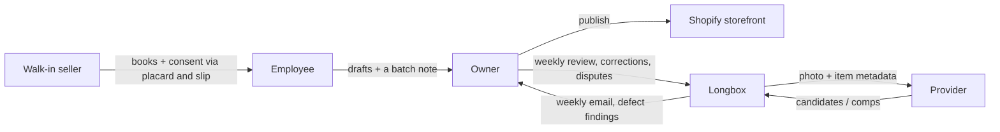

# Longbox Service Blueprints — Employee, Owner, Support, Provider

**Version:** 1.0.1 — patch: §0 timing sentence scoped to our own performance; planned artifacts admitted in §0; three line ranges nudged (gate audit).
**Bead:** E01-B03 `longbox-e5b.1.3` (epic E01 `longbox-e5b.1`, gate G1) — "Produce employee, owner, support and partner service blueprints."
**Filed:** 2026-09-03 · **Owner:** Jeremy Longshore · **Author:** parent session (service design) · **Audited:** `longbox-gate-auditor` before close
**Sensitivity:** Restricted internal when written, public since 2026-09-15 (014 §10). Every screen string quoted here is a 021 §3.1 registered string; nothing else in this document is shop-facing copy.
**Governed by:** 022 P1–P9 (RATIFIED — humans hold authority, overrides cheap, no per-person timing, accessibility, privacy of people in the frame, honesty about what the machine did, misuse path) · 019 §3.0 (eight safety controls before a live item) and §3.1–§3.6 thresholds · 021 (registered copy C1–C11; blocklist; retirement list) · 018 (evidence rules) · 017 (pain register, with severities).
**Built from:** 031 (what owners face and think; §5 what we'd ask / give back) · 032 (today's eight-step process, the two batches, the measurement protocol) · 014 §3 (the four actors) and §8 row E01-B03 · 003 (architecture) · the shipped phone UI (`public/index.html`, `public/app.js`).
**Supersedes:** 004 for E05 and E11 design purposes (§8). 004 is kept for its retailer language and is not deleted.

## 0. How to read a blueprint here

Each blueprint is one table, one row per step. The classic lanes are encoded in the column order:

`Physical evidence` · `Frontstage` — **line of interaction** — `Backstage` — **line of visibility** — `Support process` · `Systems` · `Failure path` · `Pain` · `Record written`.

- **Frontstage** is what the actor sees or touches. **Backstage** is what Longbox does that they never see. **Support process** is the part a Longbox human (or a runbook) performs behind the line of visibility.
- **Systems** reads `today → planned`: a file path is code that exists at this commit; a bead alias is work not yet built. "none today" is a finding, not an omission.
- **Pain** cites 017 with its severity (Critical / High / Medium / Low).
- **Record written** names the Hickey record appended — `scan_session`, `scan_photo`, `candidate_set`, `llm_rerank`, `human_confirmation`, `condition_assessment`, `pricing_snapshot`, `shopify_draft`, `media_deletion`, `cost_log`. Records append; nothing is edited in place (locked decision 4).
- No timing figure, no percentage and no rate appears anywhere in this document. T10 and T11 are PILOT-MEASURED-only (019 §3.3); 032 §3 shows the published estimates are not even measuring the same thing. The word "AI" appears in no shop-facing sentence (031 §3 finding).

## 1. Blueprint A — the employee scanning a long box

Actor: the person at the box (014 §3.1). They know comics; they are not expected to know grading scales, pricing sources or Shopify (017 P17).

| # | Physical evidence | Frontstage | Backstage | Support process | Systems (today → planned) | Failure path | Pain (sev) | Record written |
|---|---|---|---|---|---|---|---|---|
| A1 | Long box, bagged book, phone, counter | Opens the app, picks the shop, taps "Start scan session" | Shop row resolved; per-shop credentials resolved by key ref | — | `public/index.html:127-133`, `src/routes/scanSessions.ts` → sign-in + batch/box/task (E03-B02, E05-B04) | No shop registered → the screen says to register one; no session starts | P10 (Critical) | `scan_session` |
| A2 | The book in hand, front cover up | Photographs the cover; barcode photo or typed digits if the book has one | Upload validated, size-capped, stored; EXIF strip is planned, not shipped | — | `public/index.html:135-146`, `POST /scan-sessions/:id/photos` → EXIF strip + signed private storage (E05-B07, E03-B07) | Truncated upload → 413, no row, no bytes; oversize → rejected before any spend | P08 (Medium), P22 (High) | `scan_photo` |
| A3 | — | Taps "Identify" and waits | Barcode decoded first; only what is still ambiguous reaches a model; the re-rank must emit evidence | — | `src/services/barcode.ts`, `identify.ts`, `rerank.ts`, `src/providers/registry.ts` → full evidence ladder (E06) | Provider error → the flow falls to the manual search path, never a dead end | P01 (Critical), P04 (Critical) | `candidate_set`, `llm_rerank`, `cost_log` |
| A4 | — | Reads the band heading: "Best match" / "Close matches" / "Not sure enough to guess" | Band computed from evidence, then downgraded on contradiction | — | `src/services/bands.ts`, `public/app.js:100-106` (C1–C3 verbatim) | Contradiction → "The barcode and the cover don't agree. Check the issue number before you confirm." and the one-tap path is removed | P05 (High) | (band recorded on `candidate_set`) |
| A5 | The cover in their hand | High band: one tap on "Yes, that's the book"; or the always-present "Not this one — show other matches" | The tap is the truth of record; the machine's pick is kept as history | — | `public/app.js:128-148` | Wrong one-tap caught later → superseding confirmation, counted against T3 | P04 (Critical), P18 (High) | `human_confirmation` |
| A6 | Several similar covers | Medium band: picks from the grid. Low band: types what is on the cover | Manual entry creates an explicit candidate; no guess is substituted | — | `public/app.js:182-206`, manual-search block `index.html:155-160` | Search finds nothing → §5.3 dead-end path | P05 (High), P17 (Medium) | `human_confirmation` |
| A7 | Spine, corners, staples | Picks a grade **range** and taps the defects seen — never a number | Range + defect list stored as the human's words | — | `src/services/condition.ts`, `index.html:164-176` → shop-vocabulary ladder (E08-B01, E08-B03) | A numeric grade anywhere is a BLOCK (T7, non-waivable) | P07 (Critical), P08 (Medium) | `condition_assessment` |
| A8 | — | Sees the suggested price and where it came from, or an honest "no reliable price — here is your floor" | Every configured source runs independently; one bad source never blocks another; precedence is fixed | — | `src/services/pricingService.ts`, `pricing.ts`, `ebay.ts` → no-data / outlier / override flows (E09-B08) | All sources thin → policy floor, stated as the floor, not dressed as a comp | P06 (High), P25 (High), P24 (Medium) | `pricing_snapshot` (one per source), `cost_log` |
| A9 | — | Adjusts the price if they know the book | Override recorded with its reason; it is learning signal, never evidence against the person (022 P2/P3) | — | `index.html:184`, `POST /price` → auditable override (E09-B08, E11-B03) | Override with no reason → still recorded; never blocked behind a form | P12 (High) | `pricing_snapshot` |
| A10 | — | Taps "Send to Shopify draft" | One physical copy → one DRAFT; the provenance sentence C5 is default-on in the template | — | `src/services/shopify.ts` (DRAFT-only by construction) → staged media, retry, cleanup (E10-B04) | No credentials → stub; the pipeline does not block, and the draft is not claimed as live | P11 (Critical), P20 (Critical) | `shopify_draft` |
| A11 | — | Reads the decision strip: `Book: proposed → you confirmed · Condition: you · Price: policy → you changed` | Same string in the record and in the owner's audit view | — | none today → decision strip (E05-B09), C4 | Absent strip = a P8 honesty failure, caught by the E05-B09 acceptance | P17 (Medium) | (renders `human_confirmation` + `condition_assessment` + `pricing_snapshot`) |
| A12 | — | Sees "<Thing> saved. Undo", persisting until the next capture starts | Undo writes a superseding record; history is never edited | — | none today → undo + fix-the-last-item (E05-B09), C9 | No back path today from condition or price — a known gap, owned by E05-B09 | P18 (High) | superseding `condition_assessment` / `pricing_snapshot` |
| A13 | Next book out of the box | Next item — no re-login, no re-picking the box | Batch/box/task context carried forward | — | none today → rapid next-item loop (E05-B04) | Context lost → the operator re-enters it; friction, not data loss | P10 (Critical), P16 (High) | `scan_session` (next) |
| A14 | The stack of scanned books goes back in the box | Ends the batch; the drafts are waiting for the owner | Batch closed; the shift window is derived from session activity, never clocked in by a person | Longbox reads shift/batch aggregates only — never a person | none today → `batch` + derived `labor_shift` (E02-B03) | A per-person figure rendered anywhere is a K1 (T35, non-waivable) | P12 (High) | `scan_session` (batch link) |

## 2. Blueprint B — the owner reviewing drafts and the weekly email

Actor: the owner (014 §3.2). 031 §1: the owner is on the floor full time and is the constrained resource; the review happens at the end of a long day.

| # | Physical evidence | Frontstage | Backstage | Support process | Systems (today → planned) | Failure path | Pain (sev) | Record written |
|---|---|---|---|---|---|---|---|---|
| B1 | Laptop or tablet, back office | Opens the Shopify admin drafts list as usual — no new tool to learn on day one | Drafts were created with `status: DRAFT`; nothing was published | — | Shopify admin + `src/services/shopify.ts` → Longbox review queue (E11-B02) | Draft missing → §5.5; the reconciliation queue names it, the owner is not left guessing | P20 (Critical) | — |
| B2 | The draft on screen | Reads identity, condition words, price and its source, the decision strip (C4) and the provenance sentence (C5) | Read model assembles the session's records; nothing is recomputed | — | Shopify draft fields → per-draft review card (E11-B02, E11-B03) | A field the owner cannot trace = an honesty failure (022 P8) | P06 (High), P17 (Medium) | — |
| B3 | — | **Publishes** the good ones | Publishing is a human act in Shopify; the app has no publish path | Status watcher confirms who published | Shopify admin → `shopify_draft.published_by` + status watcher (E10-B05, T19) | Any `published_by='app'` row is a K1 safety pause (non-waivable) | P20 (Critical) | `shopify_draft` (status observed) |
| B4 | — | **Edits** identity, condition or price before publishing | The edit is captured against the session as a correction, not lost in Shopify | — | none today → correction capture (E02-B07, E11-B03) | Today an edit in Shopify vanishes as a signal — the exact 017 P18 failure | P18 (High) | superseding `human_confirmation` / `condition_assessment` |
| B5 | — | **Sends back** a draft: bad photo, wrong book, needs a second look | Item returns to the exception queue with the owner's one-line reason | — | none today → send-back (E11-B02, E11-B03) | No send-back today; the owner's only lever is edit-or-publish | P18 (High), P08 (Medium) | superseding record + queue entry |
| B6 | — | Sets the pricing policy once: floor, rounding, how far from the market they want to sit | Policy is a shop row; the price is reproducible from the snapshot plus the policy | — | `shop_pricing_policy` → policy/provider/budget admin (E11-B04) | Policy silently changed → the snapshot no longer reproduces; treated as a defect | P12 (High), P14 (Medium) | `pricing_snapshot` (policy version) |
| B7 | Phone buzzing at the counter | A duplicate or a sold-in-store book is flagged before it embarrasses anyone | Webhook and poll reconciliation across publish, sale, return, refund, deletion | — | none today → reconciliation (E10-B08, E02-B05) | A duplicate reaching a live listing is a K1 (T18, non-waivable) | P21 (High) | reconciliation rows against `shopify_draft` |
| B8 | Inbox | The plain weekly email: what got drafted, what we got wrong, what it cost — in hours and dollars, never a ratio, never a person | Aggregates by shift and batch only | Longbox drafts it; the owner corrects it | none today → weekly report (E11-B06 early slice), review (E16-B08) | A per-person column anywhere in it is a K1 (T35) | P02 (Critical), P12 (High) | — |
| B9 | — | Fifteen minutes with us: what was stupid this week | Corrections become the eval signal for the next batch | Weekly evidence, claims and economics review | none today → E16-B08 | Nothing learned from a correction = P18 unfixed | P18 (High) | — |
| B10 | Counter placard, buy slip | Keeps the placard up and the slip line in use | Consent flag on the session names the covering slip | We supply the placard and the slip — we never assume one exists (031 §4 row 10) | none today → consent path (E01-B06, T33 — a G1 blocker) | No consent path for a photographed item → capture pauses (non-waivable) | P22 (High) | `scan_session` (consent flag) |
| B11 | — | Asks: where are my photos, and when do they go? | Retention windows run on a schedule; holds exempt anything under dispute | Named windows per copy, including provider copies and their term (021 B15) | `migrations/003_reserve_principle_slots.sql` (slots reserved) → sweep + holds (E03-B09, T32) | An unqualified "your photos are deleted" is a blocked claim | P22 (High) | `media_deletion`, `retention_hold` |

## 3. Blueprint C — Longbox support: a stuck session, and a dispute

Actor: Longbox support (014 §3, the platform as an operator). At Pilot A there is no support console: every access is a manual, recorded break-glass act (022 P7).

| # | Physical evidence | Frontstage | Backstage | Support process | Systems (today → planned) | Failure path | Pain (sev) | Record written |
|---|---|---|---|---|---|---|---|---|
| C1 | Owner's text or email: "it's stuck on this book" | Owner describes the symptom in their words | — | Support asks for the session, never for the employee's name | none today → support channel (E11-B09) | A symptom report with no session id → ask for the item, not the person | P17 (Medium) | — |
| C2 | — | — | Triage: capture, identity, valuation or draft? | Read the batch aggregate first; an individual record needs break-glass | `cost_log`, `candidate_set`, `llm_rerank` → exception queue (E11-B02) | Guessing without the record is how a system defect becomes an employee's fault | P18 (High) | — |
| C3 | — | — | If an individual record must be read, the break-glass role is the **only** read path | A 006 row is written naming operator, reason and expiry, before the read | none today → break-glass admin (E11-B09); manual 006 runbook at Pilot A | Reading per-operator data outside break-glass is a K1 (T35, non-waivable) | P22 (High) | 006 row; access-audit entry |
| C4 | — | The employee is told within 7 days that their record was read | — | Deferral only for an investigation, logged with reason and expiry, delivered no later than 30 days after it closes | none today → notice path (E11-B09, 022 P3) | An open-ended deferral is not permitted | — | access-audit entry |
| C5 | — | — | Provider health, token expiry, rate limits, spend | Compare `cost_log` against the provider's own status | `src/services/pricingService.ts`, `costLog.ts` → provider health (E12-B04) | Silent provider failure → §5.5 | P01 (Critical), P03 (High) | `cost_log` |
| C6 | — | "Try it again — it should go through now" | Re-run appends new records; the failed attempt stays | Fix landed, or the item is routed to manual | `POST /identify` re-run → retry visibility (E05-B08) | A re-run that overwrites history would break locked decision 4 | P19 (High) | new `candidate_set` / `llm_rerank` |
| C7 | A buyer's message to the shop | Owner reports a dispute: the book was not what the listing said | — | The dispute is logged against the item, and the item goes on retention hold | none today → dispute record (E11-B04), hold rows in `migrations/003` | Photos swept away mid-dispute → the hold exists to prevent exactly that | P07 (Critical), P18 (High) | `retention_hold` + dispute record |
| C8 | — | The owner is told what the record shows: what was proposed, what the person confirmed | **A wrong machine call traced to a good-faith confirmation is a system defect, never an employee fault** (022 P1) — and it is not grounds for discipline | Support states this in writing, every time | none today → E11-B04 | Blaming the operator is a contract breach, not a judgement call | P17 (Medium) | dispute record (`system_defect`) |
| C9 | Monitoring notice in the employee's hand | If someone believes the data was used against them, the notice names a **role** and a 10-business-day window | Longbox pulls and provides the break-glass record and nothing more — it does not investigate or adjudicate | — | none today → C11 sentence, pilot agreement clause (E01-B05) | Longbox opining on an employment decision is out of scope by contract | — | access-audit entry |
| C10 | — | — | The week's defects, corrections and costs roll into the review | Weekly triage and evidence review | none today → E16-B08 | A defect nobody reviews recurs | P18 (High) | — |

## 4. Blueprint D — a partner/provider degrading (pricing or catalog)

Actor: the provider (014 §3.3). K4 in 019: the pipeline never blocks on a provider, and a re-route only ever goes to a provider with a signed processor term and a T25-traceable source.

| # | Physical evidence | Frontstage | Backstage | Support process | Systems (today → planned) | Failure path | Pain (sev) | Record written |
|---|---|---|---|---|---|---|---|---|
| D1 | — | Nothing — the employee is mid-book | Provider returns 429/5xx, or its token has expired | — | `src/services/pricing.ts`, `ebay.ts` (OAuth2 app token, cached) | A token expiring silently is the common case, not the exotic one | P03 (High) | `cost_log` (error category) |
| D2 | — | Nothing | Every configured source runs under `Promise.allSettled` — one failure never blocks another | — | `src/services/pricingService.ts` | A sequential fan-out would have made one dead vendor a dead product | P03 (High) | `pricing_snapshot` per surviving source |
| D3 | — | The price the employee sees follows fixed precedence: historical FMV → live-ask median → the shop's policy floor | Precedence is code, not a heuristic | — | `pickDrivingResult` in `pricingService.ts` | Asks are never labelled as market value (T25/E09-B04) | P25 (High) | `pricing_snapshot` |
| D4 | — | "No reliable price — here is your floor" reads as a normal state, not an error | With a median long-box book around a few dollars, this is the common path (032 §5) | — | none today → honest no-data state (E09-B08) | An invented value would be worse than a blank (017 P06) | P06 (High) | `pricing_snapshot` (no-data) |
| D5 | — | Nothing | Missing credentials degrade to a stub rather than a hard failure | — | all external clients stub when creds are empty | A stub must never be reported as a live result — 016 records the shipped stub explicitly | P01 (Critical) | `pricing_snapshot` / `shopify_draft` (stub flagged) |
| D6 | — | — | Sustained outage is declared, and declared-outage windows are excluded from the draft-success threshold | Support declares it and records it | none today → outage declaration (E13-B04, T17) | An undeclared outage silently degrades a threshold | P03 (High) | 006 row |
| D7 | — | — | Processor-term expiry monitoring: egress to a provider stops when its term lapses | Processor registry with expiry | none today → E04-B05 (T32) | Egress under a lapsed term is a K1 | P22 (High), P26 (Critical) | processor-registry row |
| D8 | — | — | Rights check: any imported or displayed image without a source-registry row carrying a permitted-use flag is blocked | — | none today → rights registry (E04-B05, T25 non-waivable) | Untraceable image → BLOCK, not a warning | P26 (Critical) | rights-registry row |
| D9 | — | Nothing visible | Re-route to another provider only if that provider has signed terms and traceable sources | K4 economics pivot; a re-route that would fail T25/T32 escalates to K6 | none today → provider routing (E12-B04) | Cheapest-provider routing without terms is the failure this rule exists to prevent | P01 (Critical), P26 (Critical) | 006 row, `cost_log` |
| D10 | — | — | Removing a provider entirely must leave Longbox history intact | Provider-removal test | none today → E04-B12 | Vendor lock-in by data shape is the 017 P09 failure | P09 (High) | — |

## 5. Failure paths, explicitly

### 5.1 Poor or no Wi-Fi mid-session (017 P19, High)

| Aspect | Today | Planned (E05-B08) |
|---|---|---|
| What is queued | **Nothing.** Every step is a live request; there is no client-side queue | Encrypted offline queue; resumable upload; explicit retry visibility |
| What is lost | The in-flight step. A photo that did not upload is not on the server; the tab holds no durable state | Nothing — lost/duplicated items = 0 across the airplane / intermittent / restart matrix (T23) |
| What the employee sees | A raw failure string on the status line | Queued/synced state per item, and a "these are waiting" list |
| What the record shows | A `scan_session` with a photo that never arrived — an orphan, not a corruption | Queue entries reconciled on reconnect; a superseding record, never an edit |
| Rule | The append-only model means a retry appends; it can never silently overwrite an earlier attempt | Conflict handling and storage-pressure handling are part of the same bead |

### 5.2 Interruption — a customer at the counter

| Case | What happens | What the record shows |
|---|---|---|
| Parked | The employee walks away mid-book. The session row exists with whatever records it has | A `scan_session` with, say, `scan_photo` and `candidate_set` but no `human_confirmation` — visibly incomplete, not wrong |
| Resumed | Today: they must find their way back through the same screens; there is no session list. Planned: the session is waiting in their list (E05-B04, E05-B09) | Records append from where they stopped |
| Abandoned | The session stays incomplete forever. That is the honest state; it is never auto-completed | An incomplete session is excluded from draft-gate counts and named in the batch note |
| Never | The clock is not on the person. An interruption is not a measured event about an operator (022 P3, T35) | No per-person timing exists to be affected |

### 5.3 A low band and a manual-search dead end

Employee sees "Not sure enough to guess" · "Search for it — type what's on the cover." (C3). They type the title and issue; nothing matches — a pre-barcode book, a regional printing, a title the corpus does not carry. 032 §5 says this is the normal case for long-box inventory, not the edge case.

- The flow must end in a **completable** action, never a shrug: manual entry creates an explicit unverified candidate that the human owns, and the item still reaches a draft (E05-B09, E06 abstention path).
- Abstention is reported (T6). A rising abstention rate with flat accuracy is a calibration flag, not an operator problem.
- The item may also be set aside for the owner — a send-back before it was ever a draft (E11-B02).
- Record: `candidate_set` (empty or thin) + `human_confirmation` with the manual identity, or an incomplete session with a reason.

### 5.4 A contradiction (locked decision 7)

The re-rank says one thing and its own evidence says another — the barcode reads one issue, the ranked cover is another.

| Step | Behaviour |
|---|---|
| Detection | The evidence the model emits is cross-validated against candidate metadata before any band is shown |
| Effect | **The one-tap path is removed.** A high band carrying a contradiction is downgraded and renders as a forced pick |
| Copy | "The barcode and the cover don't agree. Check the issue number before you confirm." (C3, verbatim, `public/app.js:105-106`) |
| Record | `llm_rerank` carries the evidence and the contradiction flag; the human's pick is the truth of record |
| Why | A false confirm at the high band is the expensive error — it reaches a listing with two humans' apparent blessing (T3, K2) |

### 5.5 A provider outage — stub mode, and the pipeline never blocks (019 K4)

Covered step-by-step in §4. The invariant: a missing or failing external service degrades the *quality of the suggestion*, never the *availability of the flow*. A stub result is flagged as a stub and is never reported as a live one; the price falls to the shop's own policy floor, which is a first-class state and not an error. Declared outages are excluded from the draft-success threshold so a vendor's bad afternoon does not become our red line.

### 5.6 The owner rejects a draft

| Owner action | What flows back | Record |
|---|---|---|
| Edits identity | The item returns to the accuracy record as a correction against that scan — not as a Shopify edit that nobody sees | superseding `human_confirmation` (E02-B07) |
| Edits condition | The human's revised words replace nothing; they supersede | superseding `condition_assessment` |
| Edits price | Policy is unchanged; the override is recorded with its reason | superseding `pricing_snapshot` |
| Sends back | The item lands in the exception queue with a one-line reason: bad photo, wrong book, needs a second look | queue entry + superseding record (E11-B02/B03) |
| Never happens | The correction is never attributed to a named operator in any view, report or export (T35) | — |
| Cost of not doing this | 017 P18: today corrections vanish into Shopify edits and nothing learns |

### 5.7 A walk-in seller revokes consent (022 P7)

| Step | Behaviour |
|---|---|
| Trigger | The seller says: take those photos down |
| Clock | **5 business days** — the same clock as a bystander frame, deliberately, so counter staff can recite one number |
| Longbox-controlled storage | Stored originals and unpublished derivatives are deleted; the object is tombstoned |
| The record | The event row survives; the photo does not. A `media_deletion` row is appended naming the reason code and the storage key |
| Already published | Listing media already published is **replaced**, not retroactively unpublished |
| Provider copies | Governed by the signed processor term; the shop-facing wording names the provider and its window. No unqualified deletion promise is ever made (021 B15) |
| Holds | If the item is under a dispute, return or complaint, the hold wins and the deletion waits — and the hold itself is an immutable row with a review date |
| Systems | `media_deletion`, `retention_hold` slots reserved in `migrations/003_reserve_principle_slots.sql`; the sweep and the runbook are E03-B09 / E01-B06 |

### 5.8 A wrong machine call surfaced by a buyer (022 P1 blame clause)

| Step | Behaviour |
|---|---|
| Arrival | A buyer tells the shop the book is not what the listing said |
| First act | The item goes on retention hold so nothing about it is swept while it is in question |
| The record | The session shows what was proposed, what the band was, whether there was a contradiction, and what the person confirmed |
| The finding | A dispute traced to a good-faith confirmation of a system proposal is recorded as a **system defect** |
| The rule | **Never an employee fault, and never grounds for discipline** — a contract clause in the pilot agreement, not a courtesy |
| What Longbox does not do | Investigate, adjudicate or opine on any employment decision. It provides the record; that is the whole of it |
| Feedback | The defect enters the weekly review and the eval signal; a high-band false confirm that reached a published listing trips a review on its own (K2) |

## 6. Handoffs — who hands what to whom

| From → to | Artifact | Consent / rights condition |
|---|---|---|
| Walk-in seller → employee | The books, and consent to photograph them for listing | Counter placard plus one pre-printed line on a slip **we supply** — never assumed to exist (031 §4 row 10). Per batch, revocable, 5-business-day deletion clock. Capture does not start without it (T33, G1 blocker) |
| Employee → owner | The batch's DRAFT listings plus a plain note: what was odd, what was set aside | No per-person attribution travels with it. The decision strip (C4) travels with each item |
| Owner → Shopify | Publication of a draft | A human act in the Shopify admin. The app has no publish path; any `published_by='app'` row is a K1 (T19, non-waivable) |
| Owner → Longbox | Weekly review notes, corrections, disputes; sales data for the shop's own metric | Sales data only under a signed processing scope (E01-B06). Buyer-identifying fields are dropped at the Shopify boundary and never ingested (022 P7) |
| Longbox → provider | A photo and item metadata for identification or valuation | Only under a signed processor term with a recorded retention window and expiry; the pilot is capped at two external processors, and a third is a recorded decision with its own counsel line |
| Provider → Longbox | Candidates, comps, catalog metadata | Every imported or displayed field and image needs a source-registry row with a permitted-use flag; anything untraceable is blocked, not warned about (T25, non-waivable) |
| Longbox → owner | The weekly email; defect findings; the break-glass record on request | Shift and batch aggregates only. No per-operator column in any report, template or export (T35, non-waivable) |
| Longbox → employee | Notice that an individual record was read; the monitoring notice before first use | Notice within 7 days; deferral only for an investigation, logged with reason and expiry, delivered no later than 30 days after it closes |
| Owner/Longbox → the public | Any sentence about the shop, the pilot or the results | Separate written consent every time, never a box ticked once (021 B12) |

## 7. The owner-review path in detail

**Today** the review surface is the Shopify admin drafts list. **Later** it is the Longbox queue (E11-B02/B03). The content of the review does not change between them; only the ergonomics do.

**What the owner sees, per draft:**

1. **Identity** — title, issue, printing or variant designator, written the way the shop's own catalogue writes it. 031 §7 and 032 §5: sample the shop's real titles at onboarding; a draft that looks foreign gets rejected on sight.
2. **Condition, in words** — a grade range plus the defects the person named. Never a number, anywhere (locked decision 5, T7). 032 §1.3 confirms this is live commercial practice, not a principle we invented: the back-issue trade already prices on a word ladder.
3. **Price and its source** — the suggested price with which source drove it, how fresh that evidence is, and honestly nothing where there is nothing. A live ask is never presented as a market value.
4. **Decision strip (C4)** — `Book: proposed → you confirmed · Condition: you · Price: policy → you changed`. The same string that was on the employee's screen and in the record.
5. **Provenance sentence (C5)** — "Issue, variant and condition confirmed by a person at this shop; identified with software assistance." Default-on in the draft template, removable per listing, and the removal is recorded and counted.

**The three actions:**

| Action | What the owner does | What it writes | Bead |
|---|---|---|---|
| **Publish** | Publishes in Shopify | Status observed by the watcher and recorded on `shopify_draft`; `published_by` is the person | E10-B05, T19 |
| **Edit** | Fixes identity, condition wording or price, then publishes | A superseding record against the scan session — the correction is kept as accuracy signal instead of vanishing into a Shopify edit (017 P18) | E02-B07, E11-B03 |
| **Send back** | Returns the item with one line: bad photo, wrong book, second look | A queue entry plus the superseding record; the item is re-scannable without re-entering anything | E11-B02, E11-B03 |

**What the owner never sees:** a ranking of their staff, a fastest-operator view, a per-person correction count, or a per-person minute figure. Any per-employee view the owner can open, that employee can open about themselves — symmetry by construction. The owner cannot switch the employee's own view off.

## 8. What changes versus doc 004

004 was written in retailer language before any of the registers existed. Its instincts hold; several of its specifics do not.

**What 004 got right, and this document keeps:**

- The three-band confirm shape — one tap when the evidence is strong, a forced pick when it is not, a search box when it is weak — and the rule that a contradiction never one-taps. That is now locked decision 7 and 021 C1–C3.
- Condition as a range plus named defects, in plain retail language, never a number.
- No auto-publish anywhere; drafts wait for the owner.
- Corrections as the learning signal, kept as history rather than erased.
- "No 'the AI says' dead ends" — every weak result lands in a flow the employee already understands.

**What is superseded:**

| 004 says | Superseded by | Why |
|---|---|---|
| "A book should take well under a couple of minutes; the confirm tap is the slow part" (Journey 1 step 7) | §0 of this document; no timing figure appears here | The whole "seconds/minutes" family is retired until PILOT-MEASURED (021 §2; 019 §3.3). 032 §3 shows published per-listing estimates spread from three minutes to forty and are not even measuring the same thing |
| "If the connection drops or the tab closes mid-book, the session is waiting in the list when you come back" (Journey 1, closing line) | §5.1 | Stated as if built. There is no offline queue and no session list today; E05-B08 and E05-B09 own them. 032's protocol and 017 P19 make this a first-class failure path, not a footnote |
| "The app pulls recent comps" (Journey 1 step 6) | §5.5, D3, D4 | Real sold comps are not available to us (017 P25). The precedence is historical FMV → live-ask median → policy floor, and 032 §1.3's sold-out sentinel proves a listed price without an availability signal is not evidence at all |
| "Most drafts should be publish-ready" (Journey 2 step 3) | §7 | An expectation with no measurement behind it. Owner acceptance is a threshold to be measured at the pilot, not a promise in a journey |
| "The owner fixes the draft in Shopify" (Journey 3 step 2) | B4, B5, §5.6 | 004 treated a Shopify edit as sufficient. 017 P18 records the consequence: the correction vanishes and nothing learns. The correction must be captured against the session |
| Two personas (employee, owner) | §1–§4 | Longbox support and the provider are actors with their own frontstage, failure modes and rights conditions (014 §3). A blueprint with only two actors cannot express the break-glass rule, the processor terms or a provider outage |
| Nothing about people in the frame, consent, or per-person data | §5.7, §6, B10, C3, C4 | 022 P3 and P7 did not exist when 004 was written |

004 is **superseded by 033 for E05 and E11 design purposes** and is retained for its retailer language; a one-line note to that effect has been added at its head and its Version bumped.

## 9. Design implications, by bead

- **E05-B01** (task flows and mobile IA) — build the flow from §1, not from 004 Journey 1. Two states 004 never named are structural: the parked session (§5.2) and the manual dead end (§5.3). Time the *step*, never the person, and never gate on the observation time itself.
- **E05-B02** (design system, content language, touch targets, error and undo patterns) — every screen string is a 021 registered string or it is not written. Errors say what to do next and never blame the person. No percentage, no timing, no "AI".
- **E05-B04** (batch/box/bin context and the next-item loop) — A13 and A14: context must survive the interruption in §5.2, and the batch, not the operator, is the unit everything is counted against.
- **E05-B08** (offline queue) — §5.1 is its specification. Lost or duplicated items = 0 across the airplane, intermittent and restart matrix. Queued/synced state is frontstage, not a debug detail.
- **E05-B09** (interaction shell) — owns three things this blueprint depends on and the shipped UI does not have: the decision strip (C4, A11), undo persisting until the next capture (C9, A12), and a back path from condition and price.
- **E08-B01** (condition policy) — take the vocabulary from live commercial practice (032 §1.3's nine-label ladder), not from a grading manual, and make the range the primitive. Zero numeric grades in schema, API, prompt, listing or screen.
- **E09-B08** (no-data, outlier, override) — D4: "no reliable price — here is your floor" is the common path for a long-box book, so it must read as a normal state and not as an error. Overrides are one action on the screen that showed the suggestion.
- **E10-B04** (staged media, processing state, retry, cleanup) — carries C5 into the draft template default-on, and cleanup must respect retention holds (§5.7).
- **E10-B08** (webhook and poll reconciliation) — B7: the physical copy is unique, so a single listing plus an in-store sale is a guaranteed double sell unless something reconciles (032 §2). This is not hypothetical.
- **E11-B02** (exception queue) — §5.3 and §5.6 both terminate here: the manual dead end and the send-back. The queue is the owner's inbox for everything the flow could not finish.
- **E11-B03** (compare, approve, edit, reassign, undo) — §7's three actions, with the edit writing a superseding record rather than a silent Shopify change.
- **E11-B06** (dashboards and the weekly report) — B8: shift and batch aggregates only; hours and dollars, never a ratio; no per-operator column in any report, template or export.
- **E11-B09** (audit, privacy requests, support impersonation, break-glass) — C3, C4 and C9 are its acceptance: break-glass as the only read path, the 7-day notice, the deferral rule, and a role-named misuse contact.
- **E16-B03** (training) — teach §1 as it is, including the failure paths. An operator who has seen §5.2 and §5.3 once will not treat them as their own mistake.
- **E16-B08** (daily triage, weekly review) — B9, C10: the loop that turns §5.6 corrections and §5.8 defects into next week's behaviour. Fifteen minutes, mostly the owner telling us what is stupid.

## 10. Maintenance

Supersede a step here when the bead named in its Systems column lands, and record the change in 006. When a pilot shop runs the 032 §4 protocol, its observation supersedes the assumed shape of §1 and §5.2 the way 032 §1/§4 will be superseded — this blueprint is a design instrument, not a measurement, and nothing in it moves a threshold or earns a claim (018 A3, 021 §2). New registered copy goes to 021 §3.1 first and is quoted here verbatim afterwards, never invented in place.
