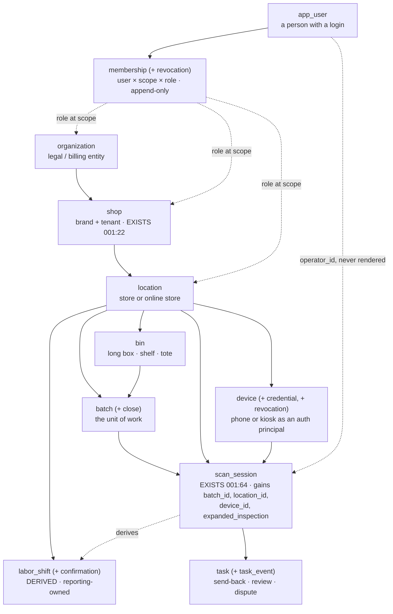

# Decision Record — Tenancy and Work-Context Model: Organization, Shop, Location, User, Role, Device, Batch, Bin, Task and the Derived Labor Shift

**Version:** 1.2.0 — minor (amend-by-a-row from 048 §7.4, applied at 048's ratification 2026-09-04): `device_credential.key_ref` becomes `token_hash`. One column's meaning changed; §11 stays signed and nothing else in this record moved. See the change log.
**Status:** RATIFIED 2026-09-03 by the acting head of board under Jeremy Longshore's 2026-09-03 delegation, after a two-lens cannon (`rich-hickey-reviewer`, `martin-fowler-reviewer`, both ACCEPT-WITH-CHANGES). Binding per §11. Jeremy may revise any line by a 006 decision-log row.
**Bead:** E02-B03 `longbox-e5b.2.3` (epic LBOX-E02 `longbox-e5b.2`, gate G2, evidence class DEC, owner-role product, risk critical) — see 000-docs/014 §8 row E02-B03
**Drafted:** 2026-09-03 by `longbox-domain-builder` · **Cannon:** `rich-hickey-reviewer` + `martin-fowler-reviewer`, 2026-09-03 · **Decision owner:** Jeremy Longshore · **Audit:** `longbox-gate-auditor` before close
**Sensitivity:** Restricted internal (014 §10)
**Supersedes:** nothing — first tenancy record.
**Inputs:** 014 §8 rows E02-B03, E03-B02/B03/B04, E05-B04 · 015 alias map · 029 v1.1.1 §2.1, §2.2, §2.8, §2.10, §3.1, §9, §12 (module ownership, dependency rule, amend-by-a-row, transaction convention) · 030 v1.1.1 §2.5, §7.1, §8 (LCID rule, `lcid_registry` FK pattern, `identity_resolution`) · 033 v1.0.1 §1 A1/A13/A14, §3 C2/C3, §5.2, §5.6, §7 (the four blueprints: who acts where, handoffs, interruption and parked sessions) · 028 v1.3.1 §4 rows 4–6 (the representative shop) · 031 v1.0.2 §1 and §8 (ComicsPRO: 81% single storefront, 30% no employees) · 032 v1.0.1 §5 (what a `batch` must carry) · 022 P2, P3, P7 (per-person data only after auth + RBAC; T35; symmetry; break-glass as a distinct role) · 019 v1.2.0 §3.0, §3.2 segments, T24, T35, T34 · 016 C4, C6, C8, C23 · `migrations/001_init.sql`, `migrations/003_reserve_principle_slots.sql`, `src/routes/scanSessions.ts`, `src/services/scanSession.ts`, `scripts/register-shop.ts` · 018 (evidence rules) · CLAUDE.md locked decisions 4, 5.

## Change log

**Version convention** (006's convention, 029 as the worked example): a **minor** bump means the content of a decision changed; a **patch** means a statement of fact was repaired with no decision changing. **1.0.0 → 1.1.0 is a minor bump** — eight cannon amendments were absorbed, none declined, and four of them (A1, A2, A4, A5) change what the schema is. A reader who acted on v1.0.0's §2.11 `source_bins` column, its §2.12 polymorphic subject, its nullable `shop.organization_id` or its §3.3 accessor scope must re-read those sections; nothing in §1 was disturbed.

| Version | Date | What changed | Authority |
| --- | --- | --- | --- |
| 1.0.0 | 2026-09-03 | Initial draft, Status PROPOSED, §11 unsigned. | `longbox-domain-builder` |
| **1.1.0** | **2026-09-03** | **RATIFIED. Eight cannon amendments absorbed, none declined.** **A1** (Hickey F1) `batch.source_bins jsonb` is replaced by the append-only join table `batch_source_bin`; new invariant I14; §4.1, §4.2 and §3.1's seed rows updated. **A2** (Hickey F2, Fowler concurring) `task`'s polymorphic `subject_table`/`subject_id` is replaced by three nullable FKs under `CHECK (num_nonnulls(...) = 1)`; I11 becomes a constraint-existence test; §9 Q4 is rewritten as decided. **A3** (Hickey F3) §2.12 states that `task`/`task_event` rows are ordinary same-transaction inserts by `workflow`, not outbox effects, and names the open item for E02-B07/B09. **A4** (Hickey Q5 over Fowler F1) `organization` is **kept**, minimal: `shop.organization_id` is `NOT NULL` and `register-shop` seeds one organization per shop 1:1; Fowler's dissent (defer it) is preserved in §11. **A5** (Fowler F2) pre-G2 `created_by`/`confirmed_by` fall **inside** the T35 accessor contract; §3.3, §4.4 and I9 updated. **A6** (Fowler F3) the G3 re-derivation of the gap rule is **segmented by staffing pattern**, with a named fallback if the distribution is not bimodal. **A7** (Fowler F4) §3.2 and §7 state the go-live posture explicitly against 019 §3.0 and §5: all three isolation layers are a go-live condition and no live shop data ever runs on a runtime-assertion-only boundary. **A8** §2.8 stands as drafted (Hickey found no complecting); one sentence added routing device handoff and credential rotation to E05-B04 and E03-B02/B04. §1's "today" claims are unchanged and re-derived at `737e12d`. | Two-lens cannon → acting head, §11 |
| **1.2.0** | **2026-09-04** | **Minor — one column's meaning changed, by an amend-by-a-row from another record's ratification, not by re-argument here.** 048 §7.4 found that §2.8's `device_credential.key_ref text NOT NULL` — *"the NAME of a reference, never a key or a public key blob — the `shop_credentials:34-35` rule, applied verbatim (locked decision 2)"* — **applied a correct rule verbatim to an object it does not fit.** `shop_credentials.key_ref` names an **environment variable an operator provisions**, and `migrations/014` has since narrowed it to a `LONGBOX_<SEGMENT>_<REST>` shape bound to the shop's slug. A device credential is **minted by the system, one per phone**: there is no environment variable for it to name, and satisfying the rule literally would mean an env var per enrolled device — **unimplementable at the second phone.** **The column becomes `token_hash text NOT NULL`** — `sha256` of a 256-bit system-minted secret — and I4 is rewritten to assert what that column must be rather than what the old one must not hold. **A hash of a system-minted secret is not a key: it opens nothing, and it is the same object 048 §3.2 stores for a session token.** **Locked decision 2 is untouched** — it governs **provider** credentials, every one of which still names an environment variable and none of which is stored. **A minor and not a patch** because what a column holds is a decision, not a statement of fact about the tree (006 `:6`; the same test 042 v1.2.0 applied to a nullability change). §11 stays signed, no other section moved, and 048 §7.4 carries the residual this creates: the device credential is now bearer material in a browser cookie jar, with its compensating controls and its keypair end state named there. 006 carries the row. | 048 §7.4 amend-by-a-row → acting head |

## 0. Evidence posture

Per 018 A1/A3, and with 029 v1.0.0's gate-audit failure (blocker B1 — a "today" claim asserted at REPRODUCED on the strength of having read a file, later found false) treated as the governing lesson:

- **Every "today" claim in §1 is REPRODUCED at `737e12d`** (branch `feat/e02-b03-tenancy-and-work-context`, replayed onto main; PR #43), each carrying either a `file:line` or the verbatim grep that produced it. §1 lists the grep commands so a reader can re-run them rather than trust the reading. A rung is earned by the citation, not by the reading. **Every cite was re-run after the replay**, not carried across: `git diff 484f069 737e12d -- src migrations scripts` is empty and every line number in §1 re-derives unchanged, which is why v1.1.0 is a minor and not a patch bump.
- **Ratification is not evidence.** §11 records that this design was adopted after two lenses argued it. It does not move any claim up the 018 ladder: §2–§7 remain ASSERTED, and the amendments below are better decisions, not measurements.
- **Every entity, column, invariant and migration step in §2–§5 is ASSERTED.** No DDL exists. No code exists. Nothing here is TESTED, and ratification would not move it: §11 records that a design was adopted, not that anything works.
- **The gap rule in §2.9 is a PROPOSED numeric parameter** and stays PROPOSED until it is signed and then re-derived from Pilot A data (018 A3: numeric thresholds are PROPOSED until signed; 018 C3: a signed threshold moves only by a logged decision naming old value, new value, motivating batch and evidence rung). It is stated here so that it can be argued with, not so it can be quietly adopted.
- **No timing figure, percentage or rate about Longbox appears in this record** (019 §3.3, 021 §2). The percentages in §3 are ComicsPRO survey figures about the trade, cited to 031, and are SOURCED about third parties.
- **This record decides schema shape. It does not authorize a per-operator surface.** T35 is non-waivable and the cheapest way to satisfy it is never to build one (022 P3, CFO). §2 reserves attribution columns; §5 constrains who may read them.

## 1. What exists today (REPRODUCED at `737e12d`)

| # | Claim | Evidence |
|---|---|---|
| E1 | **There is exactly one tenancy table.** `shop(id, name, slug, shopify_domain, created_at)` — no parent, no children, no people. | `migrations/001_init.sql:22-28` |
| E2 | Its two companions are credential references and pricing policy, both keyed only by `shop_id`. `shop_credentials.key_ref` is the NAME of an env/SOPS reference, never a raw key (locked decision 2). | `migrations/001_init.sql:30-38` (`:34-35` comment + `key_ref`), `:41-49` |
| E3 | **No organization, location, user, role, membership, device, batch, bin, task, `labor_shift`, `batch_id`, `item_slice` or `expanded_inspection` exists anywhere in the tree.** `grep -rniE 'organization\|CREATE TABLE (location\|"?user"?\|role\|membership\|device\|batch\|bin\|task\|labor_shift)\|batch_id\|item_slice\|expanded_inspection' --include=*.ts --include=*.sql src migrations scripts`, discounting the `retention_*` tables, returns **zero lines**. | grep, zero matches |
| E4 | **`labor_shift` is named in the schema but has no table.** It appears only as a string inside two CHECK enums — `retention_policy.artifact_class` and `retention_hold.target_table`. 029 §2.10 records the same finding and assigns the future table to `reporting`. | `migrations/003_reserve_principle_slots.sql:187`, `:215`; default row seeded at `:267` |
| E5 | **The actor on a session is a free-text string with a default.** `scan_session.created_by text NOT NULL DEFAULT 'employee'`; likewise `human_confirmation.confirmed_by text NOT NULL DEFAULT 'employee'`. | `migrations/001_init.sql:67`, `:117` |
| E6 | **That string comes from the client, unauthenticated.** The route parses it out of the request body with a default and hands it straight to the insert. This is 016 C4, re-derived at this SHA (016 C4's own line numbers are from an earlier commit). | `src/routes/scanSessions.ts:97`, `:100` (`created_by`); `:204`, `:211` (`confirmed_by`); insert at `src/services/scanSession.ts:19` |
| E7 | **There is no authentication or authorization layer at all.** `grep -rniE "authenticate\|jwt\|session cookie\|bearer\|preHandler\|onRequest" --include=*.ts src` returns only two provider-outbound `authorization: Bearer` headers (`src/services/ebay.ts:91`, `src/providers/openaiCompat.ts:28`). No inbound auth hook is registered. | grep, two outbound-only matches |
| E8 | **Tenancy is a path parameter validated as a UUID and nothing more.** `const shopParams = z.object({ shopId: z.string().uuid() })`; every handler re-derives scope from it. Any caller who knows a shop's UUID is inside that shop. | `src/routes/scanSessions.ts:50`; used `:94`, `:107`, `:117`, `:165`, `:198`, `:220`, `:252`, `:313` |
| E9 | **Every shop is enumerable without credentials.** `GET /api/shops` returns `id, name, slug` for every row. That endpoint is what makes E8 exploitable rather than merely weak. | `src/routes/scanSessions.ts:86-89` |
| E10 | **There is no row-level security.** `grep -cE 'ROW LEVEL SECURITY\|CREATE POLICY' migrations/*.sql` → `0` in all three migrations. `shop_id` is therefore a convention enforced by every hand-written `WHERE`, not a boundary (016 C6, C8, C23). | grep, three zero counts |
| E11 | **The attribution slots already exist, deliberately empty.** `operator_id uuid` (nullable) and `actor_verified boolean NOT NULL DEFAULT false` were added to `scan_session`, `human_confirmation`, `condition_assessment` and `pricing_snapshot` by migration 003, with the comment stating why: pre-G2 rows are aggregate-only *by construction*, and **no row is ever backfilled to true**. | `migrations/003_reserve_principle_slots.sql:44-73` (rationale `:46-51`, the loop `:66-72`, columns `:69`, `:71`) |
| E12 | **The supersession pattern this record must reuse already ships.** `supersedes_id` self-FKs plus a partial unique index making a row superseded at most once, on `condition_assessment`, `pricing_snapshot` and `human_confirmation`. | `migrations/003_reserve_principle_slots.sql:84-104` |
| E13 | **The grant/release pattern this record must reuse also already ships.** `retention_hold` has no `released_at` column; a release is a separate immutable `retention_hold_release` row, unique per hold. The header comment states the reason explicitly. | `migrations/003_reserve_principle_slots.sql:18-21`, `:205-232` |
| E14 | **`shop`, `shop_credentials` and `shop_pricing_policy` are mutable; the event tables are not.** The append-only trigger array names nine tables and none of the three config tables. The file's own header calls config "mutable-by-append". | `migrations/001_init.sql:1-4`, `:171-182` (array `:174-176`) |
| E15 | **`scan_session` is mutable too** — `setSessionStatus` issues an `UPDATE`, which is legal precisely because `scan_session` is not in E14's array. This is what makes §4's added columns an ordinary expand rather than a Hickey violation. | `src/services/scanSession.ts:41` |
| E16 | **The only transaction in the whole repository is in the onboarding script.** `grep -rn "BEGIN\|COMMIT\|ROLLBACK" --include=*.ts src scripts` → `scripts/register-shop.ts:46`, `:75`, `:84` only. There is no transaction in the request path; `src/db.ts` exports `getPool` (`:5`) and `closePool` (`:12`) and no transaction helper. 029 §12's NOTHING-EXISTS-YET block reproduces at this SHA. | grep, three matches, all in one script |
| E17 | **`register-shop` is the whole of onboarding**: one `shop` row, one `shop_credentials` row per configured kind, one `shop_pricing_policy` row, three `retention_policy` rows, inside the E16 transaction. | `scripts/register-shop.ts:48`, `:53`, `:60`, `:70` |

**What §1 adds up to.** The system has a *tenant* (E1), *credential and policy config hanging off it* (E2), *reserved but empty attribution slots* (E11), and *two proven append-only idioms to build on* (E12, E13). It has **no people, no places, no devices and no unit of work** (E3), **no way to know who is calling** (E6, E7), and **no boundary between tenants except a hand-written `WHERE`** (E8, E9, E10). E02-B03 is the missing middle. Like 030, it is additive: no existing table changes meaning, no existing row is touched, and every attribution column it fills was already reserved for it.

## 2. Decision A — The entities

Eleven new tables plus two column additions to `scan_session` and one to `human_confirmation`. Each row below fixes: identity (uuid vs LCID), owning module (029), mutability class (config vs immutable record), and its invariants.

### 2.0 Identity: uuid everywhere, LCID nowhere

**Every entity in this record is keyed by a `uuid` primary key.** No tenancy or work-context table carries an LCID, and no tenancy table is an FK target for an `*_lcid` column.

030 §2.5 is precise about what an LCID is for: it is the stable, provider-neutral name of a *catalog thing* — a `collectible_definition` or an `edition` — whose identity must survive a corpus refresh, a provider leaving, and a row being rewritten by a new corpus version. That is the problem LCIDs solve, and it is not a problem an organization or a bin has. A `location` is not versioned by a corpus, is never proposed by a provider, and has no crosswalk. Giving it an LCID would buy nothing and would break 030 I3, which asserts that **every** `%_lcid` column carries a real FK to `lcid_registry(lcid)` (030 §8, `tests/integration/lcid-registry-integrity.test.ts`): a tenancy LCID would either need a registry row it has no business having, or would fail that constraint-existence test. So the rule stated plainly, for the reader who reaches for the pattern by reflex:

> **LCIDs name catalog things. Tenancy and work context use uuids.** No table in this record carries a `*_lcid` column; 030 I3 is unaffected by anything here.

### 2.1 The shape, as a picture



Read the absences: **no arrow runs from `app_user` to `labor_shift`** (§2.9), and the one arrow from `app_user` to `scan_session` is dashed and annotated, because it is a column that exists to be audited, not read (§5, I9).

### 2.2 `organization` — the legal and billing entity

| Field | Notes |
|---|---|
| `id uuid PK` | |
| `name text NOT NULL` | trading name |
| `legal_name text` | nullable — many single-shop LLCs have no distinct one |
| `billing_email text` | |
| `created_at timestamptz NOT NULL DEFAULT now()` | |

**Owning module:** `identity` (029 §2.1 — "tenancy and authentication only").
**Mutability:** config, mutable, like `shop` (E14). A business changes its legal name; that is a correction to a fact about the present, not an event that happened.
**Invariants:** an organization has one or more shops. It carries no `shop_id` — it is *above* the shop, and is the one table in the system with no `shop_id` column and no need for one, exactly as the catalog tables in 030 §7 carry none.

**Why it exists at all, given 031's 81% (A4 — kept, minimal, over a preserved dissent).** Not for multi-shop chains — for the seam between *who signs* and *who is scanned into*. A shop is a brand and a tenant boundary; an **organization is the legal entity**, and the legal entity is what the pilot charter (E01-B05) and the consent and processor terms (E01-B06) actually bind to. That is the decisive argument, and it is about consent, not billing: a `consent`, `processor_term` or charter row filed against a *brand* points at the wrong party from the day it is written, and it points there for the life of the pilot, on rows that are append-only and cannot be re-pointed.

**Fowler's dissent, and why it was overruled.** Fowler argued to defer `organization` until a second brand or a billing trigger actually appears, on the ground that adding a parent table later is cheap under append-only rules. **He is right that the table is cheap to add later** — a new table plus a nullable FK is an ordinary expand migration, and nothing about the Hickey model makes it hard. The overrule is narrow and does not dispute that: the *table* is cheap to add later, but the *rows that will already point at the wrong identity* are not. Every consent row, charter reference and processor term written between now and that second brand would name a shop where it means an entity, and under append-only rules those rows are exactly the ones that cannot be corrected in place. The dissent is preserved in §11.

**Minimal is load-bearing.** `organization` is four columns, no behaviour, no UI, and **exactly one row per shop at onboarding** (§4.5). It is not a hierarchy, it does not group shops today, and nothing in this record reads it except the charter and consent surfaces that need a legal party to name. If a second brand never arrives, the cost stays at one row per shop forever.

### 2.3 `shop` — the brand and the tenant boundary (exists; gains one column)

Today's `shop` row (E1) is the seed. It gains exactly one column:

| Field | Notes |
|---|---|
| `organization_id uuid NOT NULL REFERENCES organization(id)` | **`NOT NULL` (A4).** The migration creates the organization row for the one existing shop and sets the FK in the same statement sequence, then adds the constraint — see §4.3 for why this is not the kind of backfill §4.4 forbids, and why v1.0.0's "leave it nullable and tighten later at E02-B10" was the weaker call: a nullable FK on a one-row table buys nothing but a second migration and a window in which a shop can exist with no legal party |

**Owning module:** `identity`. **Mutability:** unchanged — config, mutable.
**Invariant:** `shop_id` remains the FK on every shop-scoped table (locked decision 4, 016 C8). Nothing in this record weakens that; §2.4's `location_id` is *additional* scope, never a replacement.

### 2.4 `location` — a physical store, or the online store

| Field | Notes |
|---|---|
| `id uuid PK` · `shop_id uuid NOT NULL REFERENCES shop(id)` | |
| `kind text NOT NULL CHECK (kind IN ('store','online'))` | the online store is a location, not a special case |
| `name text NOT NULL` | "Main St", "Online" |
| `timezone text NOT NULL DEFAULT 'UTC'` | load-bearing for §2.9's shift derivation |
| `address_line1 / address_line2 / city / region / postal_code / country text` | all nullable — the online location has none |
| `created_at timestamptz NOT NULL DEFAULT now()` | |

**Owning module:** `identity`. **Mutability:** config, mutable (a store moves; a timezone is corrected).

**Why `online` is a location and not a boolean.** 031 §1 records 69% of shops selling online and the candidate shop's storefront carrying 1,754 products with zero back issues — the online store is a real place where work happens and inventory sits, and a draft created against it has different custody than one created at the counter. Modelling it as a location costs one enum value and buys a uniform scope for tasks, batches, devices and shifts. Modelling it as `shop.has_online boolean` would fork every one of those.

**Why not make `location` the tenant.** Because the tenant boundary is what a credential, a pricing policy and a Shopify connection belong to, and all three are per-brand, not per-store. 031 §1's 81%-single-storefront figure is the reason this must be *cheap*, not the reason it should be absent: a shop with one store has exactly one `location` row created by `register-shop`, and no operator ever sees the concept.

### 2.5 `app_user` — a person with a login

Named `app_user` because `user` is reserved in SQL and quoting it forever is a tax on every future query.

| Field | Notes |
|---|---|
| `id uuid PK` | |
| `email text NOT NULL UNIQUE` | lower-cased at write; the login identifier |
| `display_name text NOT NULL` | what a person is called, never rendered next to a session (§5, I9) |
| `status text NOT NULL DEFAULT 'active' CHECK (status IN ('active','suspended','deactivated'))` | |
| `created_at timestamptz NOT NULL DEFAULT now()` | |

**Owning module:** `identity`. **Mutability:** config, mutable — a person changes their name and their email, and those are corrections to the present.

**What it deliberately does not carry.** No password hash, no MFA secret, no session token, no invitation state. Those are **E03-B02's** (`Implement user identity, MFA for privileged roles, secure sessions, CSRF, invitations and brute-force controls`), and putting a credential column here now would pre-empt a decision this record has no standing to make. `app_user` is the *subject* of authentication; the mechanism is a separate table in a separate bead.

**No `shop_id`.** A person can hold roles in more than one scope — a spouse who owns the LLC and works the counter, a district manager over four stores — and the shop-scoping of a person is expressed by their memberships, not by a column. This is the one place where a `shop_id` column would be actively wrong, and it is worth saying out loud against locked decision 4's blanket rule: **locked decision 4 scopes shop *data*; `app_user` is not shop data, it is a party.** Every table that records what a person *did* still carries `shop_id`.

### 2.6 `role` — a closed enum, not a table

Four roles, as a `CHECK` constraint on `membership.role`:

| Role | Sees | Rationale |
|---|---|---|
| `owner` | aggregates by shift and batch; the review queue; policy admin; never a ranking (022 P3, 033 §7 "what the owner never sees") | the 031 §1 owner-operator: 88% work the store full time |
| `manager` | the same surfaces, scoped to their locations | the 19% with a second storefront; absent from the representative shop |
| `operator` | the scan flow, their own batches, and — after E03-B03 — their own record and nothing else (022 P3 symmetry) | 30% of shops have none of these; two in the representative shop |
| `support_break_glass` | **the only technical read path to per-operator data** (022 P3, 033 §3 C3) | a distinct named role, never a policy overlay on an admin session (CISO, 022 P3) |

**Decision: a closed enum, not a `role` table with permission rows.** A role table is a permission *system*; permission systems grow a UI, a delegation model and a way to grant yourself more. Four fixed roles cannot be misconfigured into a fifth, are greppable, and make T35's "outside the break-glass role" a schema-level fact rather than a runtime lookup. If a fifth role is ever needed, adding an enum value is a one-line expand migration and a deliberate decision — which is the correct cost. **`support_break_glass` is never granted at ratification and never grants itself:** see I5.

**Least privilege, stated as the default:** a new `app_user` has no memberships and therefore no access to anything. Access is only ever additive, and always through a `membership` row that names its scope.

### 2.7 `membership` and `membership_revocation` — append-only, never mutated

`membership` is the grant:

| Field | Notes |
|---|---|
| `id uuid PK` | |
| `app_user_id uuid NOT NULL REFERENCES app_user(id)` | |
| `shop_id uuid NOT NULL REFERENCES shop(id)` | present even on org-scoped grants, so locked decision 4 holds and every RLS policy is uniform |
| `scope_kind text NOT NULL CHECK (scope_kind IN ('organization','shop','location'))` | |
| `organization_id uuid REFERENCES organization(id)` · `location_id uuid REFERENCES location(id)` | exactly one non-null per `scope_kind`, enforced by a CHECK |
| `role text NOT NULL CHECK (role IN ('owner','manager','operator','support_break_glass'))` | §2.6 |
| `effective_from timestamptz NOT NULL DEFAULT now()` | |
| `effective_until timestamptz` | **NOT NULL is required when `role = 'support_break_glass'`** (CHECK) — a break-glass grant with no expiry is the failure mode the role exists to prevent |
| `granted_by uuid REFERENCES app_user(id)` | nullable only for the bootstrap grant `register-shop` writes (§3.1) |
| `reason text` | required for `support_break_glass` (CHECK) — 033 §3 C3's "operator, reason and expiry, before the read" |
| `created_at timestamptz NOT NULL DEFAULT now()` | |

`membership_revocation` ends it:

| Field | Notes |
|---|---|
| `id uuid PK` · `shop_id uuid NOT NULL` · `membership_id uuid NOT NULL REFERENCES membership(id)` | |
| `revoked_by uuid REFERENCES app_user(id)` · `reason text` · `created_at timestamptz NOT NULL DEFAULT now()` | |
| unique index on `membership_id` | at most one revocation per grant |

**Owning module:** `identity`. **Mutability:** both **immutable, append-only trigger** (`forbid_mutation()`, the `001:171-182` loop).

**Why the grant/release shape and not `supersedes_id`.** Both idioms already ship in this repo (E12, E13) and the choice between them is not cosmetic. `supersedes_id` says *"this row replaced that row"* — the right shape for a correction, where the later row is a better statement of the same fact (a re-graded condition, a re-priced item). A revocation says *"that grant ended"* — the earlier row was never wrong, and there is no replacement. Using supersession here would make "Alice's operator role was revoked when she left" indistinguishable from "Alice's operator role was corrected to operator", and would need a phantom successor row to express an ending at all. The `retention_hold` / `retention_hold_release` pair (E13, and its header comment at `003:18-21` giving exactly this reasoning about `released_at`) is the precedent, and it was written for the same reason.

**A role change is two rows, not one:** revoke the old grant, insert the new one. The history reads as what happened.

**Invariant: a membership row never mutates.** Not by convention — by trigger (I2, §5). The complete history of who could do what, when, and who granted it, is reconstructible from `membership` ⋈ `membership_revocation` at any timestamp, forever. That is what makes T35(c)'s break-glass reconciliation possible at all.

### 2.8 `device`, `device_credential`, `device_credential_revocation` — the phone as an auth principal

029 §2.1 gives identity "device registration **as an auth principal**". Three tables, mirroring `shop` / `shop_credentials` exactly, for the same reason: the thing and its keys have different lifetimes and different sensitivity.

`device` (config, mutable):

| Field | Notes |
|---|---|
| `id uuid PK` · `shop_id uuid NOT NULL REFERENCES shop(id)` | |
| `location_id uuid NOT NULL REFERENCES location(id)` | **NOT NULL** — I7: a device belongs to exactly one location |
| `label text NOT NULL` | "counter phone", "back room iPad" |
| `kind text NOT NULL CHECK (kind IN ('phone','kiosk','tablet'))` | |
| `created_at timestamptz NOT NULL DEFAULT now()` | |

`device_credential` (immutable, append-only):

| Field | Notes |
|---|---|
| `id uuid PK` · `shop_id` · `device_id uuid NOT NULL REFERENCES device(id)` | |
| `token_hash text NOT NULL` *(was `key_ref`; amended at v1.2.0 by 048 §7.4)* | **`sha256` of a 256-bit system-minted secret — the hash is stored, the secret never is.** v1.0.0 wrote `key_ref text NOT NULL`, *"the NAME of a reference, never a key or a public key blob — the `shop_credentials:34-35` rule, applied verbatim (locked decision 2)"*, and that applied a correct rule to an object it does not fit: `shop_credentials.key_ref` names an **env var an operator provisions**, while a device credential is **minted by the system, one per phone**, so there is no env var to name and the literal reading needs one per enrolled device. **Locked decision 2 is untouched** — it governs provider credentials. The residual (bearer material in a browser cookie jar) is stated at 048 §7.4 |
| `enrolled_by uuid REFERENCES app_user(id)` · `enrolled_at timestamptz NOT NULL DEFAULT now()` | |

`device_credential_revocation` (immutable, append-only): `shop_id` FK, `credential_id` unique, `revoked_by`, `reason`, `created_at`. Same shape and same reasoning as §2.7.

**Why a device is an auth principal and not a field on a session.** 022 P3 requires that the employee self-view "never [renders] on a shared or kiosk device without fresh authentication", and 033 §1 A1/A13 describes a shared counter phone passed between two people with no re-login between books. Those two requirements only coexist if *the device* and *the person* are separate principals: the device authenticates the app instance and pins the location; the person authenticates the session and pins the attribution. One shared phone, two operators, no re-login for the next book, and a self-view that still demands a fresh personal auth — that shape is only expressible with two principals, and 022's shared-device rule is unimplementable with one.

**Two mechanisms this section deliberately does not design (A8).** *How* a device session is handed from one operator to the next mid-batch without breaking the rapid next-item loop is **E05-B04**'s (033 §1 A13's "no re-login, no re-picking the box"); and *how* a `device_credential` is issued, verified and rotated — and what a rotation does to an in-flight session — is **E03-B02**'s, with the RLS interaction at **E03-B04**. This record fixes only that the device is a principal with its own credential reference and exactly one location (I3, I7); the protocol on top is two beads away, and the cannon confirmed the two concerns are separable rather than complected.

### 2.9 `labor_shift` and `labor_shift_confirmation` — derived, never entered

This is the most constrained table in the record. 019 §3.0 requires it *derived from session activity (first photo → last confirm with a gap rule), owner-confirmed once per shift in the weekly review, **never staff-entered***, and 022 P3 adds that Longbox "is not a timekeeping, payroll or wage-and-hour system" and that `labor_shift` carries its own 24-month retention window (seeded already at `003:267`).

`labor_shift` (immutable, append-only):

| Field | Notes |
|---|---|
| `id uuid PK` · `shop_id uuid NOT NULL` · `location_id uuid NOT NULL REFERENCES location(id)` | |
| `started_at timestamptz NOT NULL` | earliest `scan_photo.taken_at` in the run |
| `ended_at timestamptz NOT NULL` | latest `human_confirmation.created_at` in the run; falls back to the latest event when a run ends without a confirmation (a parked session, 033 §5.2) |
| `derivation_version text NOT NULL` | names the rule that produced this row, e.g. `gap-45m-ceiling-12h/v1` |
| `gap_minutes integer NOT NULL` · `ceiling_hours integer NOT NULL` | the parameters actually used, stored on the row |
| `source_event_count integer NOT NULL` | how many events the run contained |
| `supersedes_id uuid REFERENCES labor_shift(id)` + partial unique index | a re-derivation appends and supersedes at most once — the `003:98-104` pattern (E12) |
| `derived_at timestamptz NOT NULL DEFAULT now()` | |

**There is no `app_user_id`, no `operator_id`, and no headcount column on this table.** That is the decision, not an omission. A shift is a *window at a location*; the machine can see when work happened and cannot see who was paid for it. Deriving a per-person window from session activity would be precisely the covert timeclock 022 P3 forbids and T35 makes non-waivable — and it would be *wrong* as well as forbidden, because two people share one counter phone (§2.8).

`labor_shift_confirmation` (immutable, append-only) is where paid hours enter, from a human:

| Field | Notes |
|---|---|
| `id uuid PK` · `shop_id` · `labor_shift_id uuid NOT NULL REFERENCES labor_shift(id)` | |
| `paid_staff_hours numeric(6,2) NOT NULL CHECK (paid_staff_hours >= 0)` | the owner's figure, from their own timekeeping |
| `confirmed_by uuid NOT NULL REFERENCES app_user(id)` | must hold `owner` or `manager` at that scope (I6) |
| `note text` · `created_at timestamptz NOT NULL DEFAULT now()` | |
| unique index on `labor_shift_id` | once per shift (019 §3.0) |

**The denominator is the owner's number, not ours.** Every 019 §3.3 threshold that divides by paid staff hours (T11, T12, the north star) divides by `labor_shift_confirmation.paid_staff_hours`, never by `ended_at - started_at`. The derived window is a *prompt* — "here is when work looks like it happened; how many paid hours was that?" — and the owner's answer is the fact. This keeps 022 P3's timekeeping disclaimer honest: the shop keeps its own timekeeping, reconciles in its own favour, and pays for all time worked, and Longbox's number is explicitly downstream of theirs. An unconfirmed shift has no denominator and is reported OPEN, never estimated.

**Owning module: `reporting`** — following 029 §2.10's already-recorded assignment ("`labor_shift` … when E11/E12 create it, it belongs to reporting"). This is not a technicality: 029 §2.8 makes `reporting` **strictly downstream, never on a write path, importable by nobody but the HTTP edge**. Putting `labor_shift` there is what mechanically guarantees "no INSERT path from the app for staff" (I8) — the scan flow *cannot reach the module that owns the table*, because the dependency rule forbids the import. The workplace principle and the architecture rule turn out to enforce each other.

#### The gap rule — PROPOSED, and stated so it can be argued with

> **PROPOSED (`gap-45m-ceiling-12h/v1`).** Order every `scan_photo` and `human_confirmation` for one `location_id` by time. Split the stream wherever consecutive events are more than **45 minutes** apart. Each resulting run is one shift: `started_at` = its first `scan_photo.taken_at`, `ended_at` = its last `human_confirmation.created_at` (or its last event where the run ends unconfirmed). A run longer than **12 hours** is split at its longest interior gap and re-checked, until no run exceeds the ceiling. Runs shorter than **two events** produce no shift row.

**Why 45 minutes.** The threshold has to sit above the longest *ordinary interruption* and below the shortest *real break between shifts*. 033 §5.2 makes the interruption a first-class state — "a customer at the counter" mid-book — and 031 §1 explains why it is long: 88% of owners work the floor full time and 30% of shops have no employees at all, so the person holding the phone is also the person serving the queue. A 15-minute threshold would shatter one genuine afternoon into six "shifts" and inflate every per-shift denominator. A three-hour threshold would fuse a morning and an evening shift into one and hide a real gap. 45 minutes is the middle of that band. **It is a guess with a stated reason, and this record does not pretend otherwise.**

**Why it is signed as OPEN rather than fixed.** Per 018 A3 a numeric threshold is PROPOSED until signed, and per 018 C3 a signed threshold moves only by a logged decision naming old value, new value, motivating batch and evidence rung. So:

| Field | Value |
|---|---|
| Parameter | `gap_minutes = 45`, `ceiling_hours = 12` |
| Rung today | **PROPOSED / ASSERTED.** No Longbox session data exists to derive it from |
| Closing evidence | the inter-event gap distribution across Pilot A's batches, **segmented by staffing pattern (A6)** — solo owner-operator on one device, versus a shop running two or more operators on a shared device. The two populations have different gap signatures and must not be pooled: a solo owner's gaps are counter interruptions on a continuous shift, while a shared-device shop's gaps include the handoff between two people, which looks identical in the event stream and is not a break at all. Pooling them would fit one threshold to a bimodal-by-construction mixture and get both segments wrong. 031 §1's figures say solo scanning is common (88% of owners work the store full time; 30% of shops have no employees at all — a substantial minority, not the majority), and 028 §4 rows 5–6 says the representative pilot shop is in the *other* one. The rule stays falsifiable per segment: if a segment's distribution is bimodal, its threshold is the trough between the modes, and 45 either sits in it or does not |
| Fallback if it is not bimodal (A6) | **take the smaller of the two candidate gaps and record it in a 006 row** naming both candidates, the segment, N and the date. A unimodal distribution means the data cannot separate an interruption from a break; the smaller threshold then splits a real shift into two, which *under*-states each shift's span and is visible as more shifts than the owner confirms — an error the weekly confirmation step catches. The larger threshold fuses two shifts into one, which silently doubles a denominator with nothing to catch it. Prefer the error a human sees |
| When | re-derived at **G3**, before Pilot B, per 019 §3.0's "Pilot A may run on an owner-signed reconstructed window; Pilot B may not" |
| Owner | product (Jeremy), by a 006 decision-log row |
| Guard | the parameters are **stored on every `labor_shift` row** (`derivation_version`, `gap_minutes`, `ceiling_hours`), so a change re-derives forward and never silently restates history. Old rows keep their old parameters and are superseded, not edited |
| Red line | 018 C3: the threshold is never moved *after seeing a result it would change*, without a 006 row saying so in those words |

### 2.10 `bin` — the physical container

| Field | Notes |
|---|---|
| `id uuid PK` · `shop_id` · `location_id uuid NOT NULL REFERENCES location(id)` | |
| `label text NOT NULL` | what is written on the box: "LB-014" |
| `kind text NOT NULL CHECK (kind IN ('long_box','short_box','shelf','tote','other'))` | 033 §1's long box is the default case |
| `retired_at timestamptz` | nullable; a retired bin stops appearing in pickers and keeps its history |
| `created_at timestamptz NOT NULL DEFAULT now()` | |
| unique `(location_id, label)` where `retired_at IS NULL` | two live boxes cannot share a label at one location |

**Owning module:** `workflow` (029 §2.2, cannon amendment H5 — "how a shop organizes its floor changes at a different rate and for a different reason than who may log in").
**Mutability:** config, mutable. A bin is a label on a cardboard box; relabelling it is a correction to the present, not an event, and forcing it through an append-only table would make the shop's floor plan a historical record nobody asked for.

### 2.11 `batch` and `batch_close` — the unit of work

032 §5 specifies exactly what a batch must carry, and this is that list turned into columns.

`batch` (immutable, append-only):

| Field | Notes |
|---|---|
| `id uuid PK` · `shop_id` · `location_id uuid NOT NULL` | |
| `bin_id uuid REFERENCES bin(id)` | nullable — an over-the-counter buy has no box yet (033 §1 "a long box **or** a collection bought over the counter") |
| *(source boxes live in `batch_source_bin`, below — A1)* | v1.0.0 carried a `source_bins jsonb` array here; the cannon struck it |
| `declared_slice_mix jsonb NOT NULL DEFAULT '{}'::jsonb` | 032 §5; 019's ±10-point guardrail on T12 reads this |
| `listing_floor_cents integer` | 032 §5: "the shop's written listing floor at batch open" — nullable until E01-B02 captures it |
| `pass text NOT NULL DEFAULT 'longbox' CHECK (pass IN ('baseline','longbox'))` | 032 §5: which pass this is |
| `note text` | 032 §5: the observation note; 033 §6's "plain note: what was odd, what was set aside" |
| `opened_by uuid REFERENCES app_user(id)` · `opened_at timestamptz NOT NULL DEFAULT now()` | |

`batch_close` (immutable, append-only): `shop_id` FK, `batch_id` unique, `closed_by`, `note`, `created_at`. An open batch is one with no close row — the E13 idiom again, for the same reason: a batch was never "not closed", it simply had not ended yet.

`batch_source_bin` (immutable, append-only) — **A1**, the boxes a batch was drawn from:

| Field | Notes |
| --- | --- |
| `batch_id uuid NOT NULL REFERENCES batch(id)` · `bin_id uuid NOT NULL REFERENCES bin(id)` | |
| `PRIMARY KEY (batch_id, bin_id)` | a box is named once per batch, by the key, not by application care |
| `shop_id uuid NOT NULL REFERENCES shop(id)` | locked decision 4 and I10 apply to a join table like any other |
| `created_at timestamptz NOT NULL DEFAULT now()` | |

**Why a join table and not the `source_bins jsonb` array v1.0.0 carried (A1).** The array was a `bin_id` list inside a jsonb blob, and the cannon was right that this is the exact complecting the record spends §2.0 arguing against elsewhere: a foreign key wearing a costume. Four things come back the moment it is a table. **(a) The database checks it.** A `bin_id` in a jsonb array can name a bin that does not exist, belongs to another shop, or was retired — nothing stops it, and the check would have to live in an application invariant and a test, which is precisely the trade 030's A2 correction reversed for `lcid_registry` and should not be re-made here two records later. **(b) The uniqueness is free.** "This box is listed twice in this batch" is a composite primary key, not a deduplication routine. **(c) The reverse query exists.** "Which batches came out of box LB-014?" — the question a shop actually asks when a book turns up twice — is an index scan against a join table and a jsonb containment scan with no useful plan against an array. **(d) It composes with retention and holds.** 022 P7's per-item holds and the T32 sweep enumerate rows; a jsonb array member is not a row and cannot be held, released or counted.

The cost is honest and small: one more table, one more append-only trigger, and a batch's boxes are two inserts instead of one. That is the correct price for a referential-integrity constraint the database enforces.

**One consequence to state rather than discover.** Because the table is append-only, a box named onto a batch by mistake **cannot be removed** — the same property every event table in this system has, and the same reason it is trustworthy. The correction path is the one this record already gives every other mistake: a note on the batch now, and E02-B07's designed correction path later. It is deliberately *not* a `DELETE`, and E02-B07 should decide whether the correction shape here is a supersession row or an explicit `batch_source_bin_retraction`, rather than that decision arriving as a hotfix under a live batch.

**Owning module:** `workflow` (both `batch` and `batch_source_bin`). **A batch is not an operator.** 032 §5 says it in one line and it is the whole point: the batch is the observation, and everything in 019 §3.3 is counted against it.

### 2.12 `task` and `task_event` — the queued piece of work

033 §3 and §5.6 both terminate in a queue: the owner's send-back, the manual dead end, the dispute, the second look.

`task` (immutable, append-only):

| Field | Notes |
|---|---|
| `id uuid PK` · `shop_id` · `location_id uuid REFERENCES location(id)` | |
| `kind text NOT NULL CHECK (kind IN ('send_back','owner_review','dispute','second_look','support'))` | 033 §5.6, §3 C7, §5.3 |
| `scan_session_id uuid REFERENCES scan_session(id)` · `batch_id uuid REFERENCES batch(id)` · `shopify_draft_id uuid REFERENCES shopify_draft(id)` — all nullable, with `CHECK (num_nonnulls(scan_session_id, batch_id, shopify_draft_id) = 1)` | **A2.** Exactly one subject, three real foreign keys, both facts enforced by the database |
| `reason text NOT NULL` | 033 §5.6: "one line: bad photo, wrong book, needs a second look" |
| `opened_by uuid REFERENCES app_user(id)` · `opened_at timestamptz NOT NULL DEFAULT now()` | |

`task_event` (immutable, append-only): `shop_id` FK, `task_id`, `kind text CHECK (kind IN ('claimed','resolved','reopened','escalated'))`, `actor_id`, `note`, `created_at`. **A task's state is a view over its events**, never a column that gets updated — the same reason `scan_session`'s Hickey chain is a chain.

**Why three nullable FKs and not the polymorphic `subject_table` / `subject_id` v1.0.0 carried (A2, both lenses agreeing).** The polymorphic form is one column narrower and gives up the one thing that matters: the database can no longer tell whether a task's subject exists. A dangling `subject_id`, a subject in another shop (a T24 cross-tenant defect wearing a data-error costume, as v1.0.0's own I11 conceded), and a `subject_table` value the CHECK permits but no code handles are all constructible, and all three would be caught only by a data sweep run after the fact. Three nullable FKs plus `num_nonnulls(...) = 1` gives both properties back to Postgres: referential integrity per branch, and "exactly one subject" as a constraint rather than an assumption. **This is 030's A2 correction applied a second time** — that record wrongly believed an FK was impossible, demoted integrity to a test, and had to withdraw it; the lesson generalises, and re-making the trade here two records later would have been the same mistake with a different table. The cost is two nullable columns and a wider table; adding a fourth subject kind is one column, one CHECK edit and one migration, which is a deliberate cost for a deliberate change. §9 Q4 posed this as a question and is rewritten as decided.

**Owning module:** `workflow`.

**These are ordinary inserts, not outbox effects (A3).** `task` and `task_event` rows are written by `workflow` — the module that owns them — inside the same request transaction as everything else it writes (029 §12, once E02-B07 builds it). A send-back that opens a task is one insert on the same handle, not a queued job, and the queue in "exception queue" is a *read model over task state*, not a message queue. **What does need the outbox is the cross-module effect of a task**, not the task row: notifying the owner, emailing a batch note, re-opening a session for a second look, or anything that reaches outside the transaction. Those go through **E02-B09**'s transactional outbox when it exists; until then a task that must produce an external effect has none, and that is a stated gap rather than an implicit one. **Open item for E02-B07/B09:** enumerate which `task_event` kinds carry a cross-module effect and route each through the outbox at E02-B09, rather than growing a synchronous notification call on the write path in the interim.

### 2.13 Column additions to existing tables

| Table | Column | Why | Backfill |
|---|---|---|---|
| `scan_session` | `batch_id uuid REFERENCES batch(id)` | 019 §3.0 names it explicitly; every per-batch number needs it | **none** — §4.4 |
| `scan_session` | `location_id uuid REFERENCES location(id)` | scope for tasks, shifts and RLS | **none** |
| `scan_session` | `device_id uuid REFERENCES device(id)` | which principal captured it | **none** |
| `scan_session` | `expanded_inspection boolean NOT NULL DEFAULT false` | 019 §3.0 "at capture"; T10 measures `expanded_inspection = false` only | default is not a backfill: `false` is the truthful value for every existing row, because no expanded inspection has ever been performed |
| `human_confirmation` | `item_slice text CHECK (item_slice IN ('common','key_no_catalyst','hot_key_in_media_cycle','variant','graded_slab','pre_barcode','no_match'))` | 019 §2 segments; "assigned at confirmation by the human, never by the model" | **none** — nullable forever for pre-G2 rows |
| `scan_session`, `human_confirmation`, `condition_assessment`, `pricing_snapshot` | `operator_id` **gains its FK**: `REFERENCES app_user(id)` | the columns already exist (E11) with no target; §2.5 gives them one | **none, ever** — §4.4 |

**`scan_session.created_by` and `human_confirmation.confirmed_by` are not dropped and not backfilled.** They stay exactly as they are, holding the unauthenticated client-supplied string they have always held (E5, E6). Dropping them would destroy the only record of what the pre-G2 system was told; rewriting them would manufacture attribution that never existed. The new `operator_id` is written *only* by an authenticated path, and `actor_verified` — which already defaults to `false` and is never backfilled to `true` (`003:51`) — is the machine-readable line between the two eras. This is the 030 A1 move applied to people instead of editions: when a fact was never captured, the honest schema answers "no row / null", not a plausible guess.

## 3. Decision B — Tenant isolation

### 3.1 The request context

Every authenticated request carries a resolved context, established once, before any handler runs:

```
RequestContext {
  organization_id  uuid       // derived from shop
  shop_id          uuid       // the tenant boundary (locked decision 4)
  location_id      uuid|null  // null for shop-wide operations
  app_user_id      uuid       // the person (E03-B02)
  device_id        uuid|null  // the device principal (§2.8), null for desktop
  role             enum       // the highest role held at this scope (§2.6)
  correlation_id   uuid       // 029 §2 / E02-B08
}
```

**Today the whole of this is a path parameter** (E8), and every shop is enumerable without credentials (E9). That is 016 C4/C6/C23, and it is why E02-B03 is a G2 blocker rather than a nicety.

### 3.2 Three layers, and which bead owns each

| Layer | Rule | Owner |
|---|---|---|
| **Contract** (this record) | every shop-scoped table carries `shop_id`; the context above is resolved before any handler; no handler derives tenancy from a body field, a query parameter or a header | E02-B03 |
| **Runtime assertion** (T24, non-waivable) | a per-request assertion that every row read or written in the request carries the context's `shop_id`, plus a daily cross-tenant audit query, plus a T34 heartbeat from both | **E03-B03** |
| **Defense in depth** (RLS) | PostgreSQL row-level security with **transaction-local** tenant context — `SET LOCAL`, never sticky connection state, because the pool is shared and a leaked `SET` outlives the request | **E03-B04** (014 §8: "Use transaction-local context, not sticky connection state") |

**RLS depends on a transaction existing.** There is none in the request path today (E16), and `SET LOCAL` outside a transaction is silently a no-op. So **E03-B04 is blocked on E02-B07 building 029 §12's request-scoped transaction**, and this record states that dependency rather than discovering it at implementation time. The transaction convention itself is 029 §12's and is unchanged here: `workflow` opens one transaction per request, passes the handle explicitly through every module call, and every writing public function takes it as its first parameter.

#### Go-live posture — all three layers, before any live shop data (A7)

The three layers land in sequence, which raises the obvious question: **is there a window in which a real shop's data sits behind a runtime assertion with no RLS underneath it?** No, and the reason is already signed rather than newly argued here:

- **019 §3.0** lists, among the eight safety controls required *before the first live item*, both "runtime per-request tenant assertion" **and** "daily cross-tenant audit query", and puts the whole prerequisite block — with T24 among its detectors — at **G2**, owned by E03-B02/B03/B04/B05/B07.
- **019 §5** puts **T24 in CI at G2** as a Core Safe criterion, and places **Pilot A behind G3**. RLS (E03-B04) is a G2 deliverable; the first live shop item is a G3 event.

So the interval between E03-B03 landing and E03-B04 landing sits **inside G2 and entirely before Pilot A**, and it carries **synthetic data only** — the property tests of I13, the 500-shop synthetic load of 019 §5's G5 row, and nothing a shop typed. **All three layers are a go-live condition, not a roadmap.** A shop's first real item does not enter the system until the contract, the runtime assertion *and* RLS are all in place, and if E03-B04 slips, the gate slips with it rather than the boundary thinning. Stating it this way removes the reading — available in v1.0.0's table — that the layers are a defence-in-depth *nicety* to be completed at leisure while a pilot runs on the first one.

### 3.3 The T35 accessor rule, as a contract

019 T35(b) requires that `created_by` / `operator_id` be "selectable only inside one audited accessor module", and records that **no such module exists** — `created_by` is read directly in the route and the service today (E6). The contract this record fixes, for E03-B03 to implement:

> **Exactly one module — `identity` — may `SELECT` `operator_id`, `created_by` or `confirmed_by`, through one named, audited accessor function. Every call to it requires the `support_break_glass` role, writes an access-audit row before returning, and is covered by the T34 heartbeat. No other module, route, view, export or report may name those columns in a projection.**

**The pre-G2 strings are inside the contract, not outside it (A5).** `scan_session.created_by` and `human_confirmation.confirmed_by` are unverified, client-supplied and un-backfilled (E5, E6, §4.4) — and v1.0.0's §3.3 could be read as scoping the accessor to the *new* `operator_id` and leaving the legacy strings readable by anyone, on the theory that an unauthenticated string is not really attribution. **That reading is wrong and is closed here.** T35 keys on *operator identifiers of any shape*, not on verified ones: a `created_by` value of "ben" rendered next to three sessions is a per-operator surface whether or not the system can prove who typed it, and it is arguably worse than a verified one, because it is per-operator data *and* unreliable. So all three column names — `operator_id`, `created_by`, `confirmed_by` — sit behind the same audited accessor and the same break-glass role, on every one of the four tables that carry any of them. **A pre-G2 row's attribution is not merely unusable as evidence; it is not readable outside break-glass either.** I9 asserts all three names.

Corollaries, all of them E03-B03's acceptance and none of them built here:

- No route accepts an operator or `created_by` value as a filter, sort or grouping parameter (T35(a)).
- No response body or export carries an operator identifier alongside more than one `scan_session_id` (T35(a)).
- No export, report or template carries an operator column outside the break-glass role, **regardless of session count** (T35(a), CISO form).
- A CI walk of Fastify's registered route table — not a hand-kept list — fails closed on any unclassified route (T35(b)).
- Periodic reconciliation of Longbox-origin sessions against break-glass rows; an unmatched session is K1 (T35(c)).

**And the cheapest satisfaction is architectural, not procedural.** `reporting` owns `labor_shift` (§2.9) and may import nothing but `platform` (029 §2.8, §3.1); `identity` may import nothing but `platform` and is importable only by `commerce` and `workflow` (029 §3.1). So a reporting query *cannot* reach identity's accessor: the dependency rule makes "a per-operator column in a report" an architecture-gate failure at E02-B10, not merely a review finding. 022 P3's CFO constraint — never build a per-operator surface and then restrict it — is thereby enforced by the module graph.

### 3.4 What a cross-tenant read looks like as a K1

Concretely, so the detector has something to detect (019 K1, T24 non-waivable):

> An operator at Shop A is authenticated and holds `operator` at Shop A only. They call `GET /api/shops/{shop_B_uuid}/scan-sessions/{id}` — a UUID they obtained from `GET /api/shops` (E9), which today lists every shop in the estate without credentials. **Today: the request succeeds**, because `shopId` is validated as a UUID (E8) and nothing checks that the caller holds a membership at that shop. **After E03-B03: the context resolution finds no live `membership` for (`app_user_id`, Shop B) and the request is denied before any handler runs. After E03-B04: even a handler bug cannot return the row, because the RLS policy on `scan_session` filters on the transaction-local tenant and Shop B's rows are not visible on that connection.** Any occurrence in the daily cross-tenant audit query is **K1 — pause live batches until the P0 bead closes with an invariant-review PASS.**

The three layers are there because each fails differently: the contract fails to a code review, the runtime assertion fails to a bug, and RLS fails to a database misconfiguration. T24 is non-waivable and requires all three.

## 4. Decision C — Expand-only migration sketch (for E02-B07 / E02-B10 to execute)

**Nothing in this section is written.** It is a specification for `migrations/004_tenancy_and_work_context.sql`, in the ordering E02-B10 must land it. Per the agent contract and 029, a shipped migration is never edited; this is a new file.

### 4.1 Order

1. `organization`
2. `ALTER TABLE shop ADD COLUMN organization_id uuid REFERENCES organization(id)` — added nullable, because the column must exist before it can be populated
3. **the one data statement (A4, §4.3):** `INSERT` one `organization` per existing `shop` row and `UPDATE shop SET organization_id = …`, then `ALTER TABLE shop ALTER COLUMN organization_id SET NOT NULL` — all inside the migration's transaction, so no committed state ever has a shop without a legal party
4. `location`
5. `app_user`
6. `membership`, `membership_revocation`
7. `device`, `device_credential`, `device_credential_revocation`
8. `bin`
9. `batch`, `batch_close`, **`batch_source_bin` (A1 — after both `batch` and `bin`, since it FKs to each)**
10. `task`, `task_event`
11. `labor_shift`, `labor_shift_confirmation`
12. `ALTER TABLE scan_session ADD COLUMN batch_id / location_id / device_id / expanded_inspection`
13. `ALTER TABLE human_confirmation ADD COLUMN item_slice`
14. `ALTER TABLE {scan_session, human_confirmation, condition_assessment, pricing_snapshot} ADD CONSTRAINT … FOREIGN KEY (operator_id) REFERENCES app_user(id)`
15. append-only triggers over the new immutable tables, via the `001:171-182` `FOREACH … EXECUTE format` loop
16. current-state views: `membership_current`, `batch_open`, `task_current`, `labor_shift_current`
17. seed: nothing further. **Step 3 is the only data statement in the file.**

Every statement is `IF NOT EXISTS` / `DROP CONSTRAINT IF EXISTS` first, following `003`'s idempotence style, so a re-run is a no-op (E02-B10's "applies clean to an empty DB and to the previous snapshot").

### 4.2 Which tables get the append-only trigger

| Immutable (trigger) | Config (no trigger, mutable) |
|---|---|
| `membership`, `membership_revocation`, `device_credential`, `device_credential_revocation`, `batch`, `batch_close`, **`batch_source_bin`** (A1), `task`, `task_event`, `labor_shift`, `labor_shift_confirmation` | `organization`, `location`, `app_user`, `device`, `bin` |

The split follows `001`'s own header (`001:1-4`) and E14: **a record of something that happened is immutable; a statement about the present is corrected in place.** A person's display name, a store's timezone and a box's label are statements about the present. A grant, a revocation, a batch, a task event and a derived shift are things that happened.

### 4.3 What stays nullable, and why

| Column | Nullable because |
|---|---|
| ~~`shop.organization_id`~~ **— not nullable (A4)** | v1.0.0 left it nullable and deferred the `NOT NULL` to a later contract step, on a lock-duration argument. The cannon was right that this is the wrong trade at this size: the table has **one row**, so the lock is measured in microseconds, and the deferral buys nothing but a second migration and a window in which a `shop` can exist with no legal party to bind a consent or charter row to. The column is added nullable, populated, and set `NOT NULL` in the same transaction (§4.1 steps 2–3). **This is the single data statement in the migration**, and it is not the kind of backfill §4.4 forbids: it asserts a fact about a *business* that is externally checkable — the shop has an owner entity, and it is the entity on the pilot agreement — not a fact about a *person's actions* that was never recorded |
| `scan_session.batch_id` | pre-G2 sessions have no batch and never will (§4.4). After G2 it is enforced by application invariant I1 and by a partial `CHECK` added in a later contract migration once no null-batch session can be created |
| `scan_session.location_id`, `device_id` | same: pre-G2 rows have neither |
| `human_confirmation.item_slice` | assigned by a human at confirmation, or not at all (019 §2) |
| `operator_id` on all four tables | already nullable (E11), by design, forever |
| `membership.effective_until` | a grant with no end date is the normal case — **except** `support_break_glass`, where a CHECK makes it required |
| `batch.bin_id`, `batch.listing_floor_cents` | an over-the-counter buy has no bin; the written listing floor arrives with E01-B02 |
| `task.location_id` | a shop-wide dispute has no location |

### 4.4 No backfill — stated explicitly

1. **`operator_id` is never backfilled and `actor_verified` is never set to `true` for an existing row.** `003:46-51` already says this and gives the reason: `created_by` is client-supplied and unauthenticated (016 C4, E6), so nothing written before E03-B02 + E03-B03 is attributable to a person. **Pre-G2 rows are unattributable by construction, not by policy** (022 P3, CTO). This record does not soften it.
2. **`scan_session.batch_id` is never backfilled.** No batch existed; assigning one now would invent the boxes the items came from. Pre-G2 sessions are **excluded from per-batch denominators**, not imputed into them — the 019 §3.0 rule that affected rows are reported OPEN and stamped OPEN on the face of any artifact.
3. **`human_confirmation.item_slice` is never backfilled.** 019 §2: assigned at confirmation **by the human, never by the model**. A slice inferred later by anything — including a person who was not holding the book — is a fabrication with a schema column to live in.
4. **No `labor_shift` row is derived over pre-G2 events for use as a threshold denominator.** The derivation is harmless (the table has no operator column at all, §2.9), but a shift with no `labor_shift_confirmation` has no paid-hours figure and is reported OPEN. 019 §3.0 permits Pilot A to run on an *owner-signed reconstructed window*; Pilot B may not.
5. **`created_by` / `confirmed_by` are neither dropped nor rewritten** (§2.13) — **and they are not readable outside break-glass either (A5).** The two facts are separate and both hold: the strings stay exactly as written, *and* they sit behind identity's audited accessor with `operator_id`, because T35 keys on operator identifiers of any shape and an unverified one is per-operator data that is also unreliable (§3.3).

The precedent is 030 A1: when the schema cannot distinguish "never captured" from "captured and empty", the answer is a new dated fact, not a guessed column value — and a fabricated value in an append-only table is unfixable by construction, because the row cannot be updated (`001:171-182`).

### 4.5 `register-shop` changes

`scripts/register-shop.ts` today writes four kinds of row inside one transaction (E17). It gains four:

```
pnpm register-shop --name "Gotham City Limit" --slug gotham \
  --org "Gotham City Limit LLC" --owner-email owner@example.com --timezone America/New_York
```

Inside the existing `BEGIN` (`:46`) … `COMMIT` (`:75`):

1. `organization` — from `--org`, defaulting to `--name`. **One organization per shop, 1:1, always (A4)** — `register-shop` never reuses an existing organization row and offers no `--existing-org` flag. Grouping two shops under one entity is a deliberate, later, manual act with its own consent consequences; it is not something an onboarding script does by matching a name string
2. `shop` — as today (`:48`), now with `organization_id` **`NOT NULL`**
3. `location` — one row, `kind='store'`, `name` = the shop name, from `--timezone`
4. `app_user` — one row from `--owner-email`, `status='active'`, **no credential** (E03-B02 owns the invitation and password flow; the row is the subject, and until E03-B02 lands there is nothing to log in with, which is the honest state)
5. `membership` — one bootstrap grant: that user, `scope_kind='organization'`, `role='owner'`, `granted_by = NULL` (the only permitted null, §2.7)
6. `shop_credentials`, `shop_pricing_policy`, `retention_policy` — unchanged (`:53`, `:60`, `:70`)

**No `device`, no `bin`, no `batch`.** Those are created in the flow by the people who own them; seeding a fake "counter phone" and "Box 1" would put rows in a shop's data that nobody at the shop made. A second location, when a shop has one, is `--add-location` on a later run.

### 4.6 The representative shop, as rows — and the national case on the same schema

**The representative shop** (028 §4 rows 4–6, 031 §1): one owner-operator who works the floor, one store plus an online storefront, two operators, one shared counter phone, roughly four hours a week on back issues. In rows:

| Table | Rows | Notes |
| --- | --- | --- |
| `organization` | **1** | "Gotham City Limit LLC" — the party on the charter (E01-B05) and the consent and processor terms (E01-B06) |
| `shop` | **1** | the existing seed row (E1), now with `organization_id` |
| `location` | **2** | `kind='store'` seeded by `register-shop`; `kind='online'` added by `--add-location` when the Shopify storefront is wired |
| `app_user` | **3** | the owner (seeded) plus two operators, invited under E03-B02 |
| `membership` | **3** | owner at `scope_kind='organization'`; two `operator` grants at `scope_kind='shop'`. Zero `support_break_glass` — that role is granted only for a specific incident, always with an expiry and a reason (I5) |
| `device` + `device_credential` | **1 + 1** | the shared counter phone, pinned to the store location (I3, I7) |
| `bin` | **n** | one per physical long box the shop actually labels — created as boxes are worked, never seeded |
| `batch` + `batch_source_bin` | **1 per session of work** | typically one batch drawn from one bin, so one `batch_source_bin` row; a batch spanning two boxes has two (A1) |
| `labor_shift` + `labor_shift_confirmation` | **~1 + 1 per week** | at roughly four hours a week the derivation usually yields one shift; the owner confirms it once in the weekly review (§2.9) |

**Eight rows before anyone scans anything**, five of which `register-shop` writes in one transaction. That is the whole cost of the tenancy model for the 81% (031 §1), and the operator never sees the words organization, location, membership or device.

**The national case, on the identical schema.** A 25-location chain: **1** `organization`, **1** `shop` if it trades under one brand (or one `shop` per brand if it does not), **25** `location` rows, `app_user` and `membership` rows per person with `scope_kind='location'` for store managers and `scope_kind='shop'` for the head office, one or more `device` rows per location, and `bin` / `batch` / `labor_shift` rows scoped per location exactly as they are for the single store. **No table changes shape, no column is added, and no query is rewritten** — the difference between the representative shop and the chain is entirely a difference in row counts. That is the property this record is buying, and §6 alternative 1 is where the cost of not buying it is argued.

## 5. Invariants, as numbered testable statements

Each is falsifiable and names the file that will hold its test. **None of these tests exists**; they are E02-B07's and E03-B03/B04's acceptance.

| # | Invariant | Test file |
|---|---|---|
| **I1** | **After G2, no `scan_session` exists without a `batch_id`.** Before G2 the column is null and the session is excluded from every per-batch denominator; the test asserts both halves — that the pre-G2 rows are null *and* that a new session created through the API without a batch is rejected | `tests/integration/scan-session-batch-context.test.ts` |
| **I2** | **A `membership` row never mutates.** `UPDATE` and `DELETE` both raise from `forbid_mutation()`. A revocation is a `membership_revocation` row; a role change is a revocation plus a new grant, and the pair is reconstructible at any past timestamp | `tests/integration/append-only.test.ts` (extended) |
| **I3** | **A `device_credential` belongs to exactly one `device`, and a `device` to exactly one `location`.** `device.location_id` is `NOT NULL`; introspect `information_schema` to assert the constraint exists, then assert a two-location device cannot be constructed | `tests/integration/device-location-binding.test.ts` |
| **I4** *(rewritten at v1.2.0 by 048 §7.4)* | **`device_credential.token_hash` holds a hash and never a secret.** Assert the column holds a 64-character lowercase hex `sha256` digest and nothing else; assert the minted secret appears in no row, no log line, no error body and no fixture (048 I9's canary discipline); assert no device credential is ever verified by comparing a stored plaintext. *(v1.1.1 asserted that `key_ref` holds an env-var NAME, which was the wrong object — see the v1.2.0 change-log row. No existing scan guards either form today.)* | `tests/device-credential-token-hash.test.ts` |
| **I5** | **A `support_break_glass` membership always has `effective_until` and `reason` set, and is never granted by its own holder.** Two CHECKs plus one application assertion; a self-grant is the escalation path the role would otherwise create | `tests/integration/break-glass-grant.test.ts` |
| **I6** | **A `labor_shift_confirmation` is written only by an `app_user` holding `owner` or `manager` at that shift's scope, and at most once per shift** | `tests/integration/labor-shift-confirmation.test.ts` |
| **I7** | **`labor_shift` has no operator column and no INSERT path from the request layer.** Three assertions: (a) introspect `information_schema.columns` and assert no column on `labor_shift` references `app_user` or is named `operator_id` / `created_by`; (b) no file under `src/routes/` or `src/modules/workflow/` contains `INSERT INTO labor_shift`; (c) `reporting` is unreachable from `workflow` in the dependency-cruiser graph, so no scan-flow module can call the writer | `tests/integration/labor-shift-derivation.test.ts` + the E02-B10 architecture gate |
| **I8** | **A `labor_shift` is a pure function of its inputs.** Re-running the derivation over the same events with the same `derivation_version`, `gap_minutes` and `ceiling_hours` produces byte-identical windows. Changing a parameter appends a superseding row and never edits one | `tests/labor-shift-gap-rule.test.ts` (pure, no DB) |
| **I9** | **All three attribution column names — `operator_id`, `created_by` and `confirmed_by` — are readable only through `identity`'s audited accessor (A5).** The test asserts the full set explicitly, by name, rather than testing `operator_id` and trusting the other two to follow: the legacy strings are unverified attribution, and T35 keys on operator identifiers of any shape (§3.3). A grep assertion over `src/**` that no file outside `src/modules/identity/` names any of the three in a projection, plus a route-table walk that fails closed on any route accepting any of the three as a filter, sort or grouping parameter (T35(a)/(b)). **The test fails today by design** — `created_by` is read at `src/services/scanSession.ts:19` and `src/routes/scanSessions.ts:97`, `:100`, and `confirmed_by` at `:204`, `:211`, none of which is inside an accessor; it turns green when E03-B03 lands the accessor and the callers move behind it | `tests/architecture/t35-accessor.test.ts` |
| **I10** | **Every shop-scoped table added by this record carries a `shop_id` FK to `shop(id)`.** A constraint-existence test in the shape of 030 I3: enumerate the new tables from `information_schema`, assert each has a `shop_id` column with a FOREIGN KEY to `shop`. A new table added without it fails the build. `organization` and `app_user` are the two named exemptions and are asserted as such, so the exemption list cannot grow silently | `tests/integration/tenancy-shop-id-integrity.test.ts` |
| **I11** | **A `task` has exactly one subject, and the database enforces it (A2).** Now a **constraint-existence** test in the shape of 030 I3, not a data sweep: introspect `information_schema.table_constraints` / `key_column_usage` and assert (a) three `FOREIGN KEY` constraints on `task` — `scan_session_id → scan_session`, `batch_id → batch`, `shopify_draft_id → shopify_draft` — and (b) a `CHECK` whose expression is `num_nonnulls(scan_session_id, batch_id, shopify_draft_id) = 1`. A fourth subject kind added without its FK, or a nullable subject column added outside the CHECK, fails the build. The residual data assertion is narrower and is about tenancy, not existence: a task's subject must be in the **same shop** as the task, which no FK can express and which is a T24 cross-tenant defect when violated | `tests/integration/task-subject-integrity.test.ts` |
| **I12** | **A task's state is never a column.** `task` has no `status`; the current state is a view over `task_event`, and both tables reject `UPDATE`/`DELETE` | `tests/integration/append-only.test.ts` (extended) |
| **I13** | **Cross-tenant access is zero** (T24, non-waivable). A property test over generated queries: for any two shops and any authenticated context at one of them, no route returns a row carrying the other's `shop_id`. Re-run at G5 under the 500-shop synthetic load | `tests/integration/tenant-isolation.test.ts` |
| **I14** | **A batch's source boxes are rows, not a blob, and a box is named at most once per batch (A1).** Three assertions: (a) a `batch_source_bin` row's `bin_id` names a live `bin` in the same shop, enforced by the FK and asserted as a constraint-existence check; (b) the composite `PRIMARY KEY (batch_id, bin_id)` exists, so a duplicate insert raises rather than being deduplicated in application code; (c) no column named `source_bins` exists on `batch` — a regression guard, because the jsonb array is the shape the record deliberately gave up and the easiest one to reintroduce under time pressure | `tests/integration/batch-source-bin-integrity.test.ts` |

## 6. Alternatives considered

**1. Flat: keep `shop` as the only tenant, add a `users` table, stop there.**
The smallest thing that answers 016 C4. Rejected on three counts, in increasing order of cost. (a) It has nowhere to put a *device*, and 022 P3's shared-device rule — a self-view that never renders "on a shared or kiosk device without fresh authentication" — is unimplementable without a device principal (§2.8). (b) It has nowhere to put a *location*, so `labor_shift` would have to be derived per shop; a shop with a counter and an online listing desk running simultaneously would fuse into one impossible shift, and the denominator under every 019 §3.3 threshold would be wrong in a way nobody could see. (c) It makes the online store a boolean, forking every batch, task and shift query. The saving is four tables that a single-location shop never sees a row of.

**2. Full org/team hierarchy now: nested org units, a `role` table with permission rows, delegated grants, per-permission checks.**
Rejected as the exact failure Fowler named against 029's nine modules — speculative generality — but here it is worse, because a permission system is a *surface*: it grows a UI, an admin screen and a way to grant yourself more. 031 §1's 81% single storefront and 30% no-employees is the governing fact: the representative shop needs one owner and two operators, and a system that can express "district manager over stores 3, 7 and 11 with read-only on pricing" would be maintained forever for the 19%. Four fixed roles cannot be misconfigured into a fifth, and adding one later is a one-line expand migration — the correct cost for a decision that should be deliberate.

**3. Per-location tenants: make `location` the tenant, drop `shop` to a grouping label.**
Superficially attractive, because most of the scoping in the flow is by location. Rejected because it puts the tenant boundary in the wrong place for the things that actually hang off a tenant: `shop_credentials`, `shop_pricing_policy` and the Shopify connection are per-brand, and a two-store shop with one Shopify storefront would need either duplicated credentials (a second copy of a secret reference for every store — locked decision 2's problem, multiplied) or a shop-level exception that reintroduces the shop as a tenant under a different name. It would also break locked decision 4's `shop_id`-on-every-table rule for no gain, and would rewrite every `WHERE shop_id = $1` in the tree (E8's eight call sites) with no isolation improvement, since the isolation work is E03-B03/B04 either way.

**4. Make `labor_shift` per-operator, derived from that operator's own sessions.**
The obvious way to get a "paid staff hour" denominator directly, with no owner confirmation step. Rejected as **forbidden and wrong**. Forbidden: 022 P3 and T35 (non-waivable) — deriving a per-person time window from session activity is a covert timeclock whether or not it is ever rendered, and 022's CFO constraint is that no per-operator surface may be built and then restricted. Wrong: two operators share one counter phone (§2.8, 033 §1 A13), so the derivation would be attributing one person's window to whoever happened to be logged in. The owner's confirmed figure (§2.9) is both the lawful answer and the accurate one.

**5. Store `labor_shift` as a materialized view rather than a table.**
Cheaper: no derivation job, no supersession, no retention row. Rejected because 022 P3 gives `labor_shift` its own 24-month retention window from shift end (already seeded at `003:267`) and its own hold exemption, and a view has no rows to sweep, hold or export at offboarding. A denominator whose lifetime silently depends on the events underneath it is precisely the coupling 022 P3's CTO note struck ("a labor record's lifetime must not depend on a Shopify listing's").

## 7. Consequences

- **The pilot's early rows stay honestly unattributable.** Every threshold that needs an operator identity (T11, T12, the north star) reports OPEN for pre-G2 rows and is stamped OPEN on the face of any artifact citing it (019 §3.0). That is a real cost — the first batches cannot be sliced by operator, ever — and it is the correct one.
- **`register-shop` stops being a one-liner** (§4.5). Onboarding now creates a person and a bootstrap grant, and there is a window between that row existing and E03-B02 giving it a way to log in. During that window the system is exactly as it is today: unauthenticated. This record does not close it; E03-B02 does.
- **Four tables gain rows the representative shop will never look at.** One organization, one location, one bin per box. 031's 81% figure says the multi-location machinery is dormant for most shops, and dormant machinery is a maintenance cost paid every migration. The bet is that four cheap tables now beat a tenancy migration under a live pilot later — and it is a bet, not a proof.
- **RLS is now visibly blocked on the transaction.** E03-B04 cannot use transaction-local context until E02-B07 builds 029 §12's request transaction (E16, §3.2). Stating it here means E03-B04 is not planned as if it were ready.
- **029 needs three amend-by-a-row entries**, exactly as 030 §2.6 flagged for `physical_item` and `identity_resolution`: §2.1's owned-table list gains `organization`, `location`, `app_user`, `membership`, `membership_revocation`, `device`, `device_credential`, `device_credential_revocation`; §2.2's gains `bin`, `batch`, `batch_close`, **`batch_source_bin`** (A1), `task`, `task_event`; §2.8's gains `labor_shift`, `labor_shift_confirmation` (029 §2.10 already anticipated the last two). **This record does not amend 029** — that is E02-B05's and E02-B10's obligation under 029 §9.
- **The T35 accessor rule becomes architecturally enforced rather than procedural** (§3.3), which is a strictly better position than 019 T35(b)'s current OPEN — but it is enforced by a gate that does not exist yet (E02-B10). Until then it is prose. **And its scope now includes the two legacy string columns** (A5), which means I9's test is red on the tree as it stands (`scanSession.ts:19`, `routes/scanSessions.ts:97`, `:100`, `:204`, `:211`) and stays red until E03-B03 moves those five call sites behind the accessor. A red test naming five known call sites is a better position than a green one that never looked at them.
- **All three isolation layers are a go-live condition, not a sequence to be run down while a pilot starts** (A7, §3.2). 019 §3.0 puts the runtime assertion and the daily cross-tenant audit query among the eight controls required before the first live item; 019 §5 puts T24 in CI at G2 and Pilot A behind G3. The consequence to accept, plainly: **if E03-B04 slips, the gate slips with it.** The boundary does not thin to keep a date.
- **Two integrity choices moved from application code into the database** (A1, A2), which is a small ongoing cost and the point of both. A batch's boxes are two inserts instead of one and a mis-named box cannot be deleted (§2.11); a fourth task subject kind is a column plus a CHECK edit instead of a new enum value (§2.12). Both make the *change* more deliberate, which is what a constraint is for — and both follow 030's A2 correction rather than re-making the trade it withdrew.

## 8. What this record does not decide

- **Authentication and authorization mechanics — E03-B02.** Password/passkey storage, MFA for privileged roles, session and cookie handling, CSRF, invitations, brute-force controls, and how a `device_credential.token_hash` is actually issued, verified and rotated. `app_user` and `device` are the *subjects*; the mechanism is E03-B02's table and E03-B02's decision. **Discharged 2026-09-04 by 048** (RATIFIED v1.1.0), which also amended this record's §2.8 column by a row (v1.2.0 above).
- **The access-audit table itself — E03-B03.** T35(c) needs a durable record of every break-glass read for reconciliation, and T34 needs a heartbeat from its writer. This record fixes the *role* that gates it (§2.6) and the *contract* the accessor must satisfy (§3.3); the audit table's shape is E03-B03's.
- **RLS policy text — E03-B04.** Which tables get policies, in which order, and the transaction-local context mechanism.
- **Every view, queue and report — E11.** The exception queue (E11-B02), compare/approve/edit/reassign/undo (E11-B03), dashboards and the weekly report (E11-B06), audit and break-glass admin (E11-B09). This record gives them `task`, `batch`, `labor_shift` and a role model to render against, and renders nothing.
- **The rapid next-item loop and how batch context is carried on the phone — E05-B04.**
- **Whether the gap rule's 45 minutes is right.** §2.9 says how it will be decided and by what evidence. It is not decided here.
- **The physical copy, SKU, quantity and custody invariants — E02-B05**, which also carries the 029 amend-by-a-row for `physical_item`.

## 9. The five questions, as answered by the cannon

Two were decided and are struck through with their answers (Q4 → A2, Q5 → A4). Three are carried forward as named open items rather than closed, because the evidence that would close them does not exist yet.

1. **Is `labor_shift` at the location level, with the paid-hours figure supplied by the owner, the right shape — or does it make the denominator so dependent on a weekly human step that T11 and T12 will simply be OPEN for most batches?** The alternative that keeps the number automatic is per-operator derivation, which §6 alternative 4 rejects as forbidden by T35. Is there a third shape — for example, deriving *concurrent-work-window* hours from overlapping device sessions — that is automatic without being per-person, or is that the same surveillance wearing a different column name?

2. **Is the grant/revocation pair (§2.7) right for `membership`, or should it use the `supersedes_id` idiom that migration 003 already established for the three event tables?** The argument here is that ending is not superseding (E13's precedent), but the repo now carries two immutability idioms and a future reader has to know which applies where. Is the distinction load-bearing enough to justify carrying both, or should one be canonical?

3. **Is `role` as a closed four-value CHECK enum defensible at national scale, or is it a decision that will be relitigated the first time a design-partner shop has a district manager?** §6 alternative 2 argues the enum is cheap to extend and a permission system is a surface. The counter is that role *scope* (organization / shop / location) is already a three-value axis, and a role × scope matrix with no permission table may be under-expressive in a way that is discovered late.

4. ~~**Is `task`'s polymorphic subject acceptable, or should it be three FK columns with a CHECK that exactly one is non-null?**~~ — **ANSWERED AND DECIDED: three nullable FKs (A2, both lenses).** The question named its own answer and then declined it on table width, which was the wrong axis: the question was never width, it was whether the database or a test holds referential integrity. 030's A2 correction settled that axis one record ago, and the argument transfers without modification — a task's subject is now three real foreign keys plus `CHECK (num_nonnulls(scan_session_id, batch_id, shopify_draft_id) = 1)`, so both "the subject exists" and "there is exactly one" are enforced by Postgres. I11 became a constraint-existence test and its residual data assertion narrowed to same-shop tenancy, which is the one thing no FK can express. Design: §2.12.

5. ~~**Is `organization` earning its place before a single shop has a second brand?**~~ — **ANSWERED AND DECIDED: keep it, minimal (A4, Hickey Q5 over Fowler F1).** The question was framed on billing, which is the weaker half of the case and the half Fowler correctly said could wait. The deciding argument is **consent, not invoicing**: the pilot charter (E01-B05) and the consent and processor terms (E01-B06) bind to the **legal entity**, and rows filed against a brand would name the wrong party for the life of the pilot on records that are append-only and cannot be re-pointed. Fowler is right that the *table* is cheap to add later; the *rows already pointing at the wrong identity* are not. Kept at four columns, one row per shop, `NOT NULL` on `shop.organization_id`, no grouping behaviour. Dissent preserved in §11. Design: §2.2, §4.5.

**Two questions the cannon left open, carried forward rather than closed:** Q1 (whether an owner-confirmed denominator leaves T11/T12 OPEN for most batches — revisited with Pilot A's confirmation rate) and Q3 (whether the four-role enum survives the first design-partner shop with a district manager). Both are re-examined at G3, not decided here.

## 10. Consequences for downstream beads

| Bead | What unblocks | What it must respect |
|---|---|---|
| **E02-B05** (physical item, SKU, custody, duplicates) | `location`, `bin`, `batch` give a copy a place to be | carries 029's amend-by-a-row for `physical_item` **and** the entries in §7 |
| **E02-B06** (canonical state machine) | `batch` and `task` are the contexts a session moves within | a task's state is a view over events, never a column (I12) |
| **E02-B07** (append-only, corrections, purge; the request transaction) | writes migration `004`; builds 029 §12's transaction that E03-B04 needs | §4.4's five no-backfill statements are its acceptance |
| **E02-B10** (expand/contract, architecture gate) | the one contract step still deferred: the `scan_session.batch_id` partial CHECK once no null-batch session can be created. **`shop.organization_id NOT NULL` is no longer deferred** — A4 moved it into migration `004` itself (§4.1 steps 2–3) | proves migration `004` idempotent on a fresh DB and on the `003` snapshot; lands I9's, I11's and I14's constraint-existence tests as required checks |
| **E03-B01** (threat model) | a real asset inventory: people, devices, locations, roles | §3.4's K1 is one of its abuse cases |
| **E03-B02** (identity, MFA, sessions, invitations) | `app_user` is the subject to authenticate | must not add a credential column to `app_user` — its own table (§8) |
| **E03-B03** (RBAC, actor audit, the T35 accessor) | `membership` and the role enum are the model to enforce | §3.3 is its contract, verbatim |
| **E03-B04** (RLS) | every new table carries `shop_id` (I10) | blocked on E02-B07's transaction (§3.2) |
| **E05-B04** (tasks, batch/box/bin context, next-item loop) | `batch`, `bin`, `task`, `scan_session.batch_id` | 033 §5.2: context survives the interruption; the parked session stays visibly incomplete |
| **E11-B06** (dashboards, weekly report) | `labor_shift_confirmation.paid_staff_hours` is the denominator | no per-operator column in any report, template or export (T35, non-waivable) |

## 11. Ratification

| Field | Value |
| --- | --- |
| Decision | **Adopt §2–§7** — the entities (§2), tenant isolation (§3), the expand-only migration sketch (§4), the invariants (§5), the rejected alternatives (§6) and the consequences (§7) — as the tenancy and work-context model for Longbox, **with amendments A1–A8 absorbed**. Binding on E02-B05/B06/B07/B10, E03-B01/B02/B03/B04, E05-B04 and E11-B06 |
| Cannon | `rich-hickey-reviewer` and `martin-fowler-reviewer`, 2026-09-03 — **both ACCEPT-WITH-CHANGES** |
| Amendments at ratification | **A1** (Hickey F1) `batch.source_bins jsonb` → the append-only join table `batch_source_bin` with a composite PK and real FKs; invariant I14 added · **A2** (Hickey F2, Fowler concurring) `task`'s `subject_table`/`subject_id` → three nullable FKs under `CHECK (num_nonnulls(...) = 1)`; I11 becomes a constraint-existence test; §9 Q4 rewritten as decided · **A3** (Hickey F3) `task`/`task_event` are ordinary same-transaction inserts by `workflow`, not outbox effects; the cross-module effects of a task are the open item for E02-B07/B09 · **A4** (Hickey Q5 over Fowler F1) `organization` kept, minimal, `shop.organization_id NOT NULL`, one per shop 1:1 at onboarding · **A5** (Fowler F2) pre-G2 `created_by`/`confirmed_by` fall inside the T35 accessor contract; I9 asserts all three column names · **A6** (Fowler F3) the G3 gap-rule re-derivation is segmented by staffing pattern, with a named fallback when a segment is not bimodal · **A7** (Fowler F4) the go-live posture stated against 019 §3.0 and §5: all three isolation layers are a go-live condition · **A8** §2.8 stands as drafted; device handoff and credential rotation routed to E05-B04 and E03-B02/B04. **None declined.** |
| **Dissent preserved** | **`martin-fowler-reviewer`, on `organization` (A4): defer it until a second brand or a billing trigger actually appears, because a parent table plus a nullable FK is a cheap expand migration under append-only rules and the table earns nothing in the meantime.** Overruled on a narrower ground than it was argued: the *table* is indeed cheap to add later, but the consent, charter and processor-term rows written in the interim would name a brand where they mean a legal entity, and those rows are append-only and cannot be re-pointed. The dissent stands on the record and would be vindicated if the pilot's consent instruments turn out to bind to the shop rather than the entity — in which case `organization` should be reconsidered by a 006 row rather than defended |
| Ratified by | **Claude, acting head of board**, under Jeremy Longshore's 2026-09-03 delegation recorded in 006 |
| Date | **2026-09-03** |
| Jeremy's revision right | **Standing.** Jeremy may revise any line in this record by a 006 decision-log row naming date, old text, new text and reason (018 §5). Ratification by the acting head does not close that |
| Recorded in | 006 decision log row dated 2026-09-03 (flipped in place from the PROPOSED row filed earlier the same day, per 018 §4 C2 — the PROPOSED text lives in git history); 016 §1 row 034; bead `longbox-e5b.2.3` close reason quotes this block |

**Ratification is not evidence** (018 A3). This block records that the design was argued by two lenses and adopted. It does not make any claim in §2–§7 true of any running system: nothing here is built, nothing is TESTED, and every invariant in §5 names a test file that does not exist. What changes on ratification is only that E02-B07 and E02-B10 are now authorized to write migration `004` against this shape.
