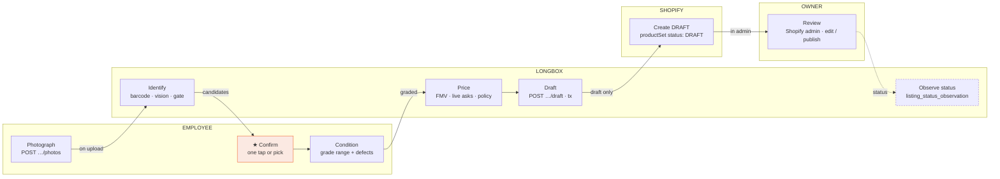

# Longbox photo-to-listing workflow — the diagram

**Version:** 1.0.0
**Status:** CURRENT at main `258a7d6` — redraw when a route, lane or gate changes
**Type:** swimlane (who owns each step, and where the work changes hands)
**Rendered:** `.arch/generate-2026-09-04T10-52.html` (single file, three gates passed) · published at <https://demos.intentsolutions.io/longbox/>
**Grounding:** every step names the route or file it comes from; two steps are marked *planned* because the table exists but nothing writes it yet

## The workflow in ASCII

Four lanes, nine steps, left to right. `★` is the focal step: the human gate nothing proceeds without. Boxes drawn with `- - -` are planned (the table or job is specified, the writer is not built).

```
            1            2             3             4             5           6            7               8              9
EMPLOYEE  [Photograph]         ┌──►[★ Confirm ]──►[ Condition ]──┐
          POST …/photos│       │   one tap or pick  grade range     │
                       │       │                    + defects       │
          ─────────────┼───────┼────────────────────────────────────┼──────────────────────────────────────────────────────────────
LONGBOX                └──►[ Identify ]─┘                           └──►[ Price ]──►[ Draft ]──┐                    ┌─ - ►[ Observe status ]
                           barcode · vision                             FMV · asks    POST …/draft│                    │     listing_status_
                           · evidence gate                              · policy      · tx        │                    │     observation (005)
          ────────────────────────────────────────────────────────────────────────────────────────┼────────────────────┼─────────────────────
SHOPIFY                                                                                          └──►[ Create DRAFT ]─┐│
                                                                                                      productSet       ││
                                                                                                      status: DRAFT    ││
          ─────────────────────────────────────────────────────────────────────────────────────────────────────────────┼┼─────────────────────
OWNER                                                                                                                  └┼─►[ Review ]────────┘
                                                                                                                        │   Shopify admin
                                                                                                                        │   edit / publish
```

Read it as handoffs:

| # | Step | Lane | Source | Hand-off out |
|---|---|---|---|---|
| 1 | Photograph | Employee | `src/routes/scanSessions.ts:155` (`POST …/photos`, phone browser) | on upload → Longbox |
| 2 | Identify | Longbox | `src/routes/scanSessions.ts:203`; `src/services/identify.ts` (barcode parse, vision candidates, evidence-contradiction gate, band) | candidates → Employee |
| 3 | **Confirm** ★ | Employee | `src/routes/scanSessions.ts:236` (one tap in the high band, a forced pick in the medium band, manual search in the low band; a contradiction removes one-tap) | same lane |
| 4 | Condition | Employee | `src/routes/scanSessions.ts:308` (grade range + defect callouts; never a number — 037) | graded → Longbox |
| 5 | Price | Longbox | `src/routes/scanSessions.ts:340` (PriceCharting historical, eBay live asks, shop policy floor; every source its own immutable snapshot) | same lane |
| 6 | Draft | Longbox | `src/routes/scanSessions.ts:401` (inside the request transaction, 041 §4; the outbox job is 043 / E02-D07) | draft only → Shopify |
| 7 | Create DRAFT | Shopify | `src/services/shopify.ts:12-20` (`productSet`, `status: "DRAFT"` hardcoded) | in admin → Owner |
| 8 | Review | Owner | Shopify admin, not Longbox (040 §4.3; 037 §4.1 owner-review triggers) | status → Longbox |
| 9 | Observe status | Longbox | `migrations/005_listing_status_observation.sql:73` (table live; the watcher that writes it is E10-B05 — *planned*) | end |

**The finding the shape carries:** every arrow that leaves Longbox lands on a person or on a DRAFT. No arrow from the Longbox lane reaches a published state — that is 019 T19 (auto-publish incidents = 0, non-waivable) drawn rather than stated. The one Longbox-owned read of Shopify (step 9) is an observation, not an action.

## Mermaid (for docs that render it)



## What is deliberately not on it

- The evidence gate's three bands and the contradiction rule live inside step 2 — a decision wedged into a swimlane breaks the shape; they are in 040 §4.2 and 019 T1/T3.
- Undo, supersession and the owner's corrections (037 §4.4, 040 S15, 041 §3) are superseding records appended later; they do not change the lane order.
- The outbox, retries and dead letters (043) sit between steps 6 and 7 and are their own record.
- Offboarding, purge and retention holds (041 §8) are a different diagram.

## Change control

Redraw when a route is added or moved, a lane changes owner, or a planned step becomes live (E10-B05, E02-D07). Re-run the three gates on the rendered file and re-copy it to the demo hub; bump this doc's version.
